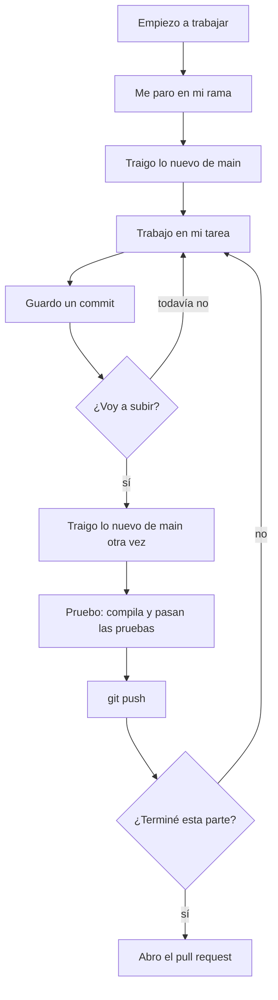

# Guía de git — cómo trabajar en equipo

Paso a paso para trabajar en el repositorio sin pisar el trabajo de los demás: qué hacer al empezar el día, cómo subir tus cambios, cómo entregar tu tarea y qué hacer cuando git se queja.

**Orden de lectura para empezar:**

1. [Guía de inicio](GUIA-INICIO.md): instalar las herramientas y clonar el repo.
2. [Plan de trabajo](PLAN-DE-TRABAJO.md): qué te toca y en qué rama.
3. Esta guía: cómo trabajar con git día a día.

Los comandos se ejecutan desde la carpeta del repo y son iguales en Windows (PowerShell) y en macOS (Terminal). Cuando cambian, se muestran los dos.

## Conceptos en un minuto

| Palabra | Qué es |
|---|---|
| **Commit** | Una "foto" de tus cambios con un mensaje. El historial es una cadena de commits |
| **Rama (branch)** | Una línea de trabajo paralela. Trabajas en la tuya sin tocar la de los demás |
| **`main`** | La rama principal: la versión del proyecto que siempre debe funcionar |
| **`origin`** | La copia del repo que está en GitHub |
| **Push** | Subir tus commits a GitHub |
| **Pull** | Traer a tu computador los commits que hay en GitHub |
| **Pull request (PR)** | La solicitud, en GitHub, para unir tu rama a `main`. Otro integrante la revisa antes |
| **Merge** | Unir los cambios de una rama con otra |
| **Conflicto** | Dos personas cambiaron las mismas líneas y git no sabe cuál versión dejar |

## Las 6 reglas

1. **Nunca trabajes en `main`.** Cada parte de una tarea tiene su propia rama (ver el [plan](PLAN-DE-TRABAJO.md#cómo-trabajamos-con-git)).
2. **Trae lo nuevo de `main` al empezar el día y antes de subir** (`git pull origin main`).
3. **Haz commits pequeños**, con mensajes que digan qué hiciste.
4. **Antes de subir, comprueba que compila y que pasan las pruebas.**
5. **Nunca subas contraseñas, tokens ni archivos de configuración personales.** Si pasa, avisa de inmediato: borrarlo en el commit siguiente no lo quita del historial.
6. **Si git dice algo que no entiendes, detente y pregunta.** Nunca uses `--force`.

## El ciclo de trabajo



## 0. Configuración única (una vez por computador)

Si seguiste la [guía de inicio](GUIA-INICIO.md), ya lo hiciste. Si no, además del nombre y el correo, ejecuta:

```bash
git config --global pull.rebase false
git config --global core.editor "code --wait"
```

- **`pull.rebase false`:** cuando tu rama y la de GitHub se hayan separado, git las une con un commit de unión (*merge*). Sin esto, git se detiene con el error `Need to specify how to reconcile divergent branches`.
- **`core.editor "code --wait"`:** cuando git necesite un mensaje (por ejemplo, al unir ramas), abre una pestaña en VS Code en lugar de Vim, un editor de terminal que confunde bastante. Revisa el mensaje, **cierra la pestaña** y git continúa.

## 1. Empezar una tarea (una vez por rama)

Espera a que tu tarea esté desbloqueada (ver [¿Quién espera a quién?](PLAN-DE-TRABAJO.md#quién-espera-a-quién) en el plan). Luego, cambiando `t5-rutinas-api` por el nombre de tu rama:

```bash
git switch main
git pull
git switch -c t5-rutinas-api
git push -u origin t5-rutinas-api
```

| Comando | Qué hace |
|---|---|
| `git switch main` | Te pasa a la rama `main` |
| `git pull` | Actualiza tu `main` con lo último de GitHub, para que tu rama nazca con todo lo que ya está terminado |
| `git switch -c t5-rutinas-api` | Crea tu rama y te pasa a ella |
| `git push -u origin t5-rutinas-api` | Crea tu rama también en GitHub y deja enlazadas las dos. De aquí en adelante basta con `git push` |

Para saber en qué rama estás: `git status` lo dice en la primera línea (`On branch ...`). VS Code también la muestra abajo a la izquierda.

## 2. Al empezar cada día

```bash
git switch t5-rutinas-api
git status
git pull origin main
```

1. **`git switch`** asegura que estás en **tu** rama.
2. **`git status`** debe decir `nothing to commit, working tree clean`. Si muestra archivos modificados, son cambios que no guardaste la última vez: haz commit primero (paso 3).
3. **`git pull origin main`** trae lo que tus compañeros ya unieron a `main` y lo mezcla con tu rama. Si nadie unió nada, dice `Already up to date`. Si se abre una pestaña `MERGE_MSG` en VS Code, es el mensaje del commit de unión: ciérrala.

Después, **revisa que MySQL y MongoDB estén encendidos** (ver la [guía de inicio](GUIA-INICIO.md) §1.5 y §1.7).

## 3. Mientras trabajas: guardar commits

Cada vez que termines algo pequeño que funcione (un DTO, un endpoint, una validación, una sección de una pantalla), guarda un commit:

```bash
git status
git add .
git commit -m "Agrega validaciones de RutinaRequest"
```

- **Revisa `git status` antes de `git add .`:** solo deben aparecer archivos que quieres guardar. Si aparece `target/`, `node_modules/`, `dist/`, `.vscode/`, `.DS_Store` o algo que no reconoces, pregunta antes.
- **Un buen mensaje dice qué cambió**, en español y empezando con un verbo: `Agrega POST /api/rutinas`, `Corrige validación de series negativas`, `Documenta la regla de récords`. **Uno malo no dice nada:** `cambios`, `avance`, `asdf`.
- **Hacer commit no sube nada.** Los commits quedan en tu computador hasta que hagas push.

## 4. Subir tus cambios

Sube al menos una vez al día. Así queda un respaldo y tus compañeros ven tu avance.

**Si tu rama toca el servicio de cuentas (Spring Boot):**

- **Windows:**

```powershell
git pull origin main
cd backend-spring
.\mvnw.cmd test
cd ..
git push
```

- **macOS:**

```bash
git pull origin main
cd backend-spring
./mvnw test
cd ..
git push
```

**Si tu rama toca el servicio de entrenamiento (Node)** (igual en Windows y en macOS):

```bash
git pull origin main
cd backend-node
npm install
npm test
cd ..
git push
```

**Si tu rama toca el frontend** (igual en Windows y en macOS):

```bash
git pull origin main
cd frontend
npm install
npm run lint
npm run build
cd ..
git push
```

`npm install` solo hace falta si el pull cambió `package.json`. Además de que compile, revisa en el navegador que tus pantallas funcionan.

**Si tu rama solo toca documentación:** `git pull origin main`, revisa que el documento se vea bien y `git push`.

1. **`git pull origin main`:** traes lo nuevo de `main` **antes** de subir. Si hay un conflicto, aparece ahora, en tu rama, y lo resuelves tú (sección 7), en lugar de aparecer después en el pull request.
2. **Las pruebas** comprueban que lo nuevo de `main` y lo tuyo, juntos, compilan y pasan. La base de datos del servicio tiene que estar encendida.
3. **`git push`:** sube tus commits a tu rama en GitHub. **No toca `main`.**

## 5. Terminar la tarea: el pull request

**Antes de abrirlo**, revisa la [definición de terminado](PLAN-DE-TRABAJO.md#definición-de-terminado): compila, pasan las pruebas, lo probaste contra el contrato y marcaste tu casilla en el README. Luego haz el paso 4 una última vez.

**Abrir el PR:**

1. Entra a https://github.com/rancesra/gymrutine. Arriba aparece un aviso con tu rama y el botón **Compare & pull request**. Si no aparece, ve a la pestaña **Pull requests → New pull request**.
2. Revisa que diga **base: `main` ← compare: `tu-rama`**.
3. **Título:** la clave de la tarjeta de Jira, la tarea y qué entrega. Por ejemplo, `GR-34 T6: API de rutinas`. La clave une el PR con su tarjeta: es la trazabilidad que pide el curso ([guía de Jira](docs/guias/JIRA.md)).
4. **Descripción:** usa esta plantilla.

   ```markdown
   ## Qué hace
   (una o dos frases)

   ## Cómo probarlo
   1. ...
   2. ...

   ## Jira
   GR-34 (T6 API de rutinas), GR-17 (H10 Crear una rutina)
   ```

   Al abrir el PR, pasa sus tarjetas a **En revisión** en Jira; al unirlo, a **Listo**.
5. En **Reviewers**, a la derecha, elige quién lo revisa (ver sección 6).
6. **Create pull request.**

**Si el revisor pide cambios:** hazlos en tu misma rama, guárdalos con commit y haz `git push`. El PR se actualiza solo; no abras otro.

**Cuando esté aprobado:** **Merge pull request → Confirm merge**, y después **Delete branch**. Avisa en el grupo que tu tarea entró a `main`, para que tus compañeros hagan `git pull origin main` en sus ramas.

**Para tu siguiente rama**, vuelve al paso 1: siempre se empieza desde un `main` actualizado.

## 6. Revisar el PR de un compañero

Revisar no es un trámite: es la forma de que los tres entiendan el código que van a usar y puedan defenderlo en la sustentación.

**Quién revisa a quién:** Rances revisa los PR de Javier y de Santiago; Javier y Santiago se turnan para revisar los de Rances. El PR del algoritmo de récords lo revisan los dos compañeros.

1. En el PR, abre la pestaña **Files changed** y lee los cambios. Puedes comentar una línea con el **+** que aparece a su lado.
2. **Qué revisar:**
   - ¿Los endpoints, campos, códigos de estado y errores son los del [contrato](docs/CONTRATO-API.md)?
   - ¿Las tablas y columnas son las del [modelo de datos](docs/MODELO-DATOS.md)?
   - ¿Se cumple la definición de terminado?
   - ¿Entiendes el código? Si no, pide que se explique en un comentario o en el Javadoc.
3. **Para probarlo en tu computador**, primero guarda tus propios cambios con commit y luego:

   ```bash
   git fetch
   git switch t5-rutinas-api
   ```

   Cuando termines de probar, vuelve a tu rama con `git switch <tu-rama>`.
4. Botón **Review changes**: **Approve** si está bien, o **Request changes** con un comentario que explique qué corregir.

## 7. Conflictos

Un conflicto ocurre cuando tú y otra persona cambiaron **las mismas líneas** de un archivo. Es normal, no es un error tuyo, y se resuelve en minutos.

**Cuándo lo verás:** al hacer `git pull origin main`, git dice algo como:

```
CONFLICT (content): Merge conflict in frontend/src/estilos.css
Automatic merge failed; fix conflicts and then commit the result.
```

**Cómo resolverlo:**

1. Abre el archivo en VS Code. Verás bloques así:

   ```
   <<<<<<< HEAD
       (tu versión)
   =======
       (la versión que viene de main)
   >>>>>>> ...
   ```

2. Encima de cada bloque, VS Code muestra tres opciones: **Accept Current Change** (lo tuyo), **Accept Incoming Change** (lo de `main`) y **Accept Both Changes** (los dos). Cuando cada uno agregó algo distinto (un método, una clase CSS, una fila en el README), casi siempre la respuesta es **Accept Both Changes**.
3. Revisa que el archivo quede bien, sin `<<<<<<<`, `=======` ni `>>>>>>>`, y que compile.
4. Guarda el archivo y termina la unión:

   ```bash
   git add .
   git commit --no-edit
   ```

   `--no-edit` usa el mensaje automático del commit de unión.
5. Sigue con normalidad: prueba y `git push`.

**Archivos donde es más probable:** `README.md` (casillas de las historias), `frontend/src/estilos.css` y `frontend/src/App.jsx` (las rutas). Si no estás seguro de qué versión dejar, **no adivines**: pregúntale a quien escribió la otra parte.

**Si el conflicto es en `package-lock.json`, no lo edites a mano.** Acepta la versión de `main` (**Accept Incoming Change** en cada bloque), ejecuta `npm install` dentro de su carpeta (`frontend/` o `backend-node/`) para que el archivo se regenere con las dependencias de los dos, y termina la unión con `git add .` y `git commit --no-edit`.

## 8. Cuando git se queja

| Mensaje o situación | Qué pasó | Qué hacer |
|---|---|---|
| `Your local changes to the following files would be overwritten` | Tienes cambios sin guardar y git no quiere perderlos | Guárdalos con `git add .` y `git commit -m "..."`, y repite el comando |
| `Updates were rejected because the remote contains work that you do not have locally` | Tu rama en GitHub tiene commits que tú no tienes (por ejemplo, porque subiste desde otro computador) | `git pull` y luego `git push` |
| `Need to specify how to reconcile divergent branches` | Falta la configuración única | `git config --global pull.rebase false` y repite |
| `CONFLICT (content): Merge conflict in ...` | Dos personas cambiaron las mismas líneas | Sección 7 |
| `not a git repository` | Estás fuera de la carpeta del repo | Entra a la carpeta con `cd` |
| La terminal muestra una pantalla extraña con `~` a la izquierda | Es Vim: falta la configuración única del editor | Escribe `:wq` y presiona Enter para salir |
| `protected branch` o `push declined` al subir a `main` | `main` está protegida y solo acepta cambios por PR | Está bien que pase. Crea tu rama con tus commits (ver abajo) |
| Hiciste commits en `main` por error | Trabajaste en la rama equivocada | Ver abajo |

**Si hiciste commits en `main` por error y todavía no los subiste**, y aún no habías creado tu rama de tarea:

```bash
git status
git branch t5-rutinas-api
git reset --hard origin/main
git switch t5-rutinas-api
```

1. `git status` tiene que decir `working tree clean`. Si no, haz commit primero: el paso 3 borra lo que no esté guardado.
2. `git branch t5-rutinas-api` crea tu rama de tarea con esos commits adentro.
3. `git reset --hard origin/main` devuelve tu `main` a como está en GitHub. Tus commits no se pierden: siguen en la rama del paso 2.
4. `git switch t5-rutinas-api` te pasa a tu rama para seguir trabajando ahí.

Si tu rama de tarea ya existía, **no hagas nada todavía y pide ayuda**: también tiene arreglo, pero es distinto.

## 9. Proteger `main` (Rances, una sola vez)

Se hace justo después del primer push de la documentación, cuando `main` ya existe en GitHub. El repositorio es público, así que las reglas funcionan en el plan gratuito.

1. En GitHub: **Settings → Rules → Rulesets → New ruleset → New branch ruleset**.
2. **Ruleset name:** `proteger-main`. **Enforcement status:** *Active*.
3. **Target branches:** *Add target → Include default branch*.
4. Marca:
   - **Restrict deletions**
   - **Block force pushes**
   - **Require a pull request before merging**, con **Required approvals: 1**
5. **Create**.

Desde ese momento, nadie (tampoco el dueño del repositorio) puede subir directo a `main`: todo entra por PR aprobado.

## 10. Marcar la entrega de cada sprint (Rances)

Al cerrar cada sprint, con todo unido a `main`, se marca el incremento entregado con una etiqueta:

```bash
git switch main
git pull
git tag sprint-2
git push origin sprint-2
```

Así queda registrado exactamente qué se entregó en cada sprint, y se puede volver a esa versión en cualquier momento.

---

_Última actualización: 2026-09-21_
