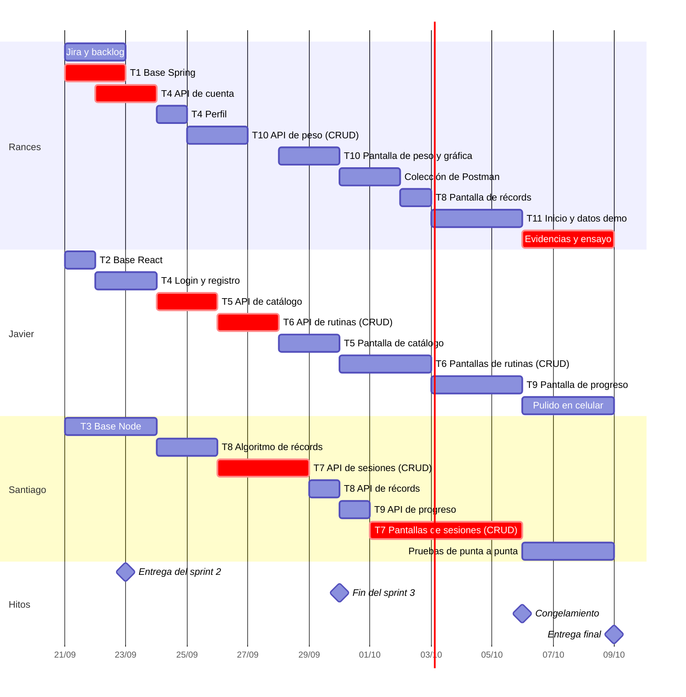
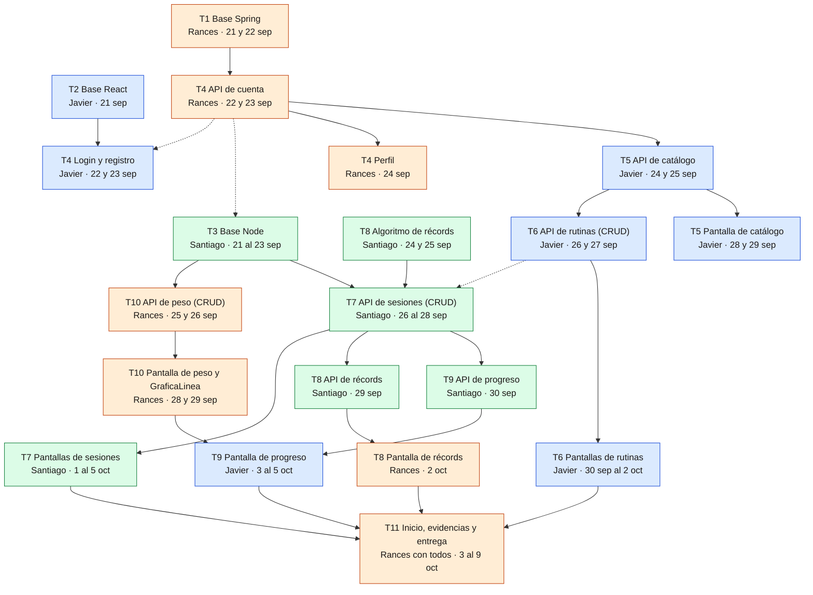

# Plan de trabajo — GymRutine

Qué le toca a cada integrante, en qué orden, qué necesita y cómo saber que terminó. **Cubre el proyecto completo: la entrega final es el viernes 9 de octubre de 2026**, y antes está la **entrega del sprint 2, el miércoles 23 de septiembre**.

Como el curso ya dio todas las clases, el proyecto deja de ir por cortes: se construye **una sola aplicación que usa todas las tecnologías del curso** (Spring Boot, JPA, MySQL, Node.js, Express, MongoDB, React, Maven, Postman, Git, Jira y Scrum). La arquitectura está en [ARQUITECTURA.md](docs/ARQUITECTURA.md).

**Orden de lectura para empezar:**

1. [Guía de inicio](GUIA-INICIO.md): instalar las herramientas, crear las bases de datos y clonar el repo.
2. Este plan: qué te toca, en qué sprint y en qué rama.
3. [Guía de git](GUIA-GIT.md): cómo trabajar día a día (pull, commits, push, pull requests y conflictos).
4. [Guía de Jira](docs/guias/JIRA.md): cómo se lleva el avance en el tablero.
5. La guía paso a paso de tu primera tarea, con el código ya probado: [T2](docs/guias/T2-FRONTEND.md) (Javier) o [T3](docs/guias/T3-NODE.md) (Santiago).

**Las fuentes de verdad son el [contrato de API](docs/CONTRATO-API.md) y el [modelo de datos](docs/MODELO-DATOS.md).** Si algo de este plan los contradice, mandan ellos. Se cambian solo si lo acordamos los tres, y primero en el documento y después en el código.

## Qué pide el curso

| Entrega | Qué pide el profesor | Cómo lo cumplimos |
|---|---|---|
| **Sprint 2 · miércoles 23 de septiembre** | Crear una cuenta en Jira y, desde esta semana, mantener ahí los avances | Proyecto `GymRutine` en [Jira](https://gymrutine-uis.atlassian.net/browse/GR) con el backlog completo y los tres sprints ([guía de Jira](docs/guias/JIRA.md)) |
| **Sprint 2 · miércoles 23 de septiembre** | Diseño de la base de datos | [MODELO-DATOS.md](docs/MODELO-DATOS.md): diagrama entidad-relación de MySQL, modelo de documentos de MongoDB y reglas |
| **Sprint 2 · miércoles 23 de septiembre** | Repositorio con Git | Este repositorio, con ramas por tarea y pull requests revisados |
| **Sprints 3 y 4 · viernes 9 de octubre** | Sustentar el proyecto mostrando el desarrollo del login | Historias H1 a H3: la API de Rances y las pantallas de Javier |
| **Sprints 3 y 4 · viernes 9 de octubre** | Un CRUD por integrante | [Un CRUD por integrante](#un-crud-por-integrante) |
| **Sprints 3 y 4 · viernes 9 de octubre** | Un Word o un `readme.md` en el repositorio con las evidencias de participación en el software y la trazabilidad del avance en Jira | [EVIDENCIAS.md](EVIDENCIAS.md) |

## Fechas clave

| Fecha | Qué pasa |
|---|---|
| Lun 21 sep | Arranque: Jira, instalación y base de los tres proyectos |
| **Mié 23 sep** | **Entrega del sprint 2:** Jira, diseño de la base de datos y repositorio. Como avance, el login y las dos bases de datos funcionando |
| Mar 29 sep | Fin del sprint 3: las APIs de catálogo, rutinas, sesiones, récords y peso corporal están listas |
| Lun 5 oct | Todo funcionando: el login y los tres CRUD de punta a punta |
| Mar 6 oct | **Congelamiento:** desde aquí no entran funcionalidades nuevas; solo correcciones, pulido y evidencias |
| Jue 8 oct | Evidencias completas, capturas de Jira y ensayo de la sustentación |
| **Vie 9 oct** | **Entrega final:** sustentación del login y de un CRUD por integrante, con las evidencias |

## Quién hace qué

| Integrante | Rol Scrum | Se hace cargo de | CRUD que presenta |
|---|---|---|---|
| **Rances** | Product Owner y coordinador | **Servicio de cuentas y rutinas** (Spring Boot + MySQL): base y autenticación. **Peso corporal** (API en Node y pantalla). Pantallas de perfil, inicio y récords. Jira, integración, Postman, datos de demostración, evidencias y entrega | Peso corporal |
| **Javier** | Scrum Master en los sprints 2 y 4 | **Frontend** (React): base, login y registro. **Catálogo y rutinas** de punta a punta (API en Spring y pantallas). Pantalla de progreso | Rutinas |
| **Santiago** | Scrum Master en el sprint 3 | **Servicio de entrenamiento** (Node + Express + MongoDB): base, sesiones, récords y progreso. Pantallas de entrenar, resumen, historial y detalle de sesión | Sesiones de entrenamiento |

Cada uno trabaja de punta a punta en sus funcionalidades: los tres tocan backend y frontend, y cualquiera puede explicar cualquier parte en la sustentación.

## Un CRUD por integrante

El curso pide que en la sustentación cada integrante muestre **un CRUD que haya desarrollado**. Cada uno presenta uno completo, de la base de datos a la pantalla:

| Integrante | CRUD | Crear | Leer | Editar | Eliminar | Dónde vive |
|---|---|---|---|---|---|---|
| **Javier** | Rutinas | H10 · `POST /rutinas` | H11 · `GET /rutinas` y `GET /rutinas/{id}` | H12 · `PUT /rutinas/{id}` | H13 · `DELETE /rutinas/{id}` | Servicio de cuentas (Spring + MySQL) · pantallas P5 y P6 |
| **Rances** | Peso corporal | H21 · `POST /peso-corporal` | H22 · `GET /peso-corporal` | H24 · `PUT /peso-corporal/{id}` | H22 · `DELETE /peso-corporal/{id}` | Servicio de entrenamiento (Node + MongoDB) · pantalla P13 |
| **Santiago** | Sesiones de entrenamiento | H14 · `POST /sesiones` | H15 y H16 · `GET /sesiones` y `GET /sesiones/{id}` | H23 · `PUT /sesiones/{id}` | H17 · `DELETE /sesiones/{id}` | Servicio de entrenamiento (Node + MongoDB) · pantallas P7 a P10 |

- **El login** (H1 a H3) lo presentan Rances, que hace la API, y Javier, que hace las pantallas.
- **Cada uno explica su CRUD completo:** la tabla o colección, la validación, el endpoint, los errores y la pantalla.
- Javier tiene además el CRUD de ejercicios propios (H5 a H9). Si sobra tiempo en la sustentación, se muestra.

## Resumen de tareas

| Tarea | Responsable | Sprint | Entrega | Historias | Depende de |
|---|---|---|---|---|---|
| **T0** Documentación, arquitectura y Jira | Rances | 2 | Estos documentos y el backlog en Jira | — | — |
| **T1** Base del servicio de cuentas | Rances | 2 | Spring Boot + MySQL: entidades, errores, referencias y catálogo base | — | — |
| **T2** Base del frontend | Javier | 2 | React con Vite: rutas, cliente de la API, sesión y estilos | — | — |
| **T3** Base del servicio de entrenamiento | Santiago | 2 | Node + Express + MongoDB: conexión, modelos, validación del token y errores | — | Nadie; la prueba final del token, T4 API (mientras tanto, API falsa) |
| **T4** Cuenta y perfil | API: Rances · Login y registro: Javier · Perfil: Rances | 2 y 3 | Registro, login, logout, perfil e interceptor | H1–H4 | T1; las pantallas, también T2 |
| **T5** Catálogo de ejercicios | Javier | 3 | API en Spring y pantalla P4 | H5–H9 | T4 API, T2 |
| **T6** Rutinas: **CRUD de Javier** | Javier | API: 3 · Pantallas: 4 | API en Spring y pantallas P5 y P6 | H10–H13 | T4 API; las pantallas, también T5 |
| **T7** Sesiones: **CRUD de Santiago** | Santiago | API: 3 · Pantallas: 4 | API en Node, con editar, y pantallas P7 a P10 | H14–H17, H23 | T3, T6 API, T8 algoritmo |
| **T8** Récords personales | Algoritmo y API: Santiago · Pantalla: Rances | 3 y 4 | Recálculo con pruebas, `GET /records` y pantalla P12 | H18, H19 | T3; la pantalla, también T7 |
| **T9** Progreso por ejercicio | API: Santiago · Pantalla: Javier | 4 | API en Node y pantalla P11 | H20 | T7 API, T10 (componente de gráfica) |
| **T10** Peso corporal: **CRUD de Rances** | Rances | 3 | API en Node, con editar, y pantalla P13 con `GraficaLinea` | H21, H22, H24 | T3, T2 |
| **T11** Inicio, integración, evidencias y entrega | Rances, con todos | 4 | P3, colección de Postman, datos de demostración, [EVIDENCIAS.md](EVIDENCIAS.md), pulido y sustentación | — | Todas |

## Calendario por sprint

La numeración sigue la del curso: el sprint 2 se entrega el 23 de septiembre y los sprints 3 y 4, el 9 de octubre.

| Sprint | Fechas | Objetivo | Rances | Javier | Santiago |
|---|---|---|---|---|---|
| **2** | lun 21 – mié 23 sep | **Bases, login y Jira** (entrega del sprint 2) | Jira · T1 → T4 API de cuenta | T2 → T4 pantallas de login y registro | T3 base de Node y MongoDB |
| **3** | jue 24 – mar 29 sep | **Las APIs** | T4 perfil (P14) · T10 API de peso → pantalla de peso y `GraficaLinea` | T5 API de catálogo → T6 API de rutinas → T5 pantalla P4 | T8 algoritmo de récords → T7 API de sesiones → T8 API de récords |
| **4** | mié 30 sep – vie 9 oct | **Pantallas, evidencias y entrega final** | Postman · T8 pantalla de récords · T11 inicio y datos de demostración · evidencias | T6 pantallas de rutinas · T9 pantalla de progreso · pulido en celular | T9 API de progreso · T7 pantallas P7 a P10 · pruebas de punta a punta |

**Del 6 al 8 de octubre no entran funcionalidades nuevas:** son para corregir, pulir, reunir las evidencias y ensayar.

**Plan B si alguien se atrasa:** lo que nunca se sacrifica es el login y los tres CRUD. Si Santiago no alcanza con sus pantallas, Rances toma P8 (resumen) y P9 (historial); P7 y P10 son parte de su CRUD y las termina él. Si Javier no alcanza con P11, la pantalla sale primero solo con la tabla y la gráfica se agrega después.

## ¿Quién espera a quién?

**Hoy nadie espera a nadie.** Cada uno empieza por lo que no depende de otros. Cuando una tarea necesita una API que todavía no está en `main`, se avanza contra el [contrato](docs/CONTRATO-API.md) con la [API falsa del servicio de cuentas](docs/guias/api-falsa-cuentas.mjs), y solo la prueba final espera a la API real. Por lo mismo, **las API van antes que las pantallas**: los compañeros las necesitan.

### Hoy, lunes 21: los tres empiezan ya

| Quién | Empieza con | Paso a paso | Para la prueba final necesita | Mientras tanto |
|---|---|---|---|---|
| Rances | Jira; después T1 y la API de T4 | [Guía de Jira](docs/guias/JIRA.md) y secciones [T1](#t1--base-del-servicio-de-cuentas-spring-boot--mysql) y [T4](#t4--cuenta-y-perfil-historias-1-a-4) de este plan | — | — |
| Javier | T2 y después las pantallas de login y registro | [Guía de T2](docs/guias/T2-FRONTEND.md) | La API de T4 de Rances en `main` | API falsa |
| Santiago | T3 | [Guía de T3](docs/guias/T3-NODE.md) | La API de T4 de Rances en `main` | API falsa |

### Lo que cada uno le entrega a otro

Estas son las únicas esperas entre personas. Si una se va a atrasar, **avísalo en el grupo ese mismo día**: quien está en la última columna tendrá que reorganizarse.

| Debe estar en `main` el | Qué | Lo entrega | A quién desbloquea |
|---|---|---|---|
| **Mié 23 sep** | T1 y la API de cuenta (T4) | Rances | Javier empieza la API de catálogo (T5) el 24. Javier y Santiago hacen la prueba final del login y del token |
| **Mié 23 sep** | T2, base del frontend, con login y registro | Javier | Rances hace el perfil (P14) el 24. Todas las pantallas se construyen sobre ella |
| **Mié 23 sep** | T3, base del servicio de entrenamiento | Santiago | Rances empieza la API de peso (T10) el 25 |
| **Dom 27 sep** | API de rutinas (T6) | Javier | Santiago hace la prueba final de la API de sesiones (T7) y, desde el 1 de octubre, sus pantallas de entrenar usan rutinas reales |
| **Lun 28 sep** | API de sesiones (T7) | Santiago | Javier muestra la "última vez" en Mis rutinas (P5) desde el 30 |
| **Mar 29 sep** | `GraficaLinea`, con la pantalla de peso (T10) | Rances | Javier dibuja la gráfica de progreso (P11) desde el 3 de octubre |
| **Mar 29 sep** | API de récords (T8) | Santiago | Rances hace la pantalla de récords (P12) el 2 de octubre |
| **Mié 30 sep** | API de progreso (T9) | Santiago | Javier hace la pantalla de progreso (P11) desde el 3 de octubre |
| **Lun 5 oct** | Todas las pantallas | Los tres | Evidencias, pruebas y ensayo (6 al 8 de octubre) y entrega final (9) |

### Línea de tiempo

Cada barra es una parte de una tarea. En rojo, la **ruta crítica**: si una de esas partes se atrasa, se atrasa la entrega.

### Dependencias entre tareas

Cada flecha va de una tarea a la que la necesita. **Flecha continua:** hay que esperar a que esté en `main` para empezar. **Flecha punteada:** se puede empezar antes contra el contrato, con la API falsa; solo la prueba final espera. Todas las pantallas se construyen sobre T2, y las API sobre T1 o T3; esas flechas no se dibujan para que el diagrama se pueda leer. Colores: naranja, Rances; azul, Javier; verde, Santiago.

### Si te toca esperar

1. **Trabaja contra el contrato.** La API falsa (`node docs/guias/api-falsa-cuentas.mjs`) responde registro, login, `GET /usuarios/me`, `GET /referencias` y `GET /rutinas/{id}`. Para lo que no tenga, usa los ejemplos del contrato como datos de prueba.
2. **Adelanta lo tuyo que no depende de nadie:** el algoritmo de récords (T8), los estilos de tu siguiente pantalla o las peticiones de Postman de tu API.
3. **Revisa los pull requests pendientes:** cada PR revisado desbloquea a alguien.
4. **Si llevas medio día bloqueado, dilo en el daily** o en el grupo: para eso está el plan B.

## Prioridades para llegar al 9 de octubre

| Prioridad | Qué entra | Historias |
|---|---|---|
| **Imprescindible** (lo pide el curso) | Login · los tres CRUD: rutinas, peso corporal y sesiones · el catálogo para elegir ejercicios · Jira al día · evidencias | H1–H3, H5, H10–H17, H21–H24 |
| **Importante** (lo que hace útil la app) | Récords automáticos · progreso · pantalla de récords · perfil · detalle de ejercicio y ejercicios propios · inicio · datos de demostración | H4, H6–H9, H18–H20 |
| **Si da el tiempo** | Borrador del entrenamiento en el navegador · enlace a YouTube · pulido de la vista de escritorio | Partes de H6 y H14 |

Lo imprescindible se termina primero, aunque lo importante quede para después.

---

## Entrega del sprint 2 — miércoles 23 de septiembre

### Qué se muestra

| # | Qué | Cómo se ve | Quién lo presenta |
|---|---|---|---|
| 1 | **Jira** (lo pide el curso) | El proyecto `GymRutine`: las 24 historias en sus épicas, el sprint 2 en curso con cada tarjeta asignada y los sprints 3 y 4 planeados | Rances |
| 2 | **Diseño de la base de datos** (lo pide el curso) | [MODELO-DATOS.md](docs/MODELO-DATOS.md): el diagrama entidad-relación de MySQL y el modelo de documentos de MongoDB. Si T1 ya está en `main`, también las 6 tablas en MySQL Workbench con los 40 ejercicios base | Rances (MySQL) y Santiago (MongoDB) |
| 3 | **Repositorio con Git** (lo pide el curso) | GitHub: la documentación, las ramas por tarea, los pull requests revisados y `main` protegida | Javier |
| 4 | Arquitectura | Diagrama de [ARQUITECTURA.md](docs/ARQUITECTURA.md) §1: React, dos servicios y dos bases de datos | Rances |
| 5 | Avance: login funcionando | Crear una cuenta y entrar desde React; cerrar sesión; volver a entrar | Javier |
| 6 | Avance: los dos servicios conectados | `GET /api/sesiones` en Node responde `[]` con token y 401 sin él: Node le pregunta a Spring si el token es válido | Santiago |

**Lo que pide el curso son las filas 1 a 3,** y ya están casi listas: solo falta crear Jira. Las filas 4 a 6 muestran el avance; si algo no llega a tiempo, se presenta lo que funcione.

### Cronograma hasta el miércoles

| Cuándo | Rances | Javier | Santiago |
|---|---|---|---|
| **Lun 21 (hoy)** | Crear Jira, importar el backlog e invitar al equipo ([guía de Jira](docs/guias/JIRA.md)). Instalar MySQL y Postman, y empezar T1 | Aceptar las invitaciones de GitHub y Jira. Instalar Node.js 24 y hacer T2 con su [guía](docs/guias/T2-FRONTEND.md) | Aceptar las invitaciones de GitHub y Jira. Instalar MongoDB, Compass y Postman, y hacer T3 con su [guía](docs/guias/T3-NODE.md) |
| **Mar 22** | Terminar T1 y hacer la API de cuenta (T4). PR a `main` | Pantallas de login y registro, probadas con la API falsa. PR a `main` | Middleware que valida el token, probado con la API falsa. PR a `main` |
| **Mié 23, temprano** | Revisar y unir los PR. Probar todo contra la API real | Probar el login contra la API real. Revisar el PR de Rances | Probar el token contra el servicio real. Tarjetas al día en Jira |
| **Mié 23, antes de clase** | Ensayo de la presentación, los tres juntos | | |

---

## Metodología: Scrum adaptado a 3 personas y 19 días

Usamos Scrum, la metodología del curso (temario §4), con los sprints del curso: el 2 dura tres días, el 3 seis y el 4 diez.

| Rol | Quién | Responsabilidad |
|---|---|---|
| Product Owner | Rances | Prioriza el backlog y acepta o devuelve cada historia comparándola con sus criterios |
| Scrum Master | Javier en los sprints 2 y 4; Santiago en el sprint 3 | Facilita la planeación y la retrospectiva, detecta bloqueos y mantiene Jira al día |
| Equipo de desarrollo | Los tres | Construye el incremento. Cada uno responde por sus tareas y por su CRUD |

| Evento | Cuándo | Duración | Resultado |
|---|---|---|---|
| Planeación del sprint | Al inicio de cada sprint | 20 min | El sprint iniciado en Jira, con cada tarjeta asignada |
| Daily | Todos los días, por escrito en el grupo del equipo | 5 min | Qué hice, qué haré y qué me bloquea. Jira debe mostrar lo mismo |
| Revisión | 23 sep, 29 sep y 8 oct (ensayo final) | 20 min | Demostración contra los criterios de aceptación |
| Retrospectiva | Después de cada revisión | 10 min | Un cambio concreto para el siguiente sprint, anotado abajo |

**Artefactos:**

- **Jira es el tablero del equipo** ([guía de Jira](docs/guias/JIRA.md)). El Product Backlog son las 24 historias de [HISTORIAS.md](docs/HISTORIAS.md), cada una en su épica, más las tareas técnicas de este plan. Cada sprint de Jira coincide con uno de este plan. Columnas: **Por hacer → En curso → En revisión → Listo**. Los errores se registran como *Bug*.
- **Trazabilidad:** el título de cada pull request empieza con la clave de Jira de lo que resuelve (`GR-34 T6: API de rutinas`). La tarjeta pasa a *En revisión* al abrir el PR y a *Listo* al unirlo. Al cerrar cada sprint se guardan capturas del tablero y del informe del sprint para [EVIDENCIAS.md](EVIDENCIAS.md).
- **Incremento:** `main` al cierre de cada sprint, marcado con la etiqueta `sprint-N`.

### Retrospectivas

| Sprint | Funcionó | No funcionó | Cambio para el siguiente sprint |
|---|---|---|---|
| 2 | | | |
| 3 | | | |
| 4 | | | |

---

## Cómo trabajamos con git

**Nadie trabaja directo en `main`.** Cada parte de una tarea vive en su rama y entra con un pull request que revisa otro integrante. El título del PR empieza con la clave de Jira. Con plazos tan cortos, **los PR se revisan el mismo día**: si te piden revisión, es lo primero que haces. El paso a paso está en la [guía de git](GUIA-GIT.md).

| Tarea | Ramas (una por PR) |
|---|---|
| T1 | `t1-base-spring` |
| T2 | `t2-base-react` |
| T3 | `t3-base-node` |
| T4 | `t4-cuenta-api` · `t4-perfil` (las pantallas de login y registro van en `t2-base-react`, con T2) |
| T5 | `t5-catalogo-api` · `t5-catalogo-pantalla` |
| T6 | `t6-rutinas-api` · `t6-rutinas-pantallas` |
| T7 | `t7-sesiones-api` · `t7-sesiones-pantallas` |
| T8 | `t8-records-algoritmo` · `t8-records-api` · `t8-records-pantalla` |
| T9 | `t9-progreso-api` · `t9-progreso-pantalla` |
| T10 | `t10-peso-api` · `t10-peso-pantalla` |
| T11 | `t11-cierre` (se puede dividir) |
| Documentación | `docs-<tema>` |

**Quién revisa a quién:** Rances revisa los PR de Javier y de Santiago; Javier y Santiago se turnan para revisar los de Rances. El PR del algoritmo de récords lo revisan los dos compañeros.

Cada proyecto vive en su carpeta (`backend-spring/`, `backend-node/` y `frontend/`), así que casi no hay conflictos entre los tres.

---

## Convenciones del servicio de cuentas (Spring Boot)

- **Paquetes por capa** dentro de `co.edu.uis.gymrutine`: `config`, `controller`, `dto`, `error`, `model`, `repository`, `seguridad` y `service`.
- **Nombres:** dominio y métodos en español (`Rutina`, `registrar`); sufijos técnicos en inglés (`Controller`, `Service`, `Repository`, `Request`, `Response`). Sin tildes ni ñ en los identificadores.
- **Entidades = clases JPA; DTOs = records.** Nunca se devuelve una entidad. Cada `Response` tiene un método estático `desde(entidad)`.
- **Entidades sin setters públicos:** cambian con métodos del dominio (`actualizar(...)`, `desactivar()`). El constructor sin argumentos que exige JPA es `protected`.
- **Inyección por constructor**, con campos `final`.
- **Todas las rutas empiezan por `/api`**, en el `@RequestMapping` de cada controller.
- **Validación en los `Request`** con el mensaje en español. **No** poner `@Validated` en la clase del controller: el manejador global no atraparía la excepción y el cliente recibiría un 500.
- **Errores:** se lanzan las excepciones del paquete `error` con el código del contrato; el manejador global las convierte en `{codigo, mensaje, campos}`.
- **El usuario autenticado** llega en el atributo de la petición `usuarioId`, que pone el interceptor. Nunca se toma de la URL ni del cuerpo.
- **Transacciones:** `@Transactional` en los servicios que escriben y `@Transactional(readOnly = true)` en los que leen.
- **Javadoc** en cada clase y en los métodos no evidentes. **Postman:** cada endpoint nuevo entra a la colección en el mismo PR.

## Convenciones del servicio de entrenamiento (Node + Express)

- **Node.js 24 con módulos ES** (`import` / `export`, como en React), Express 5 y Mongoose. Sin otras librerías: Node 24 ya trae `--env-file` para leer el `.env`, `--watch` para reiniciar al guardar y `node --test` para las pruebas.
- **Estructura** en `src/`: `rutas/` (endpoints), `servicios/` (reglas de negocio), `modelos/` (esquemas de Mongoose), `middlewares/` (autenticación y errores). Detalle en [ARQUITECTURA.md](docs/ARQUITECTURA.md) §5.
- **Nombres en español y `camelCase`;** los modelos en `PascalCase` (`Sesion.js`, `RegistroPeso.js`).
- **Las rutas no tienen reglas de negocio:** validan la entrada, llaman a un servicio y responden.
- **El usuario sale de `req.usuario`**, que pone el middleware `autenticar`. Nunca del cuerpo ni de la URL.
- **Toda consulta filtra por `usuarioId`:** así un recurso de otro usuario responde 404.
- **Errores:** se lanza un `ErrorApi(estado, codigo, mensaje, campos)`; el middleware de errores responde con el formato del contrato. Express 5 pasa solo al manejador los errores de las funciones `async`.
- **Configuración en `.env`** (que no se sube); en el repo va `.env.ejemplo` con las variables sin secretos.
- **La regla de récords es una función pura** en `servicios/records.js`, probada con `node --test` sin MongoDB.

## Convenciones del frontend (React)

- **React con Vite, en JavaScript** (`.jsx`, sin TypeScript). Estructura y rutas en [ARQUITECTURA.md](docs/ARQUITECTURA.md) §7.
- **Componentes de función con hooks,** uno por archivo, en `PascalCase`. Las páginas van en `src/paginas/` y empiezan por `Pagina`.
- **Ningún `fetch` fuera de `src/api/cliente.js`.** El proxy de Vite manda cada petición al servicio que corresponde.
- **Estado global solo para la sesión** (`AuthProvider`, que se lee con `useAuth()`). Sin librerías de estado ni de componentes.
- **Estilos en `src/estilos.css`** con las clases del [mockup HTML](docs/mockup/mockup.html). Sin estilos en línea, salvo valores calculados.
- **Listas con `key` estable:** el `id` de la API, nunca la posición.
- **`localStorage` solo guarda** `gymrutine.token`, `gymrutine.usuario` y `gymrutine.borrador.<rutinaId>`.
- **Chart.js** solo dentro de `GraficaLinea`. **`npm run lint` sin avisos** antes de subir (Oxlint, que trae la plantilla de Vite).

## Definición de terminado

- [ ] Compila y sus pruebas pasan: `./mvnw test` en `backend-spring/`, `npm test` en `backend-node/`, `npm run build` y `npm run lint` en `frontend/`
- [ ] Probado contra el contrato (en Postman para la API): mismos campos, códigos de estado y errores
- [ ] Las tablas, colecciones y campos coinciden con [MODELO-DATOS.md](docs/MODELO-DATOS.md)
- [ ] Las pantallas cumplen las reglas del [mockup](docs/mockup/README.md) y se ven bien a 360 px
- [ ] Casilla de la historia marcada en el README
- [ ] PR revisado por otro integrante y unido a `main`, con la clave de Jira en el título; la tarjeta en *Listo*

---

## T1 — Base del servicio de cuentas (Spring Boot + MySQL)

**Responsable:** Rances · **Rama:** `t1-base-spring` · **Sprint:** 2

**Qué entrega**

- Proyecto Spring Boot en `backend-spring/`, conectado a la base `gymrutine` de MySQL.
- Las 5 entidades JPA (`Usuario`, `TokenAcceso`, `Ejercicio`, `Rutina` y `RutinaEjercicio`), los 3 enumerados y los repositorios, fieles a [MODELO-DATOS.md](docs/MODELO-DATOS.md) §2 a §4. Son 6 tablas, porque `ejercicio_objetivo` es la colección de objetivos dentro de `Ejercicio`.
- `GET /api/referencias`.
- `CargaCatalogoBase` con los 40 ejercicios de [MODELO-DATOS.md](docs/MODELO-DATOS.md) §10.
- `ManejadorGlobalErrores` con el formato `{codigo, mensaje, campos}` y las excepciones del contrato.

**Cómo**

- Generar el proyecto en https://start.spring.io:

  | Opción | Valor |
  |---|---|
  | Project | **Maven** (viene Gradle por defecto: hay que cambiarlo) |
  | Language | Java |
  | Spring Boot | 4.1.1 |
  | Group / Artifact | `co.edu.uis` / `gymrutine` |
  | Package name | `co.edu.uis.gymrutine` |
  | Packaging / Configuration / Java | Jar / YAML / 21 |
  | Dependencies | Spring Web, Spring Data JPA, MySQL Driver, Validation |

- **`application.yml`:** `jdbc:mysql://localhost:3306/gymrutine` con el usuario `gymrutine` / `gymrutine`, `ddl-auto: update` y `open-in-view: false`.
- **Enumerados con sus datos visibles:** cada `Objetivo` lleva nombre, descripción, series y repeticiones sugeridas. `GET /referencias` los recorre.
- **Carga del catálogo base idempotente:** cada ejercicio se inserta solo si no existe uno base con ese nombre.
- **Pieza compartida:** `EjercicioResumenResponse` (`id`, `nombre`, `grupoMuscular`, `equipo`, `activo`), que usan catálogo y rutinas.

**Cómo verificar**

| Caso | Esperado |
|---|---|
| `./mvnw spring-boot:run` con MySQL encendido | Arranca sin errores en el puerto 8080 |
| Esquema `gymrutine` en MySQL Workbench | Las 6 tablas, con las columnas y claves del modelo |
| Arrancar la aplicación dos veces | Siguen siendo 40 ejercicios base, sin duplicados |
| `GET /api/referencias` | 200 con 3 objetivos, 8 grupos musculares y 6 equipos |
| `./mvnw test` | `BUILD SUCCESS` |

## T2 — Base del frontend (React)

**Responsable:** Javier · **Rama:** `t2-base-react` · **Sprint:** 2

**Qué entrega**

- Proyecto de React en `frontend/`, creado con Vite, con las 14 rutas de [ARQUITECTURA.md](docs/ARQUITECTURA.md) §7, cada una con su título, la navegación y un contenido provisional.
- `src/api/cliente.js`; la sesión en `src/auth/` (`contexto.js`, `AuthProvider.jsx` y `useAuth.js`) y `src/auth/RutaPrivada.jsx`.
- Componentes compartidos: `Plantilla`, `BarraNavegacion`, `Icono`, `Cargando`, `EstadoVacio`, `MensajeError` y `CampoFormulario`.
- `src/utilidades/formato.js` y `src/utilidades/referencias.js`.
- `src/estilos.css` con las variables y clases del [mockup HTML](docs/mockup/mockup.html).
- **Paso a paso y con todo el código probado:** [guía de T2](docs/guias/T2-FRONTEND.md). Incluye también las pantallas P1 y P2 de T4 y cerrar sesión desde el perfil.

**Cómo**

- **Crear el proyecto** desde la raíz del repo con `npx create-vite@latest frontend --template react --no-eslint --no-immediate`: React en JavaScript, con **Oxlint** para revisar el código (`npm run lint`). Dentro de `frontend/`: `npm install react-router chart.js`. Se suben `package.json` y `package-lock.json`.
- **`vite.config.js` con el proxy hacia los dos servicios.** Las rutas del servicio de entrenamiento van **primero**, porque Vite usa la primera que coincide:
  - `/api/sesiones`, `/api/records`, `/api/progreso` y `/api/peso-corporal` → `http://127.0.0.1:3000`
  - `/api` (todo lo demás) → `http://127.0.0.1:8080`
  - Se usa `127.0.0.1` y no `localhost` para ir siempre por IPv4: en Windows, `localhost` puede resolverse a la dirección IPv6 `::1`.
- **`cliente.js`:** funciones para GET, POST, PUT y DELETE con rutas relativas (`/api/...`) que agregan `Authorization: Bearer` si hay token. Ante un error lanzan un objeto con `estado`, `codigo`, `mensaje` y `campos`; ante 401 borran la sesión y llevan a `/login`; si la petición no llega, lanzan un error "sin conexión".
- **La sesión:** `AuthProvider` guarda usuario y token en el estado de React y en `localStorage`, y ofrece `iniciarSesion`, `registrarse`, `cerrarSesion` y `actualizarUsuario`; los componentes la leen con `useAuth()`. El contexto, el proveedor y el hook van en archivos separados porque Oxlint lo exige (regla `only-export-components`) para que funcione la recarga en caliente. **`RutaPrivada`:** sin token, lleva a `/login`.
- **`formato.js`:** kilos con `Intl` (`es-CO`), fechas cortas como en el mockup (`lun 14 sep`) e interpretación de números escritos con coma.

**Cómo verificar**

| Caso | Esperado |
|---|---|
| `npm run dev` y abrir http://localhost:5173 sin token | Lleva a `/login` |
| Cualquier página a 360 px | Sin scroll horizontal y con la barra inferior |
| Una petición con los backends apagados | "No se pudo conectar con el servidor" |
| Login, registro y cerrar sesión con la API falsa | Los casos del paso 6 de la [guía de T2](docs/guias/T2-FRONTEND.md) |
| `npm run build` y `npm run lint` | Sin errores ni avisos |

## T3 — Base del servicio de entrenamiento (Node + Express + MongoDB)

**Responsable:** Santiago · **Rama:** `t3-base-node` · **Sprint:** 2

**Qué entrega**

- Proyecto Node en `backend-node/` con Express 5 y Mongoose, conectado a la base `gymrutine` de MongoDB.
- Los modelos `Sesion` y `RegistroPeso` con sus índices, fieles a [MODELO-DATOS.md](docs/MODELO-DATOS.md) §5.
- Middleware `autenticar`, que valida el token con el servicio de cuentas.
- Middleware de errores con el formato del contrato y la clase `ErrorApi`.
- `GET /salud` (sin token) y `GET /api/sesiones` (con token), que por ahora devuelve la lista vacía.
- **Paso a paso y con todo el código probado:** [guía de T3](docs/guias/T3-NODE.md).

**Cómo**

- `npm init -y` y `npm install express mongoose`. En `package.json`: `"type": "module"` (npm lo crea como `"commonjs"`) y los scripts `dev` (`node --env-file=.env --watch src/index.js`), `start` y `test` (`node --test`).
- **`.env.ejemplo`** (se sube) y `.env` (no se sube) con `PUERTO=3000`, `MONGODB_URI=mongodb://127.0.0.1:27017/gymrutine` y `URL_SERVICIO_CUENTAS=http://127.0.0.1:8080`. Con `localhost`, en Windows Node puede intentar la dirección IPv6 `::1`, y MongoDB solo escucha en IPv4.
- **Nombres de colección explícitos:** `mongoose.model("Sesion", esquema, "sesiones")`. Si no se indican, Mongoose inventa `sesions` y `registropesos`.
- **`autenticar`:**
  1. Sin cabecera `Authorization` → 401 `NO_AUTENTICADO`.
  2. Llama a `GET {URL_SERVICIO_CUENTAS}/api/usuarios/me` con la misma cabecera, usando el `fetch` que ya trae Node.
  3. Si responde 200, guarda el usuario en `req.usuario`; si responde 401, responde 401.
  4. Si el servicio de cuentas no contesta → 503 `SERVICIO_NO_DISPONIBLE`.
- Los índices se crean solos al arrancar. Por eso las colecciones aparecen en Compass aunque estén vacías, que es lo que se muestra en la entrega del sprint 2.
- **Mientras la API de T4 no esté en `main`,** el token se valida contra la API falsa (`node docs/guias/api-falsa-cuentas.mjs`), que al arrancar muestra un token de prueba.

**Cómo verificar**

| Caso | Esperado |
|---|---|
| `npm run dev` con MongoDB encendido | "Conectado a MongoDB" y escucha en el puerto 3000 |
| http://localhost:3000/salud | 200 con `{"estado": "ok", "mongo": "conectado"}` |
| MongoDB Compass | Base `gymrutine` con las colecciones `sesiones` y `registrosPeso` y sus índices |
| `GET /api/sesiones` sin token | 401 `NO_AUTENTICADO` |
| `GET /api/sesiones` con un token válido (servicio de cuentas o API falsa encendidos) | 200 con `[]` |
| El mismo pedido con el servicio de cuentas apagado | 503 `SERVICIO_NO_DISPONIBLE` |

## T4 — Cuenta y perfil (Historias 1 a 4)

**Responsables:** API, Rances (`t4-cuenta-api`, sprint 2) · Login y registro, Javier (en la rama `t2-base-react`, junto con T2; sprint 2) · Perfil, Rances (`t4-perfil`, sprint 3)

**Qué entrega**

- `POST /api/auth/registro`, `POST /api/auth/login`, `POST /api/auth/logout`, `GET /api/usuarios/me` y `PUT /api/usuarios/me` (contrato §3).
- `InterceptorAutenticacion`, registrado en `ConfiguracionWeb`.
- Pantallas P1 (iniciar sesión) y P2 (crear cuenta) para la entrega del sprint 2; P14 (perfil) en el sprint 3.

**Cómo**

- **`spring-security-crypto`** agregado a mano en el `pom.xml`, sin versión (la maneja Spring Boot). Solo se usa `BCryptPasswordEncoder`; **no** se agrega `spring-boot-starter-security`.
- **Email normalizado** (sin espacios y en minúsculas) antes de buscar o guardar. **Contraseña** de 8 a 72 caracteres y máximo 72 bytes.
- **Token:** `UUID.randomUUID()`, que vence a los 7 días. Al iniciar sesión se borran los tokens vencidos de ese usuario.
- **Interceptor:** protege `/api/**` excepto `/api/auth/registro`, `/api/auth/login` y `/api/referencias`. Lee `Authorization: Bearer <token>`, busca un token vigente y guarda el id del usuario en el atributo de la petición `usuarioId`. Los controllers lo reciben con `@RequestAttribute("usuarioId") Long usuarioId`.
- **`GET /api/usuarios/me` es también la puerta del servicio de entrenamiento:** Node lo llama en cada petición para validar el token, así que debe responder rápido y no cargar más datos de los necesarios.

**Cómo verificar**

| Caso | Esperado |
|---|---|
| Registro válido | 201 con token y usuario; en MySQL, `contrasena_hash` empieza por `$2` y mide 60 |
| Registro con un email ya usado, en mayúsculas | 409 `EMAIL_YA_REGISTRADO` |
| Registro con contraseña de 7 caracteres | 400 con `campos.contrasena` |
| Login con contraseña incorrecta, o con un email que no existe | 401 `CREDENCIALES_INVALIDAS`, con el mismo mensaje |
| `GET /api/usuarios/me` sin token, o con un token vencido | 401 `NO_AUTENTICADO` |
| Logout y luego usar el mismo token | 204 y después 401 |
| `GET /api/sesiones` (Node) con el token | 200: el servicio de entrenamiento aceptó el token |
| Pantallas | Crear cuenta → inicio; cerrar sesión → iniciar sesión; volver a entrar |

## T5 — Catálogo de ejercicios (Historias 5 a 9)

**Responsable:** Javier · **Ramas:** `t5-catalogo-api` y `t5-catalogo-pantalla` · **Sprint:** 3

**Qué entrega:** `GET /api/ejercicios` con filtros, `GET /api/ejercicios/{id}`, `POST`, `PUT` y `DELETE` en el servicio de cuentas (contrato §5), y la pantalla P4 con el detalle y el formulario de ejercicio propio.

**Cómo**

- **Visibilidad (R1):** ejercicios activos cuyo usuario es nulo o es el autenticado. Con unas decenas de ejercicios, basta consultar los visibles y aplicar los filtros en el servicio.
- **Duplicados:** se compara el nombre sin espacios alrededor y sin distinguir mayúsculas contra los base y los propios activos; al editar, se excluye el mismo ejercicio.
- **Permisos (R2):** `PUT` o `DELETE` sobre uno base → 403; sobre uno ajeno → 404. `DELETE` es lógico e idempotente.

**Cómo verificar**

| Caso | Esperado |
|---|---|
| `GET /api/ejercicios` sin filtros | Los 40 base más los propios activos, ordenados por nombre |
| `?grupoMuscular=PECHO&objetivo=FUERZA` | Solo los que cumplen los dos filtros |
| `?grupoMuscular=VOLAR` | 400 `VALIDACION_FALLIDA` |
| `POST` con nombre "press de banca con barra" | 409 `EJERCICIO_DUPLICADO` |
| `PUT` sobre un ejercicio base | 403 `EJERCICIO_NO_EDITABLE` |
| `DELETE` de un propio, y repetirlo | 204 las dos veces; ya no se lista, pero `GET /{id}` lo devuelve con `activo: false` |

## T6 — Rutinas (Historias 10 a 13)

**Responsable:** Javier · **Ramas:** `t6-rutinas-api` (sprint 3) y `t6-rutinas-pantallas` (sprint 4)

**Qué entrega:** `GET /api/rutinas`, `GET /api/rutinas/{id}`, `POST`, `PUT` y `DELETE` en el servicio de cuentas (contrato §6), y las pantallas P5 y P6. **Es el CRUD que presenta Javier** en la entrega final.

**Cómo**

- **Validaciones de la lista en el servicio:** ningún `ejercicioId` repetido; cada ejercicio visible y activo. Si no, 400 con `campos` en `ejercicios[i].ejercicioId`.
- **`PUT` reemplaza la colección:** se vacía la lista y se agregan las filas nuevas; `orphanRemoval` borra las viejas.
- **Rutina eliminada:** `GET` la devuelve con `activa: false`; `PUT` responde 404; `DELETE` repetido responde 204.
- **`GET /api/rutinas/{id}` también lo usa el servicio de entrenamiento** para validar una sesión: debe responder 404 si la rutina es de otro usuario.
- **La API va antes que la pantalla de catálogo (P4):** Santiago la necesita para probar la API de sesiones. Debe estar en `main` el domingo 27.
- **Pantalla P5:** la última vez que se entrenó cada rutina sale de `GET /api/sesiones` (servicio de entrenamiento), no del servicio de cuentas.

**Cómo verificar**

| Caso | Esperado |
|---|---|
| `POST` con 3 ejercicios | 201; `orden` 1, 2 y 3 según el arreglo |
| `POST` con el mismo ejercicio dos veces, o con `seriesObjetivo: 11` | 400 |
| `PUT` quitando un ejercicio y reordenando los demás | 200 con exactamente la lista enviada |
| `DELETE` | 204; ya no se lista; `GET /{id}` → 200 con `activa: false` |
| `GET` de una rutina de otro usuario | 404 `RUTINA_NO_ENCONTRADA` |
| Constructor: agregar un ejercicio con objetivo Resistencia | Llega prellenado con 3 × 15 |

## T7 — Sesiones de entrenamiento (Historias 14 a 17 y 23)

**Responsable:** Santiago · **Ramas:** `t7-sesiones-api` (sprint 3) y `t7-sesiones-pantallas` (sprint 4)

**Qué entrega:** `POST /api/sesiones`, `GET /api/sesiones`, `GET /api/sesiones/{id}`, `PUT /api/sesiones/{id}`, `DELETE /api/sesiones/{id}` y `GET /api/sesiones/ultimos-registros` en el servicio de entrenamiento (contrato §7), y las pantallas P7 a P10, con la edición de la sesión en P10. **Es el CRUD que presenta Santiago** en la entrega final.

**Cómo**

- **`POST`:**
  1. Validar el cuerpo (rangos del contrato).
  2. Pedir la rutina al servicio de cuentas: `GET /api/rutinas/{rutinaId}` con el mismo token. Si responde 404, la rutina no es válida (400). Si viene con `activa: false`, también 400.
  3. Verificar que cada `ejercicioId` está en la rutina y activo.
  4. Armar el documento con la **copia de los nombres** de la rutina y de cada ejercicio, y guardarlo.
  5. Recalcular los récords de cada ejercicio de la sesión (T8) y devolver el detalle con el resumen.
- **Mientras la API de rutinas (T6) no esté en `main`,** la API falsa responde `GET /api/rutinas/3` (activa) y `GET /api/rutinas/4` (eliminada) para la usuaria de prueba, y 404 para cualquier otra.
- **Sin transacciones:** MongoDB instalado en local (sin réplica) no tiene transacciones entre documentos. El recálculo es idempotente: si falla después de guardar, el siguiente registro o eliminación lo corrige ([ARQUITECTURA.md](docs/ARQUITECTURA.md), DEC-18).
- **Toda consulta lleva `usuarioId`.** Un id que no es un `ObjectId` válido responde 404, no 500 (`mongoose.isValidObjectId`).
- **`PUT`:** valida como `POST`, pero **sin consultar al servicio de cuentas**: los ejercicios deben ser exactamente los que ya tiene la sesión. Reemplaza la fecha, la duración y las series, conserva el `orden` y recalcula los récords de sus ejercicios.
- **`DELETE`:** borra el documento y después recalcula los récords de sus ejercicios.
- **`ultimos-registros`:** pide la rutina al servicio de cuentas y, por cada ejercicio, busca la sesión más reciente del usuario que lo incluye (en cualquier rutina) y su récord vigente.
- **Pantallas:** reglas de P7 a P10 del [mockup](docs/mockup/README.md). Lo más delicado es el borrador en `localStorage` y el reintento al guardar. La edición (P10) usa las mismas filas de series que P7.

**Cómo verificar**

| Caso | Esperado |
|---|---|
| `POST` válido | 201 con `resumen` y series con `esRecord` |
| `POST` con un ejercicio que no está en la rutina, o con una rutina eliminada o de otro usuario | 400 |
| `POST` con `fechaInicio` futura, `pesoKg: 500.5` o `repeticiones: 0` | 400 con `campos` |
| `POST` con el servicio de cuentas apagado | 503 `SERVICIO_NO_DISPONIBLE` |
| `GET /api/sesiones` | De la más reciente a la más antigua, aunque se hayan registrado en otro orden |
| `GET /api/sesiones/abc` o una sesión de otro usuario | 404 `SESION_NO_ENCONTRADA` |
| `PUT` bajando a 45 kg todas las series de la sesión que tenía el récord | 200; esa sesión pierde el récord y otra puede ganarlo |
| `PUT` con un ejercicio de más o de menos | 400 `VALIDACION_FALLIDA` |
| `PUT` de una sesión de otro usuario | 404 `SESION_NO_ENCONTRADA` |
| Entrenar: recargar a mitad del entrenamiento | Se ofrece continuar el borrador |
| Entrenar: guardar sin conexión y luego reintentar | Primero el aviso y ningún dato perdido; después 201 y el resumen |

## T8 — Récords personales (Historias 18 y 19)

**Responsables:** algoritmo y API, Santiago (`t8-records-algoritmo` y `t8-records-api`, sprint 3) · pantalla, Rances (`t8-records-pantalla`, sprint 4)

**Qué entrega:** la regla R6 ([MODELO-DATOS.md](docs/MODELO-DATOS.md) §7.1) en `servicios/records.js` con sus pruebas, el recálculo al registrar, corregir y eliminar sesiones, `GET /api/records` y la pantalla P12.

**Cómo**

- **Función pura primero, el 24 y el 25 de septiembre,** antes de la API de sesiones: no depende de nadie. `calcularRecords(sesiones)` recibe las sesiones de un ejercicio ya ordenadas y devuelve qué series son récord. Se prueba con `node --test` en `test/records.test.js`, sin MongoDB.
- **`recalcularRecords(usuarioId, ejercicioId)`:** carga las sesiones del usuario que tienen ese ejercicio, ordenadas por `fechaInicio` y `_id`; aplica la función y guarda solo los documentos que cambiaron.
- **Pruebas obligatorias:** los 8 casos de la tabla del modelo, más el ejemplo completo (S1 a S4, eliminar S3, agregar la sesión del 06-sep y corregir S3).
- **`GET /api/records`:** la serie con `esRecord` y mayor peso de cada ejercicio, ordenadas por nombre. La pantalla las agrupa por grupo muscular en el orden de `/referencias`.

**Cómo verificar**

| Caso | Esperado |
|---|---|
| `npm test` | Pasan los 8 casos y el ejemplo |
| Primera sesión de un ejercicio con 40 kg; luego otra con 40 kg | La primera es récord; la segunda no |
| Sesión con 42,5 × 8 y 42,5 × 6 | Solo la primera serie de 42,5 es récord |
| Registrar una sesión con fecha anterior y más peso | Pasa a ser récord y la posterior lo pierde |
| `GET /api/records` sin sesiones | 200 con `[]` |

## T9 — Progreso por ejercicio (Historia 20)

**Responsables:** API, Santiago (`t9-progreso-api`, sprint 4) · pantalla, Javier (`t9-progreso-pantalla`, sprint 4)

**Qué entrega:** `GET /api/progreso/ejercicios` y `GET /api/progreso/ejercicios/{id}` en el servicio de entrenamiento (contrato §8), y la pantalla P11.

**Cómo**

- **Ejercicios con historial:** los que aparecen en las sesiones del usuario, con la cantidad de sesiones; el nombre y el grupo salen de la copia guardada en la sesión.
- **Puntos:** por cada sesión que tiene el ejercicio, en orden cronológico: peso máximo, volumen y si alguna serie es récord. Si el usuario no tiene registros del ejercicio → 404.
- **Pantalla:** primero la tabla y después la gráfica, reutilizando `GraficaLinea` (T10). Cambiar entre peso y volumen no vuelve a pedir datos.

**Cómo verificar**

| Caso | Esperado |
|---|---|
| Ejercicio nunca registrado | No aparece en `GET /api/progreso/ejercicios`; pedido por id → 404 |
| Tres sesiones registradas en desorden | Los puntos salen en orden cronológico |
| Volumen de un punto | Suma de peso × reps de ese ejercicio en esa sesión |
| La gráfica no se puede dibujar | La tabla sigue visible |

## T10 — Peso corporal (Historias 21, 22 y 24)

**Responsable:** Rances · **Ramas:** `t10-peso-api` y `t10-peso-pantalla` (sprint 3)

**Qué entrega:** `GET /api/peso-corporal`, `POST`, `PUT` y `DELETE` en el servicio de entrenamiento (contrato §9), la pantalla P13 y el componente `GraficaLinea`, que después reutiliza T9. **Es el CRUD que presenta Rances** en la entrega final.

**Cómo**

- **Fecha repetida:** el índice único (`usuarioId`, `fecha`) rechaza el duplicado; el error de MongoDB con código `11000` se convierte en 409 `PESO_YA_REGISTRADO`. Vale igual para `POST` y para `PUT`.
- **`PUT`:** busca el registro con su `_id` **y** el `usuarioId` del token (si no, 404), y reemplaza su fecha y su peso.
- **`GraficaLinea`:** recibe los puntos, el texto del eje y qué puntos resaltar. Crea la gráfica de Chart.js en un efecto de React y la destruye al desmontarse; si no, en desarrollo aparece *Canvas is already in use*, porque React ejecuta los efectos dos veces a propósito.

**Cómo verificar**

| Caso | Esperado |
|---|---|
| `POST` válido, y luego otro con la misma fecha | 201 y después 409 `PESO_YA_REGISTRADO` |
| `POST` con fecha futura o con `pesoKg: 10` | 400 |
| `DELETE` de un registro de otro usuario | 404 `REGISTRO_PESO_NO_ENCONTRADO` |
| `PUT` cambiando el peso de un registro | 200 con el registro corregido; la gráfica lo muestra |
| `PUT` con la fecha de otro registro del mismo usuario | 409 `PESO_YA_REGISTRADO` |
| `PUT` de un registro de otro usuario | 404 `REGISTRO_PESO_NO_ENCONTRADO` |
| Pantalla con un solo registro, o sin registros | El punto sin errores, o la invitación a registrar el primero |

## T11 — Inicio, integración, evidencias y entrega

**Responsable:** Rances, con todos · **Rama:** `t11-cierre` · **Sprint:** 4

**Qué entrega**

- **P3 Inicio** completa.
- **Colección de Postman** en `postman/`, con carpetas por servicio y un entorno `GymRutine local` cuyo token se llena solo al iniciar sesión.
- **Datos de demostración:** una carpeta de la colección que, con el Collection Runner, crea una usuaria, 3 rutinas, unas 18 sesiones de las últimas 6 semanas con cargas que progresan y 6 registros de peso.
- **[EVIDENCIAS.md](EVIDENCIAS.md) completo:** qué hizo cada uno (su CRUD, sus pull requests y sus commits), las capturas de Jira de cada sprint y la tabla que une cada historia con su tarjeta de Jira y su PR. Lo pide el curso.
- **Pulido en celulares reales**, README final con cómo ejecutar todo, etiqueta `sprint-4` y ensayo de la sustentación.

**Cómo verificar**

| Caso | Esperado |
|---|---|
| Bases recién creadas + Collection Runner | La usuaria demo tiene gráficas con al menos 6 puntos y varios récords |
| Recorrido completo: cuenta → rutina → entrenar → récord → progreso → peso | Sin errores en la consola del navegador |
| Clonar el repo en un computador limpio y seguir la guía de inicio | Todo corre sin pasos que no estén escritos |
| Revisar EVIDENCIAS.md | Cada historia tiene su tarjeta de Jira y su PR, y cada integrante muestra su CRUD |

---

_Última actualización: 2026-09-21_
