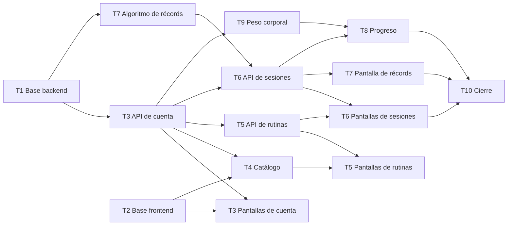

# Plan de trabajo — GymRutine

Qué le toca a cada integrante, en qué orden, qué necesita y cómo saber que terminó. Cubre los 4 sprints del corte 2.

**Orden de lectura para empezar:**

1. [Guía de inicio](GUIA-INICIO.md): instalar las herramientas, crear la base de datos y clonar el repo.
2. Este plan: qué te toca y en qué rama.
3. [Guía de git](GUIA-GIT.md): cómo trabajar día a día (pull, commits, push, pull requests y conflictos).

**Las fuentes de verdad son el [contrato de API](docs/CONTRATO-API.md) y el [modelo de datos](docs/MODELO-DATOS.md).** Si algo de este plan los contradice, mandan ellos. Se cambian solo si lo acordamos los tres, y primero en el documento y después en el código.

## Resumen

| Tarea | Responsable | Sprint | Entrega | Historias | Depende de |
|---|---|---|---|---|---|
| **T0** Documentación inicial | Rances (revisan Javier y Santiago) | 1 | Estos documentos | — | — |
| **T1** Base del backend | Rances | 1 | Esqueleto, MySQL, el modelo completo (10 tablas), errores, CORS, referencias y catálogo base | — | — |
| **T2** Base del frontend | Javier | 1 | Páginas, estilos, `api.js`, `auth.js`, `ui.js` y navegación | — | — |
| **T3** Cuenta y perfil | Rances | API: 1 · Pantallas: 2 | Registro, inicio y cierre de sesión, perfil e interceptor | H1–H4 | T1; las pantallas, también T2 |
| **T4** Catálogo de ejercicios | Javier | 2 | Ejercicios propios, filtros y pantalla del catálogo | H5–H9 | T3 API, T2 |
| **T5** Rutinas | Javier | API: 2 · Pantallas: 3 | CRUD de rutinas y constructor | H10–H13 | T3 API; las pantallas, también T4 |
| **T6** Sesiones de entrenamiento | Santiago | API: 2 · Pantallas: 3 | Registrar, prellenar, historial, detalle y eliminar | H14–H17 | T3 API, T7 algoritmo; las pantallas, también T5 API |
| **T7** Récords personales | Santiago | Algoritmo: 1–2 · Pantalla: 4 | Recálculo con pruebas, `GET /records` y pantalla | H18, H19 | T1 |
| **T8** Progreso por ejercicio | Javier | 4 | API de progreso y gráfica | H20 | T6 API, T9 |
| **T9** Peso corporal | Rances | 3 | Registro de peso y gráfica | H21, H22 | T3 API, T2 |
| **T10** Cierre | Rances, con todos | 4 | Inicio, colección de Postman, datos de demostración, pulido y sustentación | — | Todas |

## Por sprint

| Sprint | Peso | Rances | Javier | Santiago |
|---|---|---|---|---|
| **1** | 5 % | T1 → T3 API | T2 | Revisar los documentos → T7 algoritmo (cuando T1 esté en `main`) |
| **2** | 5 % | T3 pantallas | T4 → T5 API | T6 API, con el recálculo de T7 conectado |
| **3** | 10 % | T9 | T5 pantallas | T6 pantallas |
| **4** | 10 % | T10 | T8 | T7 pantalla → apoyo en T10 |

### Calendario

| Sprint | Inicio | Cierre | Entrega al profesor |
|---|---|---|---|
| 1 | _por definir_ | _por definir_ | _por definir_ |
| 2 | _por definir_ | _por definir_ | _por definir_ |
| 3 | _por definir_ | _por definir_ | _por definir_ |
| 4 | _por definir_ | _por definir_ | _por definir_ |

Las fechas se llenan con el cronograma del curso (decisión pendiente D7 en [IDEA.md](docs/IDEA.md)).

## Orden de trabajo

### ¿Quién depende de quién?

| Tarea | Puede empezar | Espera a | Quién la espera |
|---|---|---|---|
| T1 | Ya | Nadie | Todo el backend |
| T2 | Ya | Nadie | Todas las pantallas |
| T3 API | Cuando T1 esté en `main` | T1 | T4, T5, T6 y T9 (necesitan un token para probar) |
| T7 algoritmo | Cuando T1 esté en `main` | T1 | T6 API |
| T3 pantallas | Cuando T2 y T3 API estén en `main` | T2, T3 API | Nadie (sin ellas, el token se pone a mano; ver T2) |
| T4 | Cuando T3 API esté en `main` | T3 API, T2 | T5 pantallas (selector de ejercicios) |
| T5 API | Cuando T3 API esté en `main` | T3 API | T5 pantallas y T6 pantallas (para datos reales) |
| T6 API | Cuando T3 API y T7 algoritmo estén en `main` | T3 API, T7 algoritmo | T6 pantallas, T7 pantalla y T8 |
| T5 pantallas | Cuando T4 y T5 API estén en `main` | T4, T5 API | Nadie |
| T6 pantallas | Cuando T6 API esté en `main` | T6 API (y T5 API para datos reales) | T10 |
| T9 | Cuando T3 API y T2 estén en `main` | T3 API, T2 | T8 (reutiliza el patrón de gráfica) |
| T7 pantalla | Cuando T6 API esté en `main` | T6 API | T10 |
| T8 | Cuando T6 API y T9 estén en `main` | T6 API, T9 | T10 |
| T10 | Sprint 4 | Todas | — |

- **T1 y T3 API son el cuello de botella del sprint 1.** Mientras no estén en `main`, Javier y Santiago avanzan en lo que no las necesita: T2, la revisión de los documentos y el algoritmo de récords, que se puede escribir y probar sin base de datos.
- **"Para datos reales"** significa que la pantalla se puede construir antes, pero solo se termina cuando el endpoint que usa ya está en `main`. Mientras tanto, los datos de prueba se crean con Postman.
- **Todas las entidades las crea T1.** Ninguna otra tarea crea entidades nuevas, así nadie escribe su propia versión de `Rutina`. Si una tarea necesita cambiar el modelo, primero se actualiza [MODELO-DATOS.md](docs/MODELO-DATOS.md) en un PR pequeño.

---

## Metodología: Scrum adaptado a 3 personas

Usamos Scrum, que es la metodología del curso (temario §4). Con 3 personas, cada uno cumple más de un rol y los eventos son cortos.

### Roles

| Rol | Quién | Responsabilidad |
|---|---|---|
| Product Owner | Rances | Mantiene y prioriza el Product Backlog; acepta o devuelve cada historia comparándola con sus criterios |
| Scrum Master | Rota: Javier en los sprints 1 y 3, Santiago en los sprints 2 y 4 | Facilita la planeación y la retrospectiva, detecta bloqueos y mantiene el tablero al día |
| Equipo de desarrollo | Los tres | Construye el incremento. Cada uno responde por sus tareas |

> Es una propuesta: se confirma en la planeación del sprint 1.

### Eventos

| Evento | Cuándo | Duración | Resultado |
|---|---|---|---|
| Planeación del sprint | Primer día del sprint | 45 min | Sprint Backlog: las tarjetas del sprint en el tablero, cada una con responsable |
| Daily | Días de clase, por escrito en el grupo del equipo | 5 min | Cada uno responde: qué hice, qué haré y qué me bloquea |
| Revisión del sprint | Antes de la entrega al profesor | 30 min | Demostración contra los criterios de aceptación; historias aceptadas o devueltas |
| Retrospectiva | Después de la revisión | 15 min | Una cosa que funcionó, una que no y un cambio concreto, anotados en [Retrospectivas](#retrospectivas) |

### Artefactos

| Artefacto | Dónde está |
|---|---|
| Product Backlog | [docs/HISTORIAS.md](docs/HISTORIAS.md) y una issue de GitHub por historia |
| Sprint Backlog | Tablero de GitHub Projects, filtrado por la etiqueta del sprint |
| Incremento | Lo que está en `main` al cierre del sprint, marcado con la etiqueta de git `sprint-N` |
| Definición de terminado | [Sección de este plan](#definición-de-terminado) |

### Tablero en GitHub Projects

Columnas: **Backlog → Por hacer → En progreso → En revisión → Hecho**

- **Una issue por historia** (H1 a H22) y una por cada tarea sin historia (T0, T1, T2 y T10).
- **Etiquetas:** `sprint-1` a `sprint-4`, `backend`, `frontend`, `documentacion` y `error`.
- **Errores:** todo error encontrado se registra como issue con la etiqueta `error`, con qué pasó, los pasos para reproducirlo y qué se esperaba. Es el seguimiento de errores e incidencias que pide el curso.
- **Una tarjeta pasa a "En revisión"** cuando su pull request está abierto, y **a "Hecho"** cuando se une a `main` y cumple la definición de terminado.

### Retrospectivas

| Sprint | Funcionó | No funcionó | Cambio para el siguiente sprint |
|---|---|---|---|
| 1 | | | |
| 2 | | | |
| 3 | | | |
| 4 | | | |

---

## Cómo trabajamos con git

**Nadie trabaja directo en `main`.** Cada parte de una tarea vive en su propia rama y entra a `main` con un *pull request* (PR) que revisa otro integrante. El paso a paso está en la [guía de git](GUIA-GIT.md).

| Tarea | Ramas (una por PR) |
|---|---|
| T0 | `t0-documentacion` |
| T1 | `t1-base-backend` |
| T2 | `t2-base-frontend` |
| T3 | `t3-cuenta-api` · `t3-cuenta-pantallas` |
| T4 | `t4-catalogo-api` · `t4-catalogo-pantalla` |
| T5 | `t5-rutinas-api` · `t5-rutinas-pantallas` |
| T6 | `t6-sesiones-api` · `t6-sesiones-pantallas` |
| T7 | `t7-records-algoritmo` · `t7-records-pantalla` |
| T8 | `t8-progreso` |
| T9 | `t9-peso-corporal` |
| T10 | `t10-cierre` (se puede dividir en varias ramas) |
| Cambios de documentación | `docs-<tema>`, por ejemplo `docs-contrato-rutinas` |

**Quién revisa a quién:** Rances revisa los PR de Javier y de Santiago; Javier y Santiago se turnan para revisar los de Rances. **El PR del algoritmo de récords (T7) lo revisan los dos compañeros**, porque es la regla central del proyecto y la que más se va a preguntar en la sustentación.

---

## Convenciones del backend

- **Paquetes por capa** dentro de `co.edu.uis.gymrutine`: `config`, `controller`, `dto`, `error`, `model`, `repository`, `seguridad` y `service` ([ARQUITECTURA.md](docs/ARQUITECTURA.md) §3).
- **Nombres:** el dominio y los métodos en español (`Rutina`, `registrar`); los sufijos técnicos en inglés (`Controller`, `Service`, `Repository`, `Request`, `Response`). Sin tildes ni ñ en los identificadores (`contrasena`, `SesionEntrenamiento`).
- **Entidades = clases JPA; DTOs = records.** Nunca se devuelve una entidad por la API. Cada `Response` tiene un método estático `desde(entidad)`.
- **Entidades sin setters públicos.** Cambian con métodos del dominio: `actualizar(...)`, `desactivar()`, `marcarRecord(...)`. El constructor sin argumentos que exige JPA es `protected`.
- **Inyección por constructor**, con campos `final`. Nada de `@Autowired` sobre campos.
- **Todas las rutas empiezan por `/api`**, en el `@RequestMapping` de cada controller.
- **Validación en los `Request`**, con el mensaje escrito en español (`message = "..."`). Si no se escribe, el mensaje sale en el idioma del cliente y el mismo error puede llegar en inglés.
- **No poner `@Validated` en la clase del controller:** cambia el tipo de excepción que lanza Spring al validar parámetros, el manejador global no la atraparía y el cliente recibiría un 500 en lugar de un 400.
- **Errores:** se lanzan las excepciones del paquete `error` con el código del [contrato](docs/CONTRATO-API.md) §10. No se arman respuestas de error a mano en los controllers.
- **El usuario autenticado lo entrega el interceptor** (ver T3). Nunca se toma de la URL ni del cuerpo.
- **Transacciones:** `@Transactional` en los métodos de servicio que escriben, y `@Transactional(readOnly = true)` en los que leen y convierten a DTO.
- **Pesos con `BigDecimal`**, comparados con `compareTo` y no con `equals` (`60` y `60.00` no son `equals`).
- **Pruebas:** la regla de récords con pruebas unitarias JUnit que no necesitan MySQL; la capa web con `@WebMvcTest`, siguiendo el ejemplo de T1.
- **Documentación del código:** cada clase lleva un Javadoc (`/** ... */`) que explica qué papel cumple, y cada método no evidente dice qué regla aplica (R1 a R10 del modelo). No se comenta lo obvio. Si cambias un código, actualiza su comentario.
- **Postman:** cada endpoint nuevo se agrega a la colección `postman/GymRutine.postman_collection.json` en el mismo PR.

## Convenciones del frontend

- **Sin frameworks:** HTML, CSS y JavaScript. Un HTML y un JS por pantalla ([ARQUITECTURA.md](docs/ARQUITECTURA.md) §6).
- **Ningún `fetch` fuera de `api.js`.**
- **Nombres** de archivos en minúsculas; funciones y variables en español y `camelCase` (`cargarRutinas`, `pintarSeries`).
- **Sin estilos en línea:** todo va en `css/estilos.css`, con clases compartidas para botones, tarjetas, campos, chips y estados.
- **`localStorage` solo guarda** `gymrutine.token`, `gymrutine.usuario` y `gymrutine.borrador.<rutinaId>`.
- **Chart.js 4.5.1** se carga desde un CDN con la versión fijada, solo en `peso.html` y `progreso.html`.
- **Probar a 360 px** con el modo dispositivo de las herramientas de desarrollo del navegador y, antes del cierre de cada sprint, en un celular real.
- **Sin `console.log` olvidados** en los PR.

## Definición de terminado

**Tareas de backend:**

- [ ] Compila y `./mvnw test` pasa (con MySQL encendido)
- [ ] Probado en Postman contra el contrato: mismos campos, códigos de estado y errores
- [ ] Peticiones nuevas agregadas a la colección de Postman
- [ ] Tablas y columnas coinciden con [MODELO-DATOS.md](docs/MODELO-DATOS.md)
- [ ] Reglas de negocio con prueba unitaria cuando la tarea tiene lógica (obligatorio en T7)
- [ ] Clases y métodos no evidentes documentados con Javadoc

**Tareas de frontend:**

- [ ] Cumple los [criterios de entrega del mockup](docs/mockup/README.md#criterios-de-entrega-del-frontend) y las reglas de su pantalla

**Todas:**

- [ ] Casilla de la historia marcada en el README
- [ ] PR revisado por otro integrante y unido a `main`
- [ ] Issue cerrada y tarjeta en "Hecho"

---

## T0 — Documentación inicial

**Responsable:** Rances · **Revisan:** Javier y Santiago · **Rama:** `t0-documentacion` · **Estado:** en revisión del equipo

- [x] [Informe inicial](docs/IDEA.md): problema, justificación, alcance, benchmark y decisiones
- [x] [Historias de usuario](docs/HISTORIAS.md) con diagrama de casos de uso
- [x] [Modelo de datos](docs/MODELO-DATOS.md): diagrama entidad-relación, diccionario, reglas y catálogo base
- [x] [Arquitectura](docs/ARQUITECTURA.md) con diagramas y decisiones
- [x] [Contrato de API](docs/CONTRATO-API.md)
- [x] [Mockup](docs/mockup/README.md) con las reglas de cada pantalla
- [x] Plan de trabajo, [guía de inicio](GUIA-INICIO.md) y [guía de git](GUIA-GIT.md)
- [ ] Revisión de Javier y Santiago: dudas y cambios resueltos antes de empezar T1
- [ ] Tablero de GitHub Projects creado, con una issue por historia

## T1 — Base del backend

**Responsable:** Rances · **Rama:** `t1-base-backend` · **Sprint:** 1

**Qué entrega**

- Proyecto Spring Boot en `backend/`, conectado a MySQL.
- Las 9 entidades JPA con sus relaciones, los 3 enumerados y los repositorios, fieles a [MODELO-DATOS.md](docs/MODELO-DATOS.md). Son 10 tablas porque `ejercicio_objetivo` no es una entidad: es la colección de objetivos dentro de `Ejercicio`.
- `GET /api/referencias`.
- `CargaCatalogoBase` con los 40 ejercicios de [MODELO-DATOS.md](docs/MODELO-DATOS.md) §9.
- `ManejadorGlobalErrores` con el formato `{codigo, mensaje, campos}` y las excepciones del contrato §10, con sus pruebas.
- `ConfiguracionWeb` con CORS para Live Server.
- Sección "Cómo ejecutar el backend" del README.

**Cómo**

- Generar el proyecto en https://start.spring.io con estas opciones:

  | Opción | Valor |
  |---|---|
  | Project | **Maven** (viene Gradle por defecto: hay que cambiarlo) |
  | Language | Java |
  | Spring Boot | 4.1.1 |
  | Group | `co.edu.uis` |
  | Artifact | `gymrutine` |
  | Package name | `co.edu.uis.gymrutine` |
  | Packaging | Jar |
  | Configuration | YAML |
  | Java | 21 |
  | Dependencies | Spring Web, Spring Data JPA, MySQL Driver, Validation |

- **`application.yml`:** conexión a `jdbc:mysql://localhost:3306/gymrutine` con el usuario `gymrutine` / `gymrutine` de la guía de inicio, `spring.jpa.hibernate.ddl-auto: update` y `spring.jpa.open-in-view: false`. Esto último hace que un acceso perezoso fuera de la transacción falle de inmediato en desarrollo, en lugar de ocultarse.
- **Enumerados con sus datos visibles:** cada valor de `Objetivo` lleva su nombre, descripción, series y repeticiones sugeridas; `GrupoMuscular` y `Equipo`, su nombre. `GET /referencias` los recorre, así los textos existen en un solo lugar.
- **Excepciones con código:** una clase base con el código y el estado HTTP, y una por tipo de respuesta (no encontrado, validación, conflicto, no editable y no autenticado). Cada tarea las lanza con el código del contrato.
- **Carga del catálogo base idempotente:** por cada ejercicio de la lista, se inserta solo si no existe un ejercicio base (sin usuario) con ese nombre.
- **CORS** en `ConfiguracionWeb` para `/api/**`: orígenes `http://localhost:5500` y `http://127.0.0.1:5500`; métodos GET, POST, PUT, DELETE y OPTIONS; cabeceras `Content-Type` y `Authorization`.
- **Piezas compartidas**, para que nadie cree los mismos archivos al mismo tiempo:
  - Todas las entidades y repositorios.
  - `EjercicioResumenResponse` (`id`, `nombre`, `grupoMuscular`, `equipo`, `activo`), que usan rutinas, sesiones, récords y progreso.
  - Las excepciones con código.

**Cómo verificar**

| Caso | Esperado |
|---|---|
| `./mvnw spring-boot:run` con MySQL encendido | Arranca sin errores en el puerto 8080 |
| Esquema `gymrutine` en MySQL Workbench | Aparecen las 10 tablas, con las columnas y claves de MODELO-DATOS §4 |
| Arrancar la aplicación dos veces | El catálogo base sigue con 40 ejercicios, sin duplicados |
| `GET /api/referencias` | 200 con 3 objetivos, 8 grupos musculares y 6 equipos, con sus nombres visibles |
| Petición con JSON mal formado a un endpoint de prueba | 400 `VALIDACION_FALLIDA` con el formato del contrato |
| `./mvnw test` | `BUILD SUCCESS` |
| Petición desde una página servida por Live Server | Sin errores de CORS en la consola del navegador |

## T2 — Base del frontend

**Responsable:** Javier · **Rama:** `t2-base-frontend` · **Sprint:** 1

**Qué entrega**

- Carpeta `frontend/` con `index.html` y las 14 páginas del mockup, cada una con su título, la navegación y un contenido provisional.
- `css/estilos.css` con los estilos compartidos.
- `js/api.js`, `js/auth.js`, `js/ui.js` y `js/referencias.js`.

**Cómo**

- **`api.js`:**
  - La URL base (`http://localhost:8080/api`) en una sola constante.
  - Funciones para GET, POST, PUT y DELETE que agregan `Authorization: Bearer` si hay token y convierten el JSON.
  - Ante un error, lanzan un objeto con `estado`, `codigo`, `mensaje` y `campos`.
  - Ante 401 `NO_AUTENTICADO`, borran el token y llevan a `login.html`.
  - Si la petición no llega al servidor, lanzan un error "sin conexión" que se distingue de los demás.
- **`auth.js`:** guarda, lee y borra el token y el usuario (`gymrutine.token`, `gymrutine.usuario`). `protegerPagina()` se llama al inicio de cada página privada y redirige a `login.html` si no hay token.
- **`ui.js`:** muestra los estados compartidos del mockup; pinta los errores de `campos` junto a cada campo; formatea kilos y fechas en formato colombiano (`Intl.NumberFormat` con `es-CO`); interpreta números escritos con coma.
- **`referencias.js`:** pide `/referencias` una vez, la guarda en `sessionStorage` y ofrece funciones para obtener el nombre visible de un código.
- **`estilos.css`:** diseño primero para celular (360 px); botones y campos de al menos 44 px; tarjetas, chips, tablas y estados; barra de navegación inferior que desde 768 px pasa a la parte superior. Colores provisionales en variables CSS hasta cerrar D6.
- **Para probar páginas privadas antes de que existan las pantallas de T3:** iniciar sesión con Postman, copiar el token y guardarlo a mano desde la consola del navegador con `localStorage.setItem("gymrutine.token", "<token>")`.

**Cómo verificar**

| Caso | Esperado |
|---|---|
| Abrir `index.html` con Live Server, sin token | Redirige a `login.html` |
| Cualquier página a 360 px de ancho | Sin scroll horizontal y con la barra de navegación inferior |
| Cualquier página a 1024 px | Navegación arriba y contenido centrado |
| Una petición con el backend apagado | Se ve el estado "No se pudo conectar con el servidor" |
| Una petición que responde 401 | Se borra el token y se llega a `login.html` |
| Un selector de objetivo de prueba | Muestra "Pérdida de peso", no `PERDIDA_PESO` |

## T3 — Cuenta y perfil (Historias 1 a 4)

**Responsable:** Rances · **Ramas:** `t3-cuenta-api` (sprint 1) y `t3-cuenta-pantallas` (sprint 2)

**Qué entrega**

- `POST /api/auth/registro`, `POST /api/auth/login`, `POST /api/auth/logout`, `GET /api/usuarios/me` y `PUT /api/usuarios/me` (contrato §3).
- `InterceptorAutenticacion`, registrado en `ConfiguracionWeb`.
- Pantallas P1 (iniciar sesión), P2 (crear cuenta) y P14 (perfil).

**Cómo**

- **Dependencia `spring-security-crypto`** agregada a mano en el `pom.xml`, sin versión: la maneja Spring Boot. Solo se usa `BCryptPasswordEncoder` para cifrar y comparar. **No** se agrega `spring-boot-starter-security`.
- **Email normalizado** (sin espacios alrededor y en minúsculas) antes de buscar o guardar.
- **Contraseña:** además de 8 a 72 caracteres, se valida que no supere 72 bytes en UTF-8 (límite de BCrypt).
- **Token:** `UUID.randomUUID()`, con vencimiento a 7 días. Al iniciar sesión se borran los tokens vencidos de ese usuario.
- **Interceptor:**
  - Protege `/api/**` excepto `/api/auth/registro`, `/api/auth/login` y `/api/referencias`.
  - **Deja pasar las peticiones `OPTIONS`** (verificación previa de CORS).
  - Lee la cabecera `Authorization: Bearer <token>` y busca un token vigente. Si no lo hay, lanza la excepción de no autenticado y el manejador global responde 401.
  - Si el token es válido, guarda el id del usuario en el atributo de la petición **`usuarioId`**.
- **Cómo lo usan las demás tareas:** los controllers reciben el usuario con `@RequestAttribute("usuarioId") Long usuarioId`. Esta es la pieza de la que dependen T4 a T9: queda explicada en el Javadoc del interceptor.
- **Pantallas:** siguen las reglas de P1, P2 y P14 del mockup.

**Cómo verificar**

| Caso | Esperado |
|---|---|
| Registro válido | 201 con token y usuario; en MySQL, `contrasena_hash` empieza por `$2` y mide 60 |
| Registro con un email ya usado, escrito en mayúsculas | 409 `EMAIL_YA_REGISTRADO` |
| Registro con contraseña de 7 caracteres | 400 con `campos.contrasena` |
| Login correcto | 200 con token |
| Login con contraseña incorrecta, o con un email que no existe | 401 `CREDENCIALES_INVALIDAS`, con el mismo mensaje en los dos casos |
| `GET /api/usuarios/me` sin token | 401 `NO_AUTENTICADO` |
| `GET /api/usuarios/me` con un token vencido (cambiar `fecha_expiracion` en Workbench) | 401 `NO_AUTENTICADO` |
| Logout y luego usar el mismo token | 204 y después 401 |
| `GET /api/referencias` sin token | 200 |
| Petición desde Live Server con token | Sin error de CORS: el `OPTIONS` previo no recibe 401 |
| `PUT /api/usuarios/me` con otro objetivo | 200, y `GET /api/usuarios/me` muestra el nuevo |
| Pantallas | Crear cuenta → inicio; cerrar sesión → iniciar sesión; volver a entrar con la misma cuenta |

## T4 — Catálogo de ejercicios (Historias 5 a 9)

**Responsable:** Javier · **Ramas:** `t4-catalogo-api` y `t4-catalogo-pantalla` · **Sprint:** 2

**Qué entrega**

- `GET /api/ejercicios` con filtros, `GET /api/ejercicios/{id}`, `POST`, `PUT` y `DELETE` (contrato §5).
- Pantalla P4 con el detalle y el formulario de ejercicio propio.

**Cómo**

- **Visibilidad (R1):** ejercicios activos cuyo usuario es nulo o es el autenticado. Con unas decenas de ejercicios por usuario, basta consultar los visibles y aplicar los filtros opcionales en el servicio. No hace falta un método del repositorio por cada combinación de filtros.
- **Duplicados:** se compara el nombre sin espacios alrededor y sin distinguir mayúsculas contra los ejercicios base y los propios activos. Al editar, se excluye el propio ejercicio.
- **Permisos (R2):** `PUT` o `DELETE` sobre un ejercicio base → 403 `EJERCICIO_NO_EDITABLE`. Sobre uno ajeno → 404. `PUT` sobre uno propio eliminado → 404.
- **`DELETE`:** usa `desactivar()`. Si ya estaba inactivo, responde 204 sin cambios.
- **`propio`** en la respuesta es `true` cuando el ejercicio tiene usuario.
- **Pantalla:** reglas de P4. La búsqueda por nombre se hace en el navegador.

**Cómo verificar**

| Caso | Esperado |
|---|---|
| `GET /api/ejercicios` sin filtros | Los 40 base más los propios activos, ordenados por nombre |
| `?grupoMuscular=PECHO` | Los 5 de pecho (más los propios de pecho) |
| `?objetivo=FUERZA&equipo=BARRA` | Solo los que cumplen los dos filtros |
| `?grupoMuscular=VOLAR` | 400 `VALIDACION_FALLIDA` |
| `POST` válido | 201 con `propio: true` |
| `POST` con nombre "press de banca con barra" | 409 `EJERCICIO_DUPLICADO` |
| `POST` con `objetivos: []` | 400 con `campos.objetivos` |
| `PUT` sobre un ejercicio base | 403 `EJERCICIO_NO_EDITABLE` |
| `GET` de un ejercicio propio de otro usuario | 404 `EJERCICIO_NO_ENCONTRADO` |
| `DELETE` de un propio | 204; ya no aparece en el listado y `GET /{id}` responde 200 con `activo: false` |
| `DELETE` repetido | 204 otra vez |

## T5 — Rutinas (Historias 10 a 13)

**Responsable:** Javier · **Ramas:** `t5-rutinas-api` (sprint 2) y `t5-rutinas-pantallas` (sprint 3)

**Qué entrega**

- `GET /api/rutinas`, `GET /api/rutinas/{id}`, `POST`, `PUT` y `DELETE` (contrato §6).
- Pantallas P5 (mis rutinas) y P6 (constructor).

**Cómo**

- **Validaciones de la lista en el servicio:** que no se repita ningún `ejercicioId` y que cada ejercicio sea visible y esté activo. Si no, 400 con `campos` apuntando a `ejercicios[i].ejercicioId`.
- **`PUT` reemplaza la colección:** se vacía la lista de la entidad y se agregan las filas nuevas; `orphanRemoval` borra las viejas. Por eso la unicidad se valida en el servicio y no en la base de datos (DM-10).
- **`ultimaSesion`:** la `fechaInicio` más reciente de las sesiones de esa rutina.
- **Rutina eliminada:** `GET` la devuelve con `activa: false`; `PUT` responde 404; `DELETE` repetido responde 204.
- **Pantallas:** reglas de P5 y P6. Las series y repeticiones sugeridas salen de `/referencias`.

**Cómo verificar**

| Caso | Esperado |
|---|---|
| `POST` con 3 ejercicios | 201; `orden` 1, 2 y 3 según el arreglo |
| `POST` con `seriesObjetivo: 11` | 400 |
| `POST` con el mismo ejercicio dos veces | 400 |
| `POST` con un ejercicio propio de otro usuario, o eliminado | 400 con `campos` |
| `PUT` quitando un ejercicio y reordenando los demás | 200 con exactamente la lista enviada |
| `GET /api/rutinas` | Solo las activas; `ultimaSesion: null` si nunca se entrenó |
| `DELETE` | 204; ya no aparece en el listado; `GET /{id}` → 200 con `activa: false` |
| `PUT` sobre una rutina eliminada | 404 `RUTINA_NO_ENCONTRADA` |
| `GET` de una rutina de otro usuario | 404 |
| Constructor: agregar un ejercicio con objetivo Resistencia | Llega prellenado con 3 × 15 |

## T6 — Sesiones de entrenamiento (Historias 14 a 17)

**Responsable:** Santiago · **Ramas:** `t6-sesiones-api` (sprint 2) y `t6-sesiones-pantallas` (sprint 3)

**Qué entrega**

- `POST /api/sesiones`, `GET /api/sesiones`, `GET /api/sesiones/{id}`, `DELETE /api/sesiones/{id}` y `GET /api/rutinas/{id}/ultimos-registros` (contrato §6 y §7).
- Pantallas P7 (entrenar), P8 (resumen), P9 (historial) y P10 (detalle).

**Cómo**

- **`POST`, en un método `@Transactional`:**
  1. Validar las reglas de R4.
  2. Construir la sesión con sus registros y series (`orden` y `numero` según la posición).
  3. Guardar.
  4. Llamar al recálculo de T7 por cada ejercicio de la sesión.
  5. Devolver el detalle.
- **Resumen y volúmenes (R7):** se calculan al construir el DTO, con `BigDecimal`.
- **`GET /sesiones`:** las sesiones del usuario se obtienen a través de la rutina (la sesión no guarda `usuario_id`), ordenadas por `fechaInicio` descendente.
- **`DELETE`, también transaccional:** anotar los ejercicios de la sesión, borrarla y **forzar el borrado en la base de datos (`flush`) antes de recalcular**. Si no, la consulta del recálculo todavía vería las series borradas.
- **`ultimos-registros`:** por cada ejercicio de la rutina, la sesión más reciente del usuario que lo incluye (en cualquier rutina) con sus series. `recordKg` es el mayor peso del usuario en ese ejercicio, si es mayor que 0.
- **Para probar la API antes de que T5 esté en `main`:** crear rutinas insertando filas en `rutina` y `rutina_ejercicio` desde MySQL Workbench.
- **Pantallas:** reglas de P7 a P10. Lo más delicado es el borrador en `localStorage` y el reintento al guardar.

**Cómo verificar**

| Caso | Esperado |
|---|---|
| `POST` válido | 201 con `resumen` y series con `esRecord` |
| `POST` con un ejercicio que no está en la rutina | 400 |
| `POST` con una rutina eliminada, o de otro usuario | 400 |
| `POST` con `fechaInicio` futura | 400 |
| `POST` con un registro sin series | 400 |
| `POST` con `pesoKg: 500.5` o `repeticiones: 0` | 400 con `campos` señalando la serie |
| `GET /api/sesiones` | Ordenadas de la más reciente a la más antigua, también si se registraron en otro orden |
| `GET /api/sesiones/{id}` de otro usuario | 404 `SESION_NO_ENCONTRADA` |
| `DELETE` | 204 y récords recalculados (casos de T7) |
| `ultimos-registros` de un ejercicio sin historial | `fechaInicio: null` y `series: []` |
| `ultimos-registros` con dos sesiones registradas en desorden | Devuelve la de `fechaInicio` más reciente, no la última guardada |
| Entrenar: recargar la página a mitad del entrenamiento | Se ofrece continuar el borrador y los datos siguen ahí |
| Entrenar: guardar con el backend apagado | Mensaje de error, botón Reintentar y ningún dato perdido |
| Entrenar: guardar de nuevo con el backend encendido | 201, resumen visible y borrador eliminado |

## T7 — Récords personales (Historias 18 y 19)

**Responsable:** Santiago · **Ramas:** `t7-records-algoritmo` (sprints 1 y 2) y `t7-records-pantalla` (sprint 4)

**Qué entrega**

- `RecordService` con el recálculo de la regla R6 ([MODELO-DATOS.md](docs/MODELO-DATOS.md) §6.1) y sus pruebas unitarias.
- `GET /api/records` (contrato §8).
- Pantalla P12.

**Cómo**

- **Separar el cálculo de la base de datos:** una función recibe las series de un ejercicio ya ordenadas (sesión, fecha, número y peso) y devuelve cuáles son récord. Esa función se prueba con JUnit sin MySQL, y es lo primero que se hace (sprint 1).
- **`recalcular(usuarioId, ejercicioId)`:** carga con una consulta JPQL las series del usuario en ese ejercicio (a través de sesión → rutina → usuario), ordenadas por `fechaInicio`, id de la sesión y `numero`; aplica la función y actualiza cada serie con `marcarRecord`.
- **Pruebas unitarias obligatorias:** los 7 casos de la tabla de MODELO-DATOS §6.1, más el ejemplo completo: S1 a S4, luego eliminar S3 y luego agregar la sesión del 06-sep.
- **`GET /records`:** por cada ejercicio, la serie con `esRecord` y el mayor peso. Se ordena por grupo muscular, en el orden de `/referencias`, y luego por nombre.
- **Pantalla:** reglas de P12.

**Cómo verificar**

| Caso | Esperado |
|---|---|
| Primera sesión de un ejercicio con 40 kg | Esa serie es récord |
| Siguiente sesión con 40 kg | No es récord |
| Sesión con 42,5 × 8 y 42,5 × 6 | Solo la primera serie de 42,5 es récord |
| Serie de 0 kg | Nunca es récord |
| Registrar una sesión con fecha anterior y más peso | Esa sesión pasa a ser récord y la posterior pierde el récord |
| Eliminar la sesión que tenía el récord | Una sesión posterior puede recuperar el récord |
| `GET /api/records` sin sesiones | 200 con `[]` |
| Un ejercicio hecho solo con 0 kg | No aparece en `GET /api/records` |

## T8 — Progreso por ejercicio (Historia 20)

**Responsable:** Javier · **Rama:** `t8-progreso` · **Sprint:** 4

**Qué entrega**

- `GET /api/progreso/ejercicios` y `GET /api/progreso/ejercicios/{id}` (contrato §8).
- Pantalla P11 con tabla y gráfica.

**Cómo**

- **Ejercicios con historial:** los que tienen al menos una serie del usuario, con la cantidad de sesiones distintas en que aparecen.
- **Puntos:** primero se verifica que el ejercicio sea visible (si no, 404). Luego, por cada sesión: peso máximo, volumen y si alguna serie es récord, en orden cronológico.
- **Pantalla:** primero la tabla y después la gráfica de línea con Chart.js, reutilizando la configuración común que deja T9 en `js/graficas.js`. Cambiar entre peso y volumen no vuelve a pedir datos a la API.

**Cómo verificar**

| Caso | Esperado |
|---|---|
| Ejercicio nunca registrado | No aparece en el selector |
| Ejercicio visible sin historial, pedido directo por id | 200 con `puntos: []` |
| Ejercicio propio de otro usuario | 404 `EJERCICIO_NO_ENCONTRADO` |
| Tres sesiones registradas en desorden | Los puntos salen en orden cronológico |
| Volumen de un punto | Coincide con la suma de peso × reps de ese ejercicio en esa sesión |
| Punto de una sesión récord | `esRecord: true` y se ve distinto en la gráfica |
| Chart.js no carga (probar sin internet) | La tabla sigue funcionando |

## T9 — Peso corporal (Historias 21 y 22)

**Responsable:** Rances · **Rama:** `t9-peso-corporal` · **Sprint:** 3

**Qué entrega**

- `GET /api/peso-corporal`, `POST` y `DELETE` (contrato §9).
- Pantalla P13 con formulario, gráfica y lista.
- `js/graficas.js` con la configuración común de Chart.js (formato colombiano en los ejes, colores y tamaño de los puntos), que después reutiliza T8.

**Cómo**

- **Fecha repetida:** se valida en el servicio antes de guardar y se responde 409 `PESO_YA_REGISTRADO`. La restricción única de la base de datos queda como respaldo.
- **Gráfica:** es la primera del proyecto, así que define el patrón de `graficas.js`.
- **Pantalla:** reglas de P13. La diferencia contra el registro anterior se calcula en el navegador.

**Cómo verificar**

| Caso | Esperado |
|---|---|
| `POST` válido | 201 |
| `POST` con una fecha ya registrada | 409 `PESO_YA_REGISTRADO` |
| `POST` con fecha futura, o con `pesoKg: 10` | 400 |
| `GET` | Registros en orden cronológico |
| `DELETE` de un registro de otro usuario | 404 `REGISTRO_PESO_NO_ENCONTRADO` |
| Pantalla con un solo registro | La gráfica muestra el punto sin errores |
| Pantalla sin registros | Invitación a registrar el primero |

## T10 — Cierre del corte

**Responsable:** Rances, con todos · **Rama:** `t10-cierre` · **Sprint:** 4

**Qué entrega**

- **P3 Inicio** completa, con los bloques de rutinas, última sesión, récords recientes y peso.
- **Colección de Postman ordenada** en `postman/`, por carpetas: Autenticación, Referencias, Ejercicios, Rutinas, Sesiones, Récords y progreso, y Peso corporal. Incluye un entorno `GymRutine local` con las variables `urlBase` y `token`; el token se llena solo al iniciar sesión, con un script de la pestaña de pruebas de Postman.
- **Datos de demostración:** una carpeta de la colección que, ejecutada con el Collection Runner, crea una usuaria de demostración, 3 rutinas, unas 18 sesiones de las últimas 6 semanas con cargas que progresan, y 6 registros de peso. Así las gráficas y los récords tienen sentido en la sustentación.
- **Pulido en celulares reales:** recorrer todas las pantallas en al menos un Android y, si hay, un iPhone, y registrar como issue con la etiqueta `error` lo que falle.
- **Documentación final:** README con cómo ejecutar todo y el estado final, historial de cambios de cada documento y etiqueta `sprint-4`.
- **Ensayo de la sustentación:** cada integrante presenta su parte, y los tres pueden explicar la arquitectura y la regla de récords.

**Cómo verificar**

| Caso | Esperado |
|---|---|
| Base de datos recién creada + Collection Runner de "Datos de demostración" | Todas las peticiones responden lo esperado y la usuaria demo tiene gráficas con al menos 6 puntos |
| Recorrido completo: crear cuenta → crear rutina → entrenar → ver récord → ver progreso → registrar peso | Sin errores en la consola del navegador |
| Clonar el repo en un computador limpio y seguir la guía de inicio | La app corre sin pasos que no estén escritos |

---

_Última actualización: 2026-09-14_
