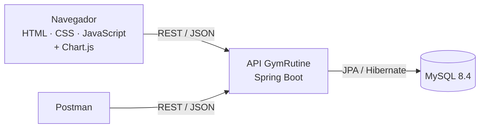

# 🏋️ GymRutine


**Entornos de Programación (24542)** · Universidad Industrial de Santander (UIS) · Corte 2: Proyecto Spring Boot + JavaScript

Aplicación web para personas que **entrenan solas en el gimnasio**: arman rutinas alineadas a su objetivo, registran cada serie que realmente hacen y ven su **progreso medible**, con la evolución de sus cargas en gráficas y récords personales que el sistema detecta solo.

## Qué hace

1. **Cuenta y objetivo:** cada usuario elige su objetivo (fuerza, pérdida de peso o resistencia), y eso ajusta las sugerencias.
2. **Catálogo de ejercicios:** 40 ejercicios base por grupo muscular y equipo, más los ejercicios propios de cada usuario.
3. **Rutinas:** ejercicios con series y repeticiones objetivo, prellenadas según el objetivo.
4. **Registro de sesiones:** peso y repeticiones de cada serie, prellenados con lo que se hizo la última vez.
5. **Récords personales automáticos:** el sistema detecta cuándo se supera la mejor marca en un ejercicio.
6. **Progreso:** gráfica de la evolución del peso levantado por ejercicio.
7. **Peso corporal:** registro y gráfica, para medir el progreso de quien busca bajar de peso.

## Arquitectura



Un solo backend en capas y un frontend que solo habla con él por la API. El detalle está en [ARQUITECTURA.md](docs/ARQUITECTURA.md).

## Documentación

**¿Eres del equipo y vas a empezar?** Lee en este orden: [guía de inicio](GUIA-INICIO.md) → [plan de trabajo](PLAN-DE-TRABAJO.md) → [guía de git](GUIA-GIT.md).

| Documento | Contenido |
|---|---|
| [Informe inicial](docs/IDEA.md) | Problema, justificación, alcance, benchmark contra GymTracker y decisiones del proyecto |
| [Historias de usuario](docs/HISTORIAS.md) | Product Backlog: 22 historias con criterios de aceptación y diagrama de casos de uso |
| [Modelo de datos](docs/MODELO-DATOS.md) | Diagrama entidad-relación, diccionario de datos, reglas de negocio y catálogo base |
| [Arquitectura](docs/ARQUITECTURA.md) | Stack con versiones, capas, autenticación, diagramas de secuencia y decisiones técnicas |
| [Contrato de API](docs/CONTRATO-API.md) | Endpoints, modelos y errores acordados entre frontend y backend |
| [Mockup](docs/mockup/README.md) | Las 14 pantallas con las reglas de cada una |
| [Plan de trabajo](PLAN-DE-TRABAJO.md) | Scrum adaptado, tareas por sprint, dependencias y cómo verificar cada tarea |
| [Guía de inicio](GUIA-INICIO.md) | Instalar las herramientas, crear la base de datos y arrancar el proyecto (Windows y macOS) |
| [Guía de git](GUIA-GIT.md) | Ramas, pull requests, conflictos y protección de `main` |

## Estructura del repositorio

```
├── docs/                 Documentación del proyecto
│   └── mockup/           Pantallas con sus reglas
├── backend/              API en Spring Boot (llega con la tarea T1)
├── frontend/             HTML, CSS y JavaScript (llega con la tarea T2)
├── postman/              Colección y entorno de Postman (llega con las tareas de la API)
├── GUIA-INICIO.md        Instalación y primer arranque
├── PLAN-DE-TRABAJO.md    Tareas del equipo
└── GUIA-GIT.md           Cómo trabajar con git
```

## Cómo ejecutar

> Todavía no hay código: el proyecto está en la fase de documentación inicial.

Cuando estén en `main` la base del backend (T1) y la del frontend (T2), los pasos serán los de la [guía de inicio](GUIA-INICIO.md) §5 y §6:

1. MySQL 8.4 encendido, con la base `gymrutine` creada.
2. Backend: `./mvnw spring-boot:run` desde `backend/` (en Windows, `.\mvnw.cmd spring-boot:run`) → http://localhost:8080/api/referencias
3. Frontend: `frontend/index.html` con Live Server → http://127.0.0.1:5500/frontend/index.html

## Estado

### Sprint 1 — Documentación y bases (5 %)

- [x] Documentación inicial: informe, historias, modelo de datos, arquitectura, contrato, mockup, plan y guías
- [ ] Revisión de la documentación por el equipo y tablero de GitHub Projects
- [ ] Base del backend (T1)
- [ ] Base del frontend (T2)
- [ ] API de cuenta (T3)
- [ ] Algoritmo de récords con pruebas (T7)

### Sprint 2 — Cuenta y catálogo (5 %)

- [ ] H1 — Crear cuenta
- [ ] H2 — Iniciar sesión
- [ ] H3 — Cerrar sesión
- [ ] H4 — Ver y editar mi perfil
- [ ] H5 — Explorar el catálogo de ejercicios
- [ ] H6 — Ver el detalle de un ejercicio
- [ ] H7 — Crear un ejercicio propio
- [ ] H8 — Editar un ejercicio propio
- [ ] H9 — Eliminar un ejercicio propio
- [ ] API de rutinas y API de sesiones (T5 y T6)

### Sprint 3 — Rutinas, entrenamiento y peso (10 %)

- [ ] H10 — Crear una rutina
- [ ] H11 — Ver mis rutinas
- [ ] H12 — Editar una rutina
- [ ] H13 — Eliminar una rutina
- [ ] H14 — Registrar una sesión de entrenamiento
- [ ] H15 — Ver el historial de sesiones
- [ ] H16 — Ver el detalle de una sesión
- [ ] H17 — Eliminar una sesión
- [ ] H18 — Detección automática de récords personales
- [ ] H21 — Registrar mi peso corporal
- [ ] H22 — Ver la evolución de mi peso corporal

### Sprint 4 — Progreso y cierre (10 %)

- [ ] H19 — Ver mis récords personales
- [ ] H20 — Ver el progreso de un ejercicio
- [ ] Inicio, colección de Postman y datos de demostración (T10)
- [ ] Pulido en celulares reales y documentación final
- [ ] Sustentación

## Equipo

| Integrante | Rol Scrum | Funcionalidades |
|---|---|---|
| Rances Ramírez | Product Owner · coordinador | Base del backend, cuenta y perfil, peso corporal, cierre |
| Javier | Scrum Master en los sprints 1 y 3 | Base del frontend, catálogo de ejercicios, rutinas, progreso |
| Santiago | Scrum Master en los sprints 2 y 4 | Sesiones de entrenamiento y récords personales |

Los tres trabajan en backend y frontend: cada uno se hace cargo de sus funcionalidades de punta a punta.
