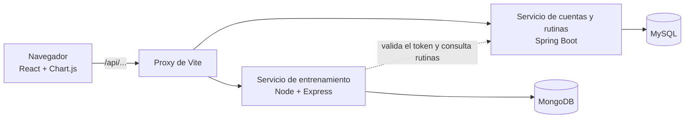

# 🏋️ GymRutine


**Entornos de Programación (24542)** · Universidad Industrial de Santander (UIS) · Entrega del sprint 2: **23 de septiembre** · Entrega final: **9 de octubre de 2026**

Aplicación web para personas que **entrenan solas en el gimnasio**: arman rutinas alineadas a su objetivo, registran cada serie que realmente hacen y ven su **progreso medible**, con la evolución de sus cargas en gráficas y récords personales que el sistema detecta solo.

## Qué hace

1. **Cuenta y objetivo:** cada usuario elige su objetivo (fuerza, pérdida de peso o resistencia), y eso ajusta las sugerencias.
2. **Catálogo de ejercicios:** 40 ejercicios base por grupo muscular y equipo, más los ejercicios propios de cada usuario.
3. **Rutinas:** ejercicios con series y repeticiones objetivo, prellenadas según el objetivo.
4. **Registro de sesiones:** peso y repeticiones de cada serie, prellenados con lo que se hizo la última vez.
5. **Corregir lo registrado:** una sesión o un registro de peso se pueden editar, y los récords se recalculan.
6. **Récords personales automáticos:** el sistema detecta cuándo se supera la mejor marca en un ejercicio.
7. **Progreso:** gráfica de la evolución del peso levantado por ejercicio.
8. **Peso corporal:** registro y gráfica, para medir el progreso de quien busca bajar de peso.

## Arquitectura



**Microservicios:** dos servicios, cada uno con su propia base de datos. El de **cuentas y rutinas** (Spring Boot + JPA + MySQL) maneja usuarios, catálogo y rutinas. El de **entrenamiento** (Node.js + Express + MongoDB) maneja sesiones, récords, progreso y peso corporal. El frontend en React habla con los dos por la API. El detalle está en [ARQUITECTURA.md](docs/ARQUITECTURA.md).

## Documentación

**¿Eres del equipo y vas a empezar?** Lee en este orden: [guía de inicio](GUIA-INICIO.md) → [plan de trabajo](PLAN-DE-TRABAJO.md) → [guía de git](GUIA-GIT.md) → [guía de Jira](docs/guias/JIRA.md) → la guía de tu primera tarea ([T2](docs/guias/T2-FRONTEND.md) o [T3](docs/guias/T3-NODE.md)). Quién espera a quién está en el [plan](PLAN-DE-TRABAJO.md#quién-espera-a-quién).

| Documento | Contenido |
|---|---|
| [Plan de trabajo](PLAN-DE-TRABAJO.md) | Qué pide el curso, calendario hasta el 9 de octubre, un CRUD por integrante, quién espera a quién y cómo verificar cada tarea |
| [Evidencias](EVIDENCIAS.md) | Participación de cada integrante y trazabilidad del avance en Jira (entrega final) |
| [Informe inicial](docs/IDEA.md) | Problema, justificación, alcance, benchmark contra GymTracker y decisiones del proyecto |
| [Historias de usuario](docs/HISTORIAS.md) | Product Backlog: 24 historias con criterios de aceptación y diagrama de casos de uso |
| [Modelo de datos](docs/MODELO-DATOS.md) | Diagrama entidad-relación (MySQL), modelo de documentos (MongoDB), reglas de negocio y catálogo base |
| [Arquitectura](docs/ARQUITECTURA.md) | Los dos servicios, cómo se comunican, stack con versiones, diagramas y decisiones técnicas |
| [Contrato de API](docs/CONTRATO-API.md) | Los 29 endpoints, qué servicio atiende cada uno, modelos y errores |
| [Mockup en HTML](docs/mockup/mockup.html) | Cómo se ven las 14 pantallas, con sus reglas anotadas (se abre en el navegador) |
| [Reglas de las pantallas](docs/mockup/README.md) | Ruta, datos, validaciones y estados de cada pantalla |
| [Guía de inicio](GUIA-INICIO.md) | Instalar las herramientas, crear las bases de datos y arrancar todo (Windows y macOS) |
| [Guía de git](GUIA-GIT.md) | Ramas, pull requests, conflictos y protección de `main` |
| [Guía de Jira](docs/guias/JIRA.md) | Crear el proyecto, importar el backlog y llevar los sprints en Jira. El tablero está en [gymrutine-uis.atlassian.net](https://gymrutine-uis.atlassian.net/browse/GR) |
| [Guía de T2](docs/guias/T2-FRONTEND.md) | Paso a paso de la base del frontend y las pantallas de acceso, con el código probado (Javier) |
| [Guía de T3](docs/guias/T3-NODE.md) | Paso a paso de la base del servicio de entrenamiento, con el código probado (Santiago) |
| [Backlog para Jira](docs/guias/jira-backlog.csv) | Las 24 historias y las tareas del plan, listas para importar en Jira |
| [API falsa del servicio de cuentas](docs/guias/api-falsa-cuentas.mjs) | Imita el login y las rutinas del contrato para avanzar sin esperar al servicio real (`node docs/guias/api-falsa-cuentas.mjs`) |

## Estructura del repositorio

```
├── docs/                 Documentación del proyecto
│   ├── evidencias/       Capturas de Jira y de la app para EVIDENCIAS.md
│   ├── guias/            Guías de T2, T3 y Jira, el backlog para Jira y la API falsa
│   └── mockup/           Mockup en HTML y reglas de cada pantalla
├── backend-spring/       Servicio de cuentas y rutinas: Spring Boot + MySQL (tarea T1)
├── backend-node/         Servicio de entrenamiento: Node.js + Express + MongoDB (tarea T3)
├── frontend/             Aplicación de React con Vite (tarea T2)
├── postman/              Colección y entorno de Postman (tarea T11)
├── EVIDENCIAS.md         Participación y trazabilidad en Jira
├── GUIA-INICIO.md        Instalación y primer arranque
├── PLAN-DE-TRABAJO.md    Tareas del equipo
└── GUIA-GIT.md           Cómo trabajar con git
```

## Cómo ejecutar

Son cinco piezas. Las dos bases de datos arrancan solas con el computador; las otras tres van cada una en su terminal. El paso a paso está en la [guía de inicio](GUIA-INICIO.md) §5 y §6.

| Pieza | Comando | Dirección |
|---|---|---|
| MySQL 8.4 y MongoDB 8.0 | Servicios del sistema operativo | `localhost:3306` y `localhost:27017` |
| Servicio de cuentas | `./mvnw spring-boot:run` en `backend-spring/` (Windows: `.\mvnw.cmd spring-boot:run`) | http://localhost:8080/api/referencias |
| Servicio de entrenamiento | `npm run dev` en `backend-node/` | http://localhost:3000/salud |
| Frontend | `npm run dev` en `frontend/` | http://localhost:5173 |

## Estado

### Sprint 2 — Bases, login y Jira (21 al 23 de septiembre) · Entrega del sprint 2

- [x] Documentación: plan, informe, historias, modelo de datos, arquitectura, contrato, mockup en HTML y guías
- [x] Diseño de la base de datos ([MODELO-DATOS.md](docs/MODELO-DATOS.md))
- [x] Repositorio con Git
- [x] Proyecto en [Jira](https://gymrutine-uis.atlassian.net/browse/GR) con el backlog y los sprints
- [x] T1 Base del servicio de cuentas (Spring Boot + MySQL)
- [ ] T2 Base del frontend (React)
- [ ] T3 Base del servicio de entrenamiento (Node + MongoDB)
- [ ] H1 — Crear cuenta
- [ ] H2 — Iniciar sesión
- [ ] H3 — Cerrar sesión

### Sprint 3 — Las APIs (24 al 29 de septiembre)

- [ ] H4 — Ver y editar mi perfil
- [ ] H5 — Explorar el catálogo de ejercicios
- [ ] H6 — Ver el detalle de un ejercicio
- [ ] H7 — Crear un ejercicio propio
- [ ] H8 — Editar un ejercicio propio
- [ ] H9 — Eliminar un ejercicio propio
- [ ] H21 — Registrar mi peso corporal
- [ ] H22 — Ver la evolución de mi peso corporal
- [ ] H24 — Corregir un registro de peso
- [ ] API de rutinas, de sesiones y de récords; algoritmo de récords con pruebas

### Sprint 4 — Pantallas, evidencias y entrega final (30 de septiembre al 9 de octubre)

- [ ] H10 — Crear una rutina
- [ ] H11 — Ver mis rutinas
- [ ] H12 — Editar una rutina
- [ ] H13 — Eliminar una rutina
- [ ] H14 — Registrar una sesión de entrenamiento
- [ ] H15 — Ver el historial de sesiones
- [ ] H16 — Ver el detalle de una sesión
- [ ] H17 — Eliminar una sesión
- [ ] H23 — Editar una sesión
- [ ] H18 — Detección automática de récords personales
- [ ] H19 — Ver mis récords personales
- [ ] H20 — Ver el progreso de un ejercicio
- [ ] Inicio, colección de Postman y datos de demostración
- [ ] [Evidencias de participación y trazabilidad en Jira](EVIDENCIAS.md)
- [ ] Pulido en celulares reales y documentación final
- [ ] **Entrega final: viernes 9 de octubre**

## Equipo

| Integrante | Rol Scrum | Se hace cargo de | CRUD que presenta |
|---|---|---|---|
| Rances Ramírez | Product Owner · coordinador | Servicio de cuentas (base y autenticación), peso corporal, perfil, inicio, récords (pantalla), Jira e integración | Peso corporal |
| Javier | Scrum Master en los sprints 2 y 4 | Frontend (base, login y registro), catálogo y rutinas de punta a punta, pantalla de progreso | Rutinas |
| Santiago | Scrum Master en el sprint 3 | Servicio de entrenamiento: base, sesiones, récords y progreso, con sus pantallas | Sesiones de entrenamiento |

Los tres trabajan en backend y frontend: cada uno se hace cargo de sus funcionalidades de punta a punta.
