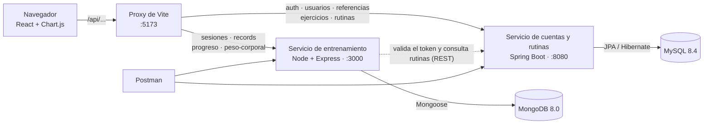
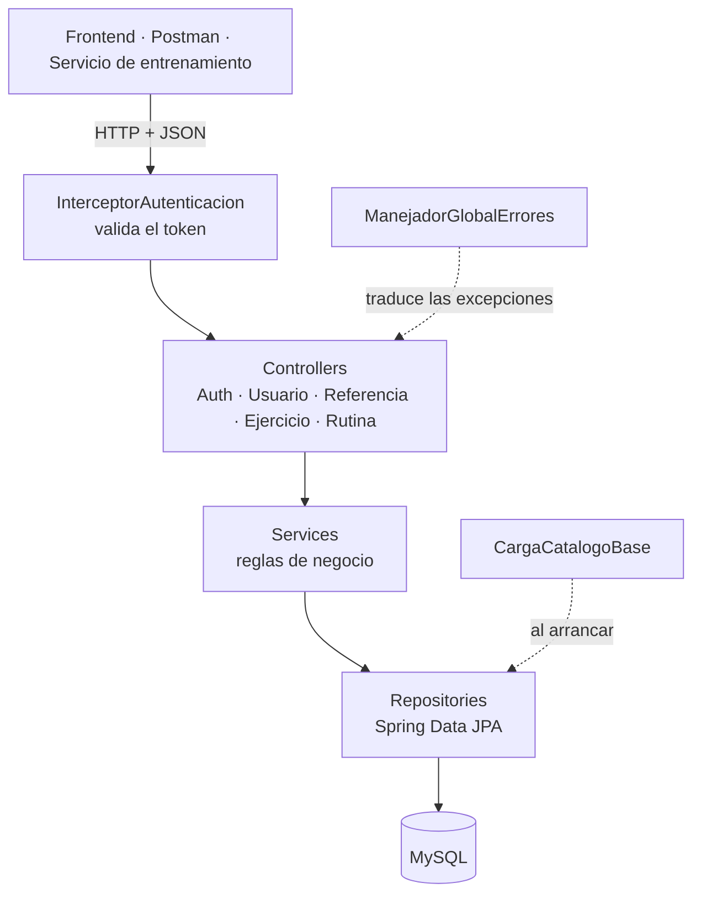
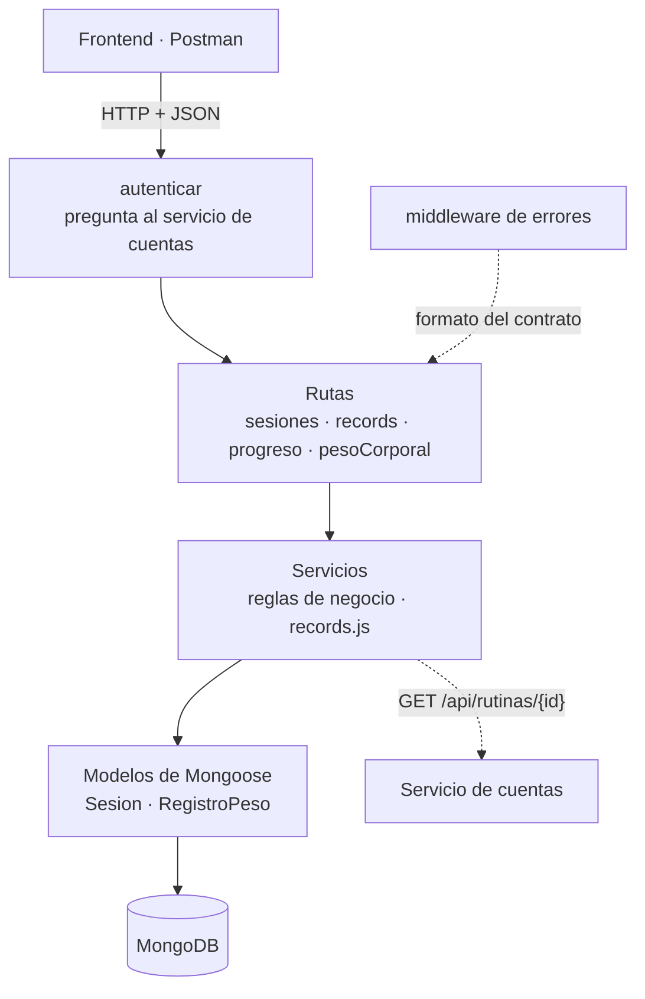
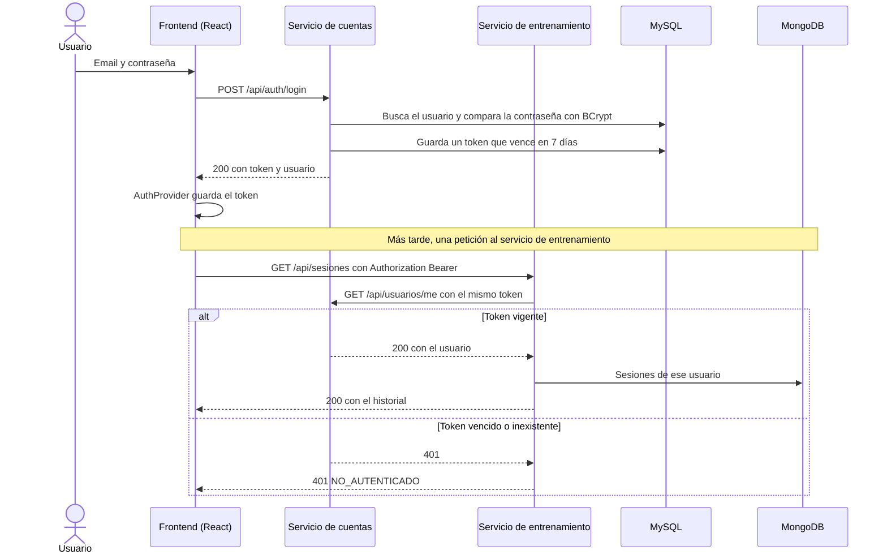
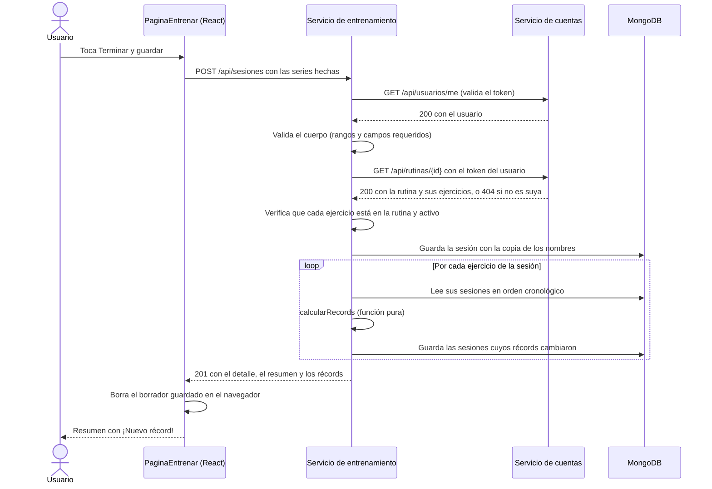
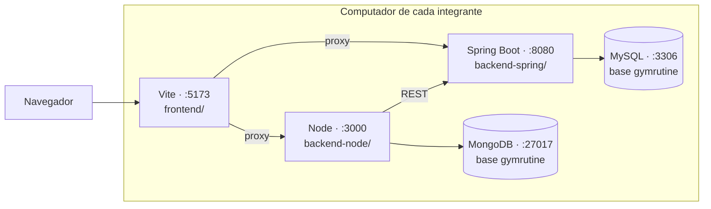

# Arquitectura — GymRutine

**Versión:** 2.2
**Fecha:** 2026-09-21

## 1. Vista general

GymRutine es una aplicación web con **arquitectura de microservicios** (temario §7.1): un frontend de React y **dos servicios**, cada uno con su propia base de datos. Así el proyecto usa todas las tecnologías del curso: Spring Boot con JPA y MySQL, y Node.js con Express y MongoDB.



- **El frontend solo habla con la API.** No conoce las bases de datos ni sabe que hay dos servicios: el proxy de Vite manda cada ruta al servicio que corresponde.
- **Cada servicio es dueño de sus datos.** Ninguno lee la base del otro: si el servicio de entrenamiento necesita saber algo de una rutina, se lo pregunta al servicio de cuentas por su API.

## 2. Servicios y responsabilidades

| Servicio | Tecnología | Es dueño de | Base de datos | Puerto | Carpeta |
|---|---|---|---|---|---|
| **Cuentas y rutinas** | Spring Boot 4.1 + JPA | Usuarios, sesiones iniciadas (tokens), catálogo de ejercicios y rutinas | MySQL 8.4 · 6 tablas | 8080 | `backend-spring/` |
| **Entrenamiento** | Node.js 24 + Express 5 + Mongoose | Sesiones de entrenamiento, récords, progreso y peso corporal | MongoDB 8.0 · 2 colecciones | 3000 | `backend-node/` |
| **Frontend** | React 19 + Vite 8 | Las 14 pantallas | — (solo `localStorage`) | 5173 | `frontend/` |

**Por qué este corte:** lo que se **planea** (catálogo y rutinas) es relacional y lo usan muchas partes, así que vive en MySQL con integridad referencial. Lo que se **ejecuta** (cada sesión con sus ejercicios y series) es un documento anidado que se escribe una vez y se lee completo: el caso ideal de MongoDB.

## 3. Stack y versiones

Versiones verificadas en las fuentes oficiales el **2026-09-21**. Se fijan para que los tres trabajen con lo mismo.

| Tecnología | Versión | Uso | ¿Se ve en clase? |
|---|---|---|---|
| Java (JDK Temurin) | 21 LTS | Servicio de cuentas | Sí |
| Spring Boot (Web, Data JPA, Validation) | 4.1.1 | Servicio de cuentas | Sí (temario §7) |
| Maven, con Maven Wrapper | el que trae el proyecto | Construcción del servicio de cuentas | Sí (§7.5) |
| spring-security-crypto | la de Spring Boot | **Solo** cifrar contraseñas con BCrypt | **No:** excepción justificada (DEC-07) |
| MySQL Community Server + Workbench | 8.4 LTS | Base del servicio de cuentas | Sí (§6) |
| Node.js | 24 LTS | Servicio de entrenamiento y herramientas del frontend | Sí (§8) |
| Express | 5.2 | Rutas del servicio de entrenamiento | Sí (§8.6) |
| Mongoose | 9.10 | Modelos y conexión con MongoDB | Sí (§8.5 y §8.6) |
| MongoDB Community Server + Compass | 8.0 · 1.50 | Base del servicio de entrenamiento | Sí (§9) |
| React | 19.3 | Interfaz de usuario | Sí (§10) |
| Vite | 8.3 | Crear, servir y compilar el frontend; proxy hacia los servicios | Herramienta para crear el proyecto (§10.1) |
| Oxlint | la que trae la plantilla de Vite | Revisar el código del frontend (`npm run lint`) | Viene con la plantilla de React de Vite |
| React Router | 8.4 | Navegación entre pantallas | Complemento estándar de React (confirmar, D8) |
| Chart.js | 4.5.1 | Gráficas de progreso y de peso | **No:** excepción justificada (DEC-08) |
| Postman | vigente | Pruebas de las dos APIs | Sí (§7.7) |
| Git y GitHub | vigente | Versiones, ramas y pull requests | Sí (§5) |
| Jira | plan Free | Tablero Scrum: backlog, sprints, errores y trazabilidad ([guía](guias/JIRA.md)) | Sí: lo pide el curso (§4) |

## 4. Servicio de cuentas y rutinas (Spring Boot)



- **Controller:** recibe la petición, valida la entrada y convierte entre HTTP y DTOs. No tiene reglas de negocio.
- **Service:** aplica las reglas de [MODELO-DATOS.md](MODELO-DATOS.md) §7 (visibilidad, permisos y borrado lógico). Las operaciones que escriben son transaccionales.
- **Repository:** interfaces de Spring Data JPA. **Model:** las entidades del modelo.
- **DTOs** (`...Request` y `...Response`): nunca se devuelve una entidad, para que un cambio en la base no cambie el contrato sin querer.
- **ManejadorGlobalErrores** convierte las excepciones al formato `{codigo, mensaje, campos}`. **CargaCatalogoBase** inserta los 40 ejercicios base al arrancar.

| Paquete (`co.edu.uis.gymrutine`) | Contiene |
|---|---|
| `config` | `ConfiguracionWeb` (registra el interceptor), `CargaCatalogoBase` |
| `controller` | Un controller por recurso |
| `dto` | Records de petición y respuesta |
| `error` | `ManejadorGlobalErrores`, `ErrorResponse` y las excepciones con código |
| `model` | Entidades JPA y enumerados |
| `repository` | Interfaces de Spring Data JPA |
| `seguridad` | `InterceptorAutenticacion` y el cifrado de contraseñas |
| `service` | Servicios con las reglas de negocio |

## 5. Servicio de entrenamiento (Node + Express)



```
backend-node/
├── package.json          "type": "module"; scripts dev, start y test
├── .env.ejemplo          PUERTO, MONGODB_URI y URL_SERVICIO_CUENTAS (el .env real no se sube)
├── src/
│   ├── index.js          conecta con MongoDB y arranca Express
│   ├── app.js            JSON, rutas, /salud y middleware de errores
│   ├── config/db.js      conexión con Mongoose
│   ├── errores.js        clase ErrorApi(estado, codigo, mensaje, campos)
│   ├── middlewares/
│   │   ├── autenticar.js valida el token con el servicio de cuentas
│   │   └── errores.js    responde {codigo, mensaje, campos}
│   ├── modelos/
│   │   ├── Sesion.js     colección "sesiones"
│   │   └── RegistroPeso.js  colección "registrosPeso"
│   ├── rutas/            sesiones.js, records.js, progreso.js, pesoCorporal.js
│   └── servicios/
│       ├── cuentas.js    cliente HTTP hacia el servicio de cuentas
│       ├── sesiones.js   registrar, listar, eliminar y últimos registros
│       └── records.js    regla de récords (función pura) y recálculo
└── test/
    └── records.test.js   pruebas con node --test
```

- **Rutas:** reciben la petición, validan la entrada, llaman a un servicio y responden. Equivalen a los controllers de Spring.
- **Servicios:** las reglas de negocio. `records.js` separa el cálculo (una función pura, fácil de probar) del acceso a MongoDB.
- **Modelos:** esquemas de Mongoose con sus validaciones e índices. Mongoose crea los índices al arrancar.
- **Sin librerías extra:** Node 24 lee el `.env` con `--env-file`, reinicia al guardar con `--watch`, trae `fetch` para llamar al otro servicio y `node --test` para las pruebas.

## 6. Comunicación entre servicios y autenticación

**El servicio de cuentas emite los tokens; el de entrenamiento los valida preguntándole.**



**Reglas:**

1. Las contraseñas se guardan como hash BCrypt, nunca en texto.
2. Al iniciar sesión o crear la cuenta se genera un token aleatorio (UUID) que se guarda en `token_acceso` y vence a los 7 días.
3. El frontend envía el token en `Authorization: Bearer <token>` a **cualquiera** de los dos servicios.
4. El servicio de cuentas protege todo `/api/**` excepto `POST /api/auth/registro`, `POST /api/auth/login` y `GET /api/referencias`.
5. El servicio de entrenamiento protege todas sus rutas con el middleware `autenticar`, que llama a `GET /api/usuarios/me` del servicio de cuentas con el mismo token. Si el servicio de cuentas no contesta, responde 503 `SERVICIO_NO_DISPONIBLE`.
6. **El usuario siempre sale del token**, nunca de la URL ni del cuerpo. Un recurso de otro usuario responde 404.
7. Cuando el servicio de entrenamiento necesita una rutina (al registrar una sesión), la pide con `GET /api/rutinas/{id}` **usando el token del usuario**: si la rutina es de otro usuario, el servicio de cuentas responde 404 y la sesión se rechaza.

**Limitaciones conocidas**, aceptables para un proyecto que corre en local y anotadas como trabajo futuro: el token se guarda tal cual en MySQL (en producción, su hash); no hay límite de intentos de inicio de sesión; cada petición al servicio de entrenamiento hace una llamada extra al de cuentas (se podría guardar la respuesta unos segundos); en desarrollo se usa HTTP sin cifrar.

## 7. Frontend (React)

Una aplicación de **React** creada con **Vite**, en JavaScript (sin TypeScript). Cada pantalla del [mockup](mockup/mockup.html) es una página con su propia ruta, construida con componentes compartidos.

```
frontend/
├── index.html                punto de entrada que usa Vite
├── package.json              dependencias fijadas y scripts: dev, build, lint
├── vite.config.js            proxy de /api hacia los dos servicios
└── src/
    ├── main.jsx              arranca React con el enrutador y la sesión
    ├── App.jsx               tabla de rutas y rutas protegidas
    ├── estilos.css           variables y clases del mockup, primero para celular
    ├── api/cliente.js        única puerta hacia la API: token, JSON y errores del contrato
    ├── auth/
    │   ├── contexto.js       el contexto de la sesión
    │   ├── AuthProvider.jsx  usuario y token disponibles en toda la app
    │   ├── useAuth.js        lee la sesión desde cualquier componente
    │   └── RutaPrivada.jsx   lleva a /login si no hay sesión iniciada
    ├── componentes/          Plantilla, BarraNavegacion, Icono, Cargando, EstadoVacio,
    │                         MensajeError, CampoFormulario, FilaSerie, GraficaLinea…
    ├── paginas/              una página por pantalla: PaginaLogin, PaginaEntrenar…
    └── utilidades/
        ├── formato.js        números y fechas en formato colombiano
        └── referencias.js    GET /referencias con caché
```

### Rutas y servicio que usa cada pantalla

| Pantalla | Ruta | Página | Servicios |
|---|---|---|---|
| P1 Iniciar sesión | `/login` | `PaginaLogin` | Cuentas |
| P2 Crear cuenta | `/registro` | `PaginaRegistro` | Cuentas |
| P3 Inicio | `/` | `PaginaInicio` | Cuentas y entrenamiento |
| P4 Catálogo de ejercicios | `/ejercicios` | `PaginaEjercicios` | Cuentas |
| P5 Mis rutinas | `/rutinas` | `PaginaRutinas` | Cuentas y entrenamiento (última vez) |
| P6 Constructor de rutina | `/rutinas/nueva` · `/rutinas/:id/editar` | `PaginaRutinaFormulario` | Cuentas |
| P7 y P8 Entrenar y resumen | `/rutinas/:id/entrenar` | `PaginaEntrenar` | Cuentas (rutina) y entrenamiento |
| P9 Historial | `/historial` | `PaginaHistorial` | Entrenamiento |
| P10 Detalle de sesión | `/historial/:id` | `PaginaSesion` | Entrenamiento |
| P11 Progreso por ejercicio | `/progreso` (`?ejercicio=` opcional) | `PaginaProgreso` | Entrenamiento |
| P12 Récords | `/progreso/records` | `PaginaRecords` | Entrenamiento (y referencias para agrupar) |
| P13 Peso corporal | `/progreso/peso` | `PaginaPeso` | Entrenamiento |
| P14 Perfil | `/perfil` | `PaginaPerfil` | Cuentas |

### El proxy de Vite hace de puerta de entrada

En desarrollo, el navegador solo habla con `localhost:5173`. El proxy de `vite.config.js` reenvía cada petición según su prefijo; **las reglas del servicio de entrenamiento van primero**, porque Vite usa la primera que coincide:

| Prefijo | Va a |
|---|---|
| `/api/sesiones`, `/api/records`, `/api/progreso`, `/api/peso-corporal` | Servicio de entrenamiento (`127.0.0.1:3000`) |
| `/api` (todo lo demás) | Servicio de cuentas (`127.0.0.1:8080`) |

Como para el navegador todo viene del mismo origen, **ningún servicio configura CORS**.

### Reglas del frontend

- **Toda comunicación con la API pasa por `api/cliente.js`.** Ningún componente llama a `fetch` directamente.
- **Estado global solo para la sesión** (`AuthProvider`, que se lee con `useAuth()`). No se usan librerías de estado ni de componentes. El contexto, el proveedor y el hook van en archivos separados porque Oxlint lo exige (regla `only-export-components`) para que funcione la recarga en caliente.
- **Ningún texto de enumerados escrito a mano:** los nombres visibles salen de `GET /referencias`.
- **Estados compartidos como componentes** (`Cargando`, `EstadoVacio`, `MensajeError`, `CampoFormulario`).
- **Primero para celular:** base a 360 px; desde 768 px, navegación superior y contenido centrado, como en el [mockup](mockup/mockup.html).
- **Formato colombiano** para números y fechas (`62,5 kg`, `1.935 kg`, `lun 14 sep`), aunque la API use punto decimal.
- **`localStorage`:** solo el token, el usuario y el borrador del entrenamiento en curso.
- **Chart.js solo dentro de `GraficaLinea`**, que crea la gráfica en un efecto y la destruye al desmontarse.

## 8. Flujo principal: registrar una sesión

Es el flujo que atraviesa los dos servicios y concentra la lógica de negocio.



**Sin transacciones:** MongoDB instalado en local, sin réplica, no hace transacciones entre documentos. Por eso el recálculo de récords se diseñó **idempotente**: siempre parte del historial completo del ejercicio, así que si falla después de guardar la sesión, el siguiente registro o eliminación deja todo correcto (DEC-18). Corregir o eliminar una sesión sigue el mismo camino: se guarda el cambio (o se borra el documento) y se recalculan los récords de sus ejercicios. Al corregir, el servicio de entrenamiento no vuelve a consultar la rutina, porque la sesión ya guarda la copia de los nombres.

## 9. Entorno de desarrollo



| Pieza | Dirección | Cómo se arranca |
|---|---|---|
| MySQL | `localhost:3306`, base `gymrutine` | Servicio del sistema operativo |
| MongoDB | `localhost:27017`, base `gymrutine` | Servicio del sistema operativo |
| Servicio de cuentas | `http://localhost:8080/api` | `./mvnw spring-boot:run` en `backend-spring/` |
| Servicio de entrenamiento | `http://localhost:3000/api` · salud en `/salud` | `npm run dev` en `backend-node/` |
| Frontend | `http://localhost:5173` | `npm run dev` en `frontend/` |

Son **cinco piezas**: las dos bases de datos arrancan solas con el computador y las otras tres se abren en tres terminales de VS Code. El paso a paso está en la [guía de inicio](../GUIA-INICIO.md).

**`127.0.0.1` entre programas:** el proxy de Vite y el servicio de entrenamiento se conectan a `127.0.0.1` y no a `localhost`. En Windows, `localhost` puede resolverse a la dirección IPv6 `::1`, y MongoDB solo escucha en IPv4. En el navegador, `localhost` funciona igual.

**API falsa del servicio de cuentas:** mientras el servicio de cuentas no tenga la autenticación, [`guias/api-falsa-cuentas.mjs`](guias/api-falsa-cuentas.mjs) ocupa su lugar en el puerto 8080 con las respuestas del contrato. Así el frontend y el servicio de entrenamiento avanzan sin esperarlo.

**Credenciales de desarrollo:** los tres usan el mismo usuario local de MySQL (`gymrutine` / `gymrutine`) y MongoDB sin usuario. Son **solo para desarrollo local**: nunca se usan en un servidor real.

## 10. Decisiones de arquitectura

| # | Decisión | Alternativas descartadas | Por qué |
|---|---|---|---|
| DEC-01 | **Dos servicios (microservicios) separados por responsabilidad:** cuentas y rutinas en Spring Boot; entrenamiento en Node | Un solo backend · un servicio por tecnología que duplique funciones · microservicios completos con gateway, registro de servicios y colas | El curso pide usar todas sus tecnologías y presenta la arquitectura de microservicios (§7.1). Dos servicios con una frontera clara (lo que se planea y lo que se ejecuta) muestran el concepto sin montar una infraestructura que no cabe en 19 días |
| DEC-02 | **Una base de datos por servicio:** MySQL para cuentas, catálogo y rutinas; MongoDB para el entrenamiento | Todo en MySQL · todo en MongoDB | Cada dato va al motor que le sienta. Lo que se planea necesita integridad referencial (una rutina apunta a ejercicios que existen). Una sesión es un documento anidado (ejercicios → series) que se escribe una vez y se lee completo, sin uniones entre tablas |
| DEC-03 | **MySQL 8.4 LTS** y **MongoDB 8.0**, con versiones fijadas | Versiones de innovación (MySQL 26.x, MongoDB 8.3) | Las versiones de soporte largo tienen más material de referencia. Fijarlas evita que cada integrante instale una distinta |
| DEC-04 | **Spring Boot 4.1.1 con Java 21** y **Node.js 24 LTS** | Java 25 · Node 22 | Son las versiones estables vigentes. Java 21 es el JDK que el equipo ya instaló para teambsoft; Node 24 trae de fábrica lo que en otras versiones exige librerías (DEC-17) |
| DEC-05 | **Maven con Maven Wrapper** | Gradle | Maven está en el temario (§7.5). start.spring.io propone Gradle por defecto: hay que cambiarlo al generar el proyecto |
| DEC-06 | **Token aleatorio guardado en MySQL**, validado por un interceptor en Spring; **Node lo valida preguntándole a Spring** (D4) | Spring Security completo · JWT compartido entre los dos servicios · sesión con cookie | Spring Security no está en el temario. Un JWT compartido exige una librería y un secreto en los dos servicios, y no se puede revocar antes de que venza. Con el token en una tabla, cerrar sesión lo invalida en los dos servicios al instante y hay una sola fuente de verdad |
| DEC-07 | **Contraseñas con BCrypt usando solo `spring-security-crypto`** | Guardarlas en texto · programar el cifrado a mano | Guardarlas en texto es inaceptable y programar el cifrado a mano es propenso a errores. Es una dependencia pequeña que no activa Spring Security: se usa para cifrar y para comparar |
| DEC-08 | **Chart.js dentro de un componente propio** (`GraficaLinea`) | Dibujar con `<canvas>` a mano · adaptadores de Chart.js para React | Dibujar ejes y escalas a mano no es evaluable. Chart.js solo visualiza; un componente propio evita sumar otra librería. Cada gráfica muestra también sus datos en una tabla |
| DEC-09 | **React con Vite** (D10) | JavaScript sin framework · Create React App · Next.js | React está en el temario (§10). Con 14 pantallas que comparten piezas, los componentes evitan repetir código. Create React App dejó de ser la opción recomendada por React en 2025; Vite es la herramienta vigente y el equipo ya la usó. Next.js agrega un servidor que no hace falta |
| DEC-10 | **Esquema de MySQL generado por Hibernate** (`ddl-auto: update`) e **índices de MongoDB creados por Mongoose** al arrancar | Scripts de migración (Flyway o Liquibase) | Las herramientas de migración no se ven en clase. Riesgo: `update` no borra ni renombra columnas, así que al cambiar el modelo cada integrante recrea su base local ([guía de inicio](../GUIA-INICIO.md) §8) |
| DEC-11 | **El mismo formato de error en los dos servicios:** `{codigo, mensaje, campos}` | Que cada servicio responda a su manera | El frontend maneja todos los errores con una sola función sin saber qué servicio respondió. Es el formato que el equipo ya usó en teambsoft |
| DEC-12 | **Sin funcionamiento sin conexión** (D1) | PWA con Service Worker | Las PWA no están en el temario. Mitigación: el entrenamiento en curso se guarda como borrador en el navegador y el guardado se reintenta |
| DEC-13 | **El usuario sale del token, no de la URL** | Rutas con el id del usuario | Con el id en la URL, bastaría cambiar un número para intentar leer datos ajenos |
| DEC-14 | **El proxy de Vite como puerta de entrada** en desarrollo | Un API gateway (como Kong) · CORS en los dos servicios | El proxy enruta por prefijo, igual que haría un gateway, sin instalar nada más. Como el navegador ve un solo origen, no hay que configurar CORS. En producción, ese papel lo cumpliría un gateway o un servidor web |
| DEC-15 | **La sesión guarda una copia de los nombres** de la rutina y de los ejercicios | Guardar solo los ids y pedir los nombres al servicio de cuentas al mostrar el historial | El historial se debe ver igual aunque la rutina o el ejercicio se renombren o se eliminen después, y sin una llamada extra por cada sesión. En bases de documentos, copiar los datos que se leen juntos es la forma normal de modelar |
| DEC-16 | **Node valida cada sesión preguntándole la rutina a Spring** con el token del usuario | Confiar en lo que manda el frontend · que Node lea MySQL directamente | Cada servicio es dueño de sus datos. Al usar el token del usuario, Spring aplica sus propias reglas de pertenencia: si la rutina es de otro, responde 404 y la sesión se rechaza |
| DEC-17 | **Node sin librerías extra:** solo Express y Mongoose, con módulos ES | dotenv, nodemon, axios o jest | Node 24 trae `--env-file`, `--watch`, `fetch` y `node --test`. Menos dependencias que instalar y explicar. Los módulos ES (`import`) son la misma sintaxis que usa React |
| DEC-18 | **Sin transacciones en MongoDB; recálculo de récords idempotente** | Configurar MongoDB como réplica de un nodo para tener transacciones | Esa configuración no se ve en clase. Como el recálculo siempre parte del historial completo del ejercicio, si falla a mitad, la siguiente escritura deja todo correcto |

## 11. Documentos relacionados

- [MODELO-DATOS.md](MODELO-DATOS.md): tablas de MySQL, colecciones de MongoDB, reglas de negocio y decisiones del modelo
- [CONTRATO-API.md](CONTRATO-API.md): endpoints de los dos servicios, modelos y errores
- [HISTORIAS.md](HISTORIAS.md): backlog con criterios de aceptación
- [mockup/mockup.html](mockup/mockup.html) y [mockup/README.md](mockup/README.md): pantallas con sus reglas

## 12. Historial de cambios

| Fecha | Cambio |
|---|---|
| 2026-09-14 | v1.0: versión inicial. Versiones verificadas: Spring Boot 4.1.1, Java 21, MySQL 8.4 LTS, Chart.js 4.5.1 |
| 2026-09-15 | v1.1: frontend con React 19 y Vite 8; proxy de Vite en lugar de CORS; tabla de rutas |
| 2026-09-21 | v2.0: el proyecto une los dos cortes y pasa a **dos servicios**: cuentas y rutinas (Spring Boot + MySQL) y entrenamiento (Node.js 24 + Express 5 + Mongoose 9 + MongoDB 8.0). Autenticación entre servicios, proxy hacia los dos y decisiones DEC-01, DEC-02, DEC-06 y DEC-14 a DEC-18 |
| 2026-09-21 | v2.1: la sesión de React se divide en `contexto.js`, `AuthProvider.jsx` y `useAuth.js`; Oxlint en el stack; React Router 8.4; conexiones entre programas por `127.0.0.1`; API falsa del servicio de cuentas para desarrollo |
| 2026-09-21 | v2.2: Jira reemplaza a GitHub Projects como tablero, como pide el curso. Corregir una sesión (`PUT /sesiones/{id}`) sigue el mismo camino de recálculo que registrarla o eliminarla |
