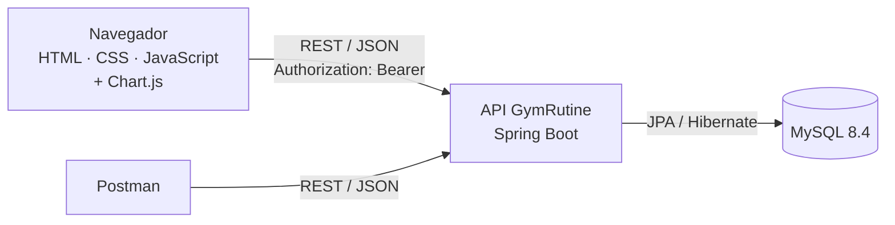
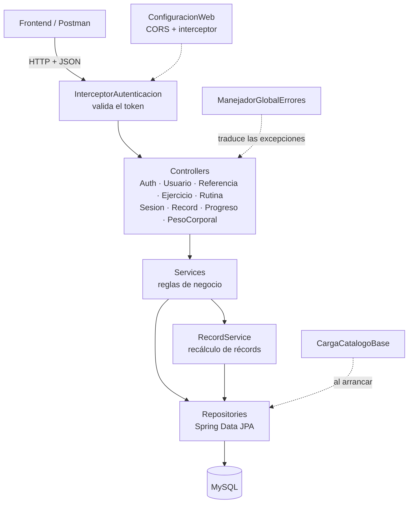
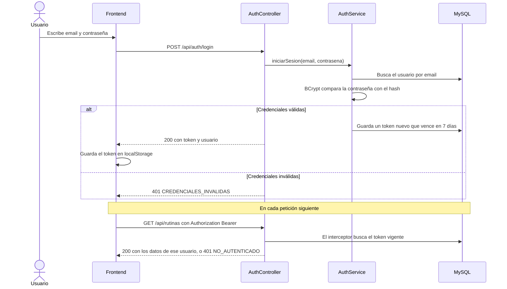
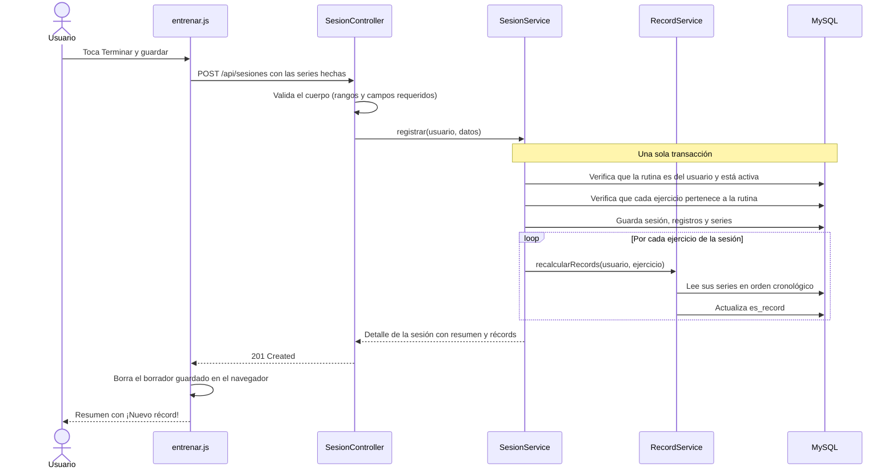
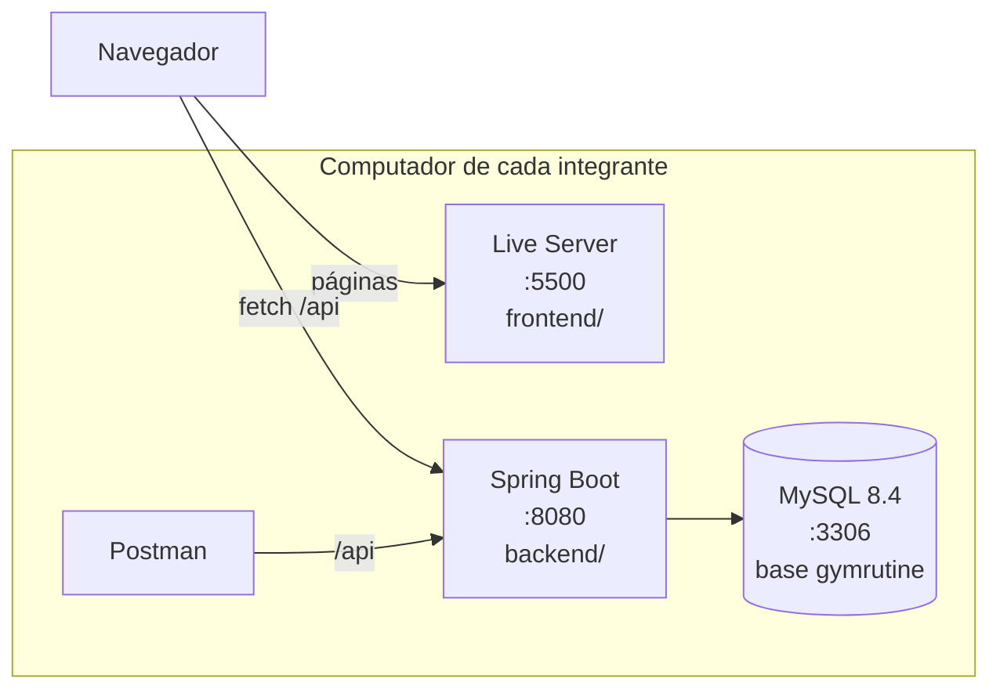

# Arquitectura — GymRutine

**Versión:** 1.0
**Fecha:** 2026-09-14

## 1. Vista general

GymRutine es una **aplicación web en capas**. El frontend (HTML, CSS y JavaScript) corre en el navegador y **solo se comunica con el backend a través de la API REST**. El backend (Spring Boot) contiene toda la lógica de negocio y guarda los datos en MySQL por medio de JPA.



Este es el desacoplamiento que pide el curso: el frontend no conoce la base de datos, y el backend no genera pantallas. Por eso el frontend de este corte se puede reemplazar por React en el corte 3 sin tocar la API.

## 2. Stack y versiones

Versiones verificadas en las fuentes oficiales el **2026-09-14**. Se fijan para que los tres integrantes trabajen con lo mismo.

| Tecnología | Versión | Uso | ¿Se ve en clase? |
|---|---|---|---|
| Java (JDK Temurin) | 21 LTS | Lenguaje del backend | Sí |
| Spring Boot | 4.1.1 | Framework del backend | Sí (temario §7) |
| Maven, con Maven Wrapper | el que trae el proyecto | Construcción y dependencias | Sí (§7.5) |
| Spring Web | la de Spring Boot | API REST | Sí (§7.4) |
| Spring Data JPA (Hibernate) | la de Spring Boot | Persistencia | Sí (§7.6) |
| Validation | la de Spring Boot | Validar cuerpos y parámetros | Parte de Spring Boot |
| MySQL Driver | la de Spring Boot | Conexión con MySQL | Parte de Spring Boot |
| spring-security-crypto | la de Spring Boot | **Solo** cifrar contraseñas con BCrypt | **No:** excepción justificada (DEC-07) |
| MySQL Community Server | 8.4 LTS | Base de datos | Sí (bibliografía del curso) |
| MySQL Workbench | la vigente | Ver tablas y datos | Complemento de MySQL |
| HTML, CSS y JavaScript | estándar del navegador | Frontend | Sí |
| Chart.js | 4.5.1 | Gráficas de progreso | **No:** excepción justificada (DEC-08) |
| VS Code + Live Server | vigente | Editor y servidor del frontend en desarrollo | Herramienta de trabajo |
| Postman | vigente | Pruebas de la API | Sí (§7.7) |
| Git, GitHub, GitHub Projects e Issues | vigente | Versiones, tablero y seguimiento de errores | Sí (§4) |

## 3. Arquitectura del backend



**Capas:**

- **Controller:** recibe la petición, valida la entrada con Validation y convierte entre HTTP y DTOs. No contiene reglas de negocio.
- **Service:** aplica las reglas de negocio ([MODELO-DATOS.md](MODELO-DATOS.md) §6): pertenencia, borrado lógico, consistencia de la sesión y récords. Las operaciones que escriben son transaccionales.
- **Repository:** interfaces de Spring Data JPA. Las consultas simples salen del nombre del método; las de progreso y récords usan JPQL.
- **Model:** las entidades JPA del [modelo de datos](MODELO-DATOS.md) §8.

**Piezas transversales:**

- **DTOs** (`...Request` y `...Response`): definen lo que entra y sale por la API. Nunca se devuelve una entidad directamente, para que un cambio en la base de datos no cambie el contrato sin querer.
- **ManejadorGlobalErrores** (`@RestControllerAdvice`): convierte las excepciones al formato `{codigo, mensaje, campos}` del [contrato](CONTRATO-API.md) §10. Controllers y services solo lanzan excepciones.
- **InterceptorAutenticacion** (`HandlerInterceptor` de Spring MVC): valida el token y deja disponible el usuario autenticado para los controllers.
- **ConfiguracionWeb:** registra el interceptor y la configuración de CORS.
- **CargaCatalogoBase:** inserta los ejercicios base al arrancar, de forma idempotente.

### Paquetes

Paquete raíz: `co.edu.uis.gymrutine`, organizado por capa, igual que en el proyecto teambsoft.

| Paquete | Contiene |
|---|---|
| `config` | `ConfiguracionWeb`, `CargaCatalogoBase` |
| `controller` | Un controller por recurso del contrato |
| `dto` | Records de petición y respuesta |
| `error` | `ManejadorGlobalErrores`, `ErrorResponse` y las excepciones con código |
| `model` | Entidades JPA y enumerados |
| `repository` | Interfaces de Spring Data JPA |
| `seguridad` | `InterceptorAutenticacion` y el cifrado de contraseñas |
| `service` | Servicios con las reglas de negocio |

## 4. Autenticación



**Reglas:**

1. Las contraseñas se guardan como hash BCrypt, nunca en texto.
2. Al iniciar sesión o crear la cuenta se genera un token aleatorio (UUID) que se guarda en `token_acceso` y vence a los 7 días.
3. El frontend envía el token en la cabecera `Authorization: Bearer <token>`.
4. El interceptor protege todo `/api/**` **excepto** `POST /api/auth/registro`, `POST /api/auth/login` y `GET /api/referencias`.
5. El interceptor **deja pasar las peticiones `OPTIONS`**. Son la verificación previa de CORS que hace el navegador y no llevan token; si se bloquean, el navegador rechaza la petición real.
6. El usuario siempre se toma del token, nunca de la URL ni del cuerpo. Un recurso de otro usuario responde 404.
7. Cerrar sesión borra el token.

**Limitaciones conocidas**, aceptables para un proyecto académico que corre en local, y anotadas como trabajo futuro: el token se guarda tal cual en la base de datos (en producción se guardaría su hash), no hay límite de intentos de inicio de sesión y en desarrollo se usa HTTP sin cifrar.

## 5. Flujo principal: registrar una sesión

Es el flujo que concentra la lógica de negocio del proyecto.



Si cualquier paso falla, la transacción se revierte: no quedan sesiones a medio guardar ni récords desactualizados. Eliminar una sesión sigue el mismo camino: se borra y se recalculan los récords de sus ejercicios en la misma transacción.

## 6. Frontend

HTML, CSS y JavaScript, sin frameworks. Una página HTML por pantalla del [mockup](mockup/README.md), con su propio archivo JavaScript, y un grupo de archivos compartidos que construye la tarea T2.

```
frontend/
├── index.html          redirige a inicio o a iniciar sesión
├── login.html          P1
├── registro.html       P2
├── inicio.html         P3
├── ejercicios.html     P4
├── rutinas.html        P5
├── rutina.html         P6   (?id= para editar)
├── entrenar.html       P7 y P8   (?rutinaId=)
├── historial.html      P9
├── sesion.html         P10  (?id=)
├── progreso.html       P11
├── records.html        P12
├── peso.html           P13
├── perfil.html         P14
├── css/
│   └── estilos.css     estilos compartidos, primero para celular
└── js/
    ├── api.js          URL base, token en cada petición, errores del contrato
    ├── auth.js         token y usuario en localStorage; protege las páginas privadas
    ├── ui.js           estados compartidos y formato de números y fechas
    ├── referencias.js  GET /referencias con caché
    ├── graficas.js     configuración común de Chart.js (la crea T9)
    └── (un archivo por página: login.js, entrenar.js, …)
```

**Reglas del frontend:**

- **Toda comunicación con el backend pasa por `api.js`.** Ninguna página llama a `fetch` directamente. Así el token, la URL base y el manejo de errores están en un solo lugar.
- **Ningún texto de enumerados escrito a mano:** los nombres visibles salen de `GET /referencias`.
- **Estados compartidos** en todas las pantallas: cargando, lista vacía, error de validación (junto a cada campo), no autenticado, no encontrado y sin conexión.
- **Primero para celular:** diseño base a 360 px; desde 768 px, navegación superior y contenido centrado.
- **Formato colombiano** para mostrar números y fechas (`62,5 kg`, `1.935 kg`, `dom 14 sep`), aunque la API use punto decimal.
- **Datos guardados en el navegador (`localStorage`):** el token, el usuario y el borrador del entrenamiento en curso. Nada más.
- **Chart.js** se carga con una etiqueta `<script>` con la versión fijada, solo en las páginas que grafican.

## 7. Entorno de desarrollo



| Pieza | Dirección | Cómo se arranca |
|---|---|---|
| MySQL | `localhost:3306`, base `gymrutine` | Servicio del sistema operativo ([GUIA-INICIO.md](../GUIA-INICIO.md)) |
| Backend | `http://localhost:8080/api` | `./mvnw spring-boot:run` desde `backend/` |
| Frontend | `http://127.0.0.1:5500/frontend/` | Live Server desde VS Code |

**Configuración de la base de datos en desarrollo:** los tres usan el mismo usuario local de MySQL (`gymrutine` / `gymrutine`, creado con la guía de inicio). Así la configuración del proyecto funciona igual en los tres computadores sin archivos personales. Son credenciales **solo para desarrollo local**: nunca se usan en un servidor real.

## 8. Decisiones de arquitectura

| # | Decisión | Alternativas descartadas | Por qué |
|---|---|---|---|
| DEC-01 | **Un solo backend en capas** | Microservicios con gateway, registro de servicios y colas de mensajes | Somos 3 personas con una sola aplicación, y el corte 2 evalúa Spring Boot, REST y JPA. La infraestructura de microservicios se comería el tiempo del proyecto sin aportar a lo que se evalúa |
| DEC-02 | **Base de datos relacional (MySQL + JPA)** | MongoDB | Los datos están muy relacionados (usuario → rutina → sesión → serie) y necesitan integridad referencial y consultas con agregaciones para el progreso. JPA está en el temario de este corte; MongoDB llega en el corte 3 |
| DEC-03 | **MySQL 8.4 LTS**, con versión fijada | 9.7 LTS · 26.7 (versión de innovación) | 26.7 es una versión de innovación, con soporte corto. Entre las dos LTS, 8.4 es la que tiene más material de referencia. Fijarla evita que cada integrante instale una distinta |
| DEC-04 | **Spring Boot 4.1.1 con Java 21** | Java 25 · Spring Boot 4.0 | 4.1.1 es la versión estable por defecto en start.spring.io a la fecha. Java 21 es LTS y es el JDK que el equipo ya instaló para el proyecto teambsoft. Java 25 no aporta nada al alcance y obligaría a instalar otro JDK |
| DEC-05 | **Maven con Maven Wrapper** | Gradle | Maven está en el temario (§7.5). Ojo: start.spring.io propone Gradle por defecto y hay que cambiarlo al generar el proyecto. El wrapper evita que cada uno instale Maven |
| DEC-06 | **Token aleatorio guardado en MySQL + interceptor de Spring MVC** (D4) | Spring Security completo · JWT · sesión HTTP con cookie | Spring Security no está en el temario y su configuración no se evalúa. JWT exige una librería externa y no se puede revocar sin una lista negra. La sesión con cookie, con el frontend en otro puerto, obliga a configurar CORS con credenciales, y el frontend React del corte 3 no la compartiría. Un token en una tabla es fácil de explicar, se revoca borrándolo y se prueba sin esfuerzo en Postman |
| DEC-07 | **Contraseñas con BCrypt, usando solo `spring-security-crypto`** | Guardarlas en texto · implementar PBKDF2 a mano · Spring Security completo | Guardarlas en texto es inaceptable. Programar el cifrado a mano es propenso a errores. `spring-security-crypto` es la parte de cifrado de Spring, una dependencia pequeña que no activa Spring Security. Es la única pieza del backend que no se ve en clase, y su uso se limita a dos métodos: cifrar y comparar |
| DEC-08 | **Chart.js para las gráficas** | Dibujar con `<canvas>` a mano | Dibujar ejes, escalas y puntos a mano no es evaluable y consumiría un sprint. Chart.js solo visualiza: no tiene lógica de negocio. Se carga con la versión fijada y cada gráfica muestra también sus datos en una tabla |
| DEC-09 | **Frontend en su propia carpeta, servido con Live Server** | Archivos estáticos dentro de Spring Boot | Deja la separación de capas a la vista, recarga al instante al editar y es la misma separación que tendrá el corte 3. El costo es configurar CORS para el puerto 5500 |
| DEC-10 | **Esquema generado por Hibernate** (`ddl-auto: update`) | Scripts SQL versionados con Flyway o Liquibase | Las herramientas de migraciones no se ven en clase. Las entidades reflejan el modelo documentado y en desarrollo basta. Riesgo: `update` no borra ni renombra columnas, así que al cambiar el modelo cada integrante recrea su base local ([GUIA-INICIO.md](../GUIA-INICIO.md) §8) |
| DEC-11 | **Errores `{codigo, mensaje, campos}` con un manejador global** | ProblemDetail (RFC 9457) · mensajes sueltos | Es el mismo formato que el equipo ya usó en teambsoft, más `campos` para marcar errores junto a cada campo del formulario. El código permite que el frontend reaccione sin interpretar textos |
| DEC-12 | **Sin funcionamiento sin conexión** (D1) | PWA con Service Worker y sincronización | Las PWA no están en el temario y cambiarían la arquitectura. Mitigación para la mala señal del gimnasio: el entrenamiento en curso se guarda como borrador en el navegador y, si falla la conexión, el guardado se reintenta sin perder datos |
| DEC-13 | **El usuario sale del token, no de la URL** (`GET /rutinas` en lugar de `GET /usuarios/7/rutinas`) | Rutas con el id del usuario | Con el id en la URL, bastaría cambiar un número para intentar leer datos ajenos. Además simplifica el contrato |

## 9. Documentos relacionados

- [MODELO-DATOS.md](MODELO-DATOS.md): diagrama entidad-relación, reglas de negocio y decisiones del modelo
- [CONTRATO-API.md](CONTRATO-API.md): endpoints, modelos y errores
- [HISTORIAS.md](HISTORIAS.md): backlog con criterios de aceptación
- [mockup/README.md](mockup/README.md): pantallas con sus reglas

## 10. Historial de cambios

| Fecha | Cambio |
|---|---|
| 2026-09-14 | v1.0: versión inicial. Versiones verificadas: Spring Boot 4.1.1, Java 21, MySQL 8.4 LTS, Chart.js 4.5.1 |
