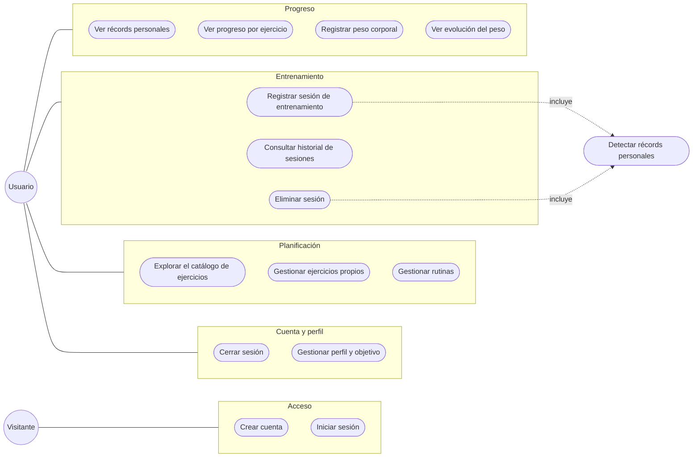

# Historias de usuario — GymRutine

**Versión:** 1.0
**Fecha:** 2026-09-14
**Formato:** Como [rol], quiero [funcionalidad], para [beneficio], con criterios Dado / Cuando / Entonces

Este es el **Product Backlog** del proyecto. Cada historia tiene sus criterios de aceptación: una historia está terminada cuando cumple todos sus criterios y la [definición de terminado](../PLAN-DE-TRABAJO.md#definición-de-terminado).

**Roles:**

- **Visitante:** no ha iniciado sesión.
- **Usuario:** tiene la sesión iniciada. Es la persona que entrena sola y gestiona sus propias rutinas.

## Diagrama de casos de uso

**Cómo leerlo:** una línea de un actor hacia un grupo significa que ese actor participa en todos los casos de uso del grupo. Registrar y eliminar una sesión **incluyen** la detección de récords: el usuario no la ejecuta por separado, sino que ocurre siempre que se registra o elimina una sesión.

## Mapa del backlog

| Épica | Historias | Responsable | Sprint en que se termina |
|---|---|---|---|
| A. Cuenta y perfil | H1 · H2 · H3 · H4 | Rances | 2 |
| B. Catálogo de ejercicios | H5 · H6 · H7 · H8 · H9 | Javier | 2 |
| C. Rutinas | H10 · H11 · H12 · H13 | Javier | 3 |
| D. Entrenamiento | H14 · H15 · H16 · H17 | Santiago | 3 |
| E. Récords y progreso | H18 · H19 (Santiago) · H20 (Javier) | Santiago y Javier | H18 en 3; H19 y H20 en 4 |
| F. Peso corporal | H21 · H22 | Rances | 3 |

El detalle de qué se hace en cada sprint y en qué orden está en el [plan de trabajo](../PLAN-DE-TRABAJO.md).

---

## Épica A — Cuenta y perfil

### H1 — Crear cuenta

**Prioridad:** Alta · **Sprint:** 2 · **Responsable:** Rances · **Endpoints:** `GET /referencias`, `POST /auth/registro`

**Como** visitante, **quiero** crear una cuenta con mi nombre, email, contraseña y objetivo, **para** guardar mis rutinas y mi progreso.

- **Dado** que no tengo cuenta
- **Cuando** envío nombre, email, contraseña de 8 a 72 caracteres y un objetivo
- **Entonces** se crea mi cuenta, quedo con la sesión iniciada y entro al inicio
- **Y** mi contraseña se guarda cifrada, nunca en texto
- **Y** si el email ya está registrado, sin importar mayúsculas, veo un aviso (409 `EMAIL_YA_REGISTRADO`)
- **Y** si un campo no cumple las reglas, veo el error junto a ese campo (400 `VALIDACION_FALLIDA`)

### H2 — Iniciar sesión

**Prioridad:** Alta · **Sprint:** 2 · **Responsable:** Rances · **Endpoints:** `POST /auth/login`

**Como** visitante con cuenta, **quiero** iniciar sesión con mi email y contraseña, **para** entrar a mis datos desde cualquier dispositivo.

- **Dado** que tengo una cuenta
- **Cuando** envío mi email y mi contraseña correctos
- **Entonces** entro al inicio y mi sesión dura 7 días en ese navegador
- **Y** si el email no existe o la contraseña no coincide, veo el mismo mensaje en los dos casos (401 `CREDENCIALES_INVALIDAS`), sin revelar cuál falló
- **Y** si mi sesión vence o el token no es válido, cualquier pantalla me devuelve a iniciar sesión

### H3 — Cerrar sesión

**Prioridad:** Alta · **Sprint:** 2 · **Responsable:** Rances · **Endpoints:** `POST /auth/logout`

**Como** usuario, **quiero** cerrar sesión, **para** que nadie use mi cuenta en un dispositivo compartido.

- **Dado** que tengo la sesión iniciada
- **Cuando** cierro sesión
- **Entonces** mi token deja de funcionar en el servidor y vuelvo a la pantalla de iniciar sesión
- **Y** en ese navegador ya no quedan guardados ni mi token ni mis datos

### H4 — Ver y editar mi perfil

**Prioridad:** Media · **Sprint:** 2 · **Responsable:** Rances · **Endpoints:** `GET /usuarios/me`, `PUT /usuarios/me`

**Como** usuario, **quiero** ver mi perfil y cambiar mi nombre y mi objetivo, **para** que las sugerencias se ajusten a lo que busco ahora.

- **Dado** que tengo la sesión iniciada
- **Cuando** cambio mi nombre o mi objetivo y guardo
- **Entonces** mi perfil queda actualizado
- **Y** las sugerencias nuevas usan el objetivo nuevo: los recomendados del catálogo y las series y repeticiones de las rutinas que cree desde ahora
- **Y** las rutinas que ya tenía conservan su objetivo
- **Y** mi email se muestra, pero no se puede cambiar

---

## Épica B — Catálogo de ejercicios

### H5 — Explorar el catálogo de ejercicios

**Prioridad:** Alta · **Sprint:** 2 · **Responsable:** Javier · **Endpoints:** `GET /referencias`, `GET /ejercicios`

**Como** usuario, **quiero** explorar los ejercicios por grupo muscular y por equipo, y ver los recomendados para mi objetivo, **para** elegir qué incluir en mis rutinas.

- **Dado** que tengo la sesión iniciada
- **Cuando** abro el catálogo
- **Entonces** veo los ejercicios base y mis ejercicios propios activos, agrupados por grupo muscular y con la cantidad de cada grupo
- **Y** puedo filtrar por grupo muscular, por equipo y por "recomendados para mi objetivo", y buscar por nombre
- **Y** un filtro sin resultados muestra una lista vacía, no un error
- **Y** los ejercicios propios se distinguen de los del catálogo base
- **Y** nunca veo los ejercicios propios de otros usuarios

### H6 — Ver el detalle de un ejercicio

**Prioridad:** Media · **Sprint:** 2 · **Responsable:** Javier · **Endpoints:** `GET /ejercicios/{id}`

**Como** usuario, **quiero** ver el detalle de un ejercicio, **para** saber cómo se hace antes de agregarlo a una rutina.

- **Dado** que un ejercicio es visible para mí
- **Cuando** abro su detalle
- **Entonces** veo nombre, grupo muscular, equipo, objetivos recomendados y la descripción de la técnica
- **Y** tengo un enlace que busca la técnica del ejercicio en YouTube
- **Y** si el ejercicio no existe o es propio de otro usuario, veo "no encontrado" (404 `EJERCICIO_NO_ENCONTRADO`)

### H7 — Crear un ejercicio propio

**Prioridad:** Media · **Sprint:** 2 · **Responsable:** Javier · **Endpoints:** `POST /ejercicios`

**Como** usuario, **quiero** crear un ejercicio que no está en el catálogo, **para** usarlo en mis rutinas.

- **Dado** que tengo la sesión iniciada
- **Cuando** envío nombre (3 a 80 caracteres), grupo muscular, equipo, al menos un objetivo y, si quiero, una descripción
- **Entonces** el ejercicio se crea como propio y solo yo lo veo
- **Y** si ya existe un ejercicio base o uno propio activo con ese nombre, sin importar mayúsculas, veo un aviso (409 `EJERCICIO_DUPLICADO`)
- **Y** si un campo no cumple las reglas, veo el error junto a ese campo (400 `VALIDACION_FALLIDA`)

### H8 — Editar un ejercicio propio

**Prioridad:** Baja · **Sprint:** 2 · **Responsable:** Javier · **Endpoints:** `PUT /ejercicios/{id}`

**Como** usuario, **quiero** corregir los datos de un ejercicio que creé, **para** mantenerlo bien descrito.

- **Dado** que el ejercicio es mío y está activo
- **Cuando** envío todos sus datos con los cambios
- **Entonces** queda actualizado, también en las rutinas que lo usan
- **Y** si intento editar un ejercicio del catálogo base, la operación se rechaza (403 `EJERCICIO_NO_EDITABLE`)
- **Y** si no existe, es de otro usuario o ya lo eliminé, veo "no encontrado" (404)

### H9 — Eliminar un ejercicio propio

**Prioridad:** Baja · **Sprint:** 2 · **Responsable:** Javier · **Endpoints:** `DELETE /ejercicios/{id}`

**Como** usuario, **quiero** eliminar un ejercicio que creé y ya no uso, **para** mantener limpio mi catálogo.

- **Dado** que el ejercicio es mío
- **Cuando** lo elimino y confirmo
- **Entonces** deja de aparecer en el catálogo, y ya no puedo agregarlo a rutinas ni registrarlo en sesiones nuevas
- **Y** mi historial y mis récords con ese ejercicio se conservan
- **Y** si ya estaba eliminado, la operación responde con éxito sin cambiar nada
- **Y** si intento eliminar un ejercicio del catálogo base, la operación se rechaza (403)

---

## Épica C — Rutinas

### H10 — Crear una rutina

**Prioridad:** Alta · **Sprint:** 3 · **Responsable:** Javier · **Endpoints:** `GET /referencias`, `GET /ejercicios`, `POST /rutinas`

**Como** usuario, **quiero** armar una rutina con ejercicios del catálogo y sus series y repeticiones objetivo, **para** entrenar con un plan alineado a mi objetivo.

- **Dado** que tengo la sesión iniciada
- **Cuando** creo una rutina
- **Entonces** su objetivo es, por defecto, el de mi perfil, y lo puedo cambiar
- **Y** al agregar un ejercicio, las series y repeticiones vienen prellenadas según el objetivo de la rutina (fuerza 4 × 5, pérdida de peso 3 × 12, resistencia 3 × 15), y las puedo cambiar
- **Y** al elegir ejercicios puedo filtrar y ver cuáles se recomiendan para ese objetivo
- **Y** puedo ordenar y quitar ejercicios antes de guardar
- **Y** al guardar con nombre (3 a 80 caracteres) y entre 1 y 15 ejercicios sin repetir, con series de 1 a 10 y repeticiones de 1 a 50, la rutina se crea con los ejercicios en el orden en que los dejé
- **Y** si un ejercicio no existe, no es visible para mí o está eliminado, la rutina no se guarda (400 `VALIDACION_FALLIDA`)

### H11 — Ver mis rutinas

**Prioridad:** Alta · **Sprint:** 3 · **Responsable:** Javier · **Endpoints:** `GET /rutinas`, `GET /rutinas/{id}`

**Como** usuario, **quiero** ver mis rutinas y el detalle de cada una, **para** elegir cuál entrenar hoy.

- **Dado** que tengo rutinas creadas
- **Cuando** abro "Mis rutinas"
- **Entonces** veo cada rutina activa con su objetivo, cuántos ejercicios tiene y cuándo la entrené por última vez ("aún no la entrenas" si nunca)
- **Y** al abrir una, veo sus ejercicios en orden con sus series y repeticiones objetivo
- **Y** si no tengo rutinas, veo una invitación a crear la primera
- **Y** nunca veo rutinas de otros usuarios (404 `RUTINA_NO_ENCONTRADA`)

### H12 — Editar una rutina

**Prioridad:** Media · **Sprint:** 3 · **Responsable:** Javier · **Endpoints:** `GET /rutinas/{id}`, `PUT /rutinas/{id}`

**Como** usuario, **quiero** cambiar una rutina, **para** ajustarla cuando progreso o cambio de plan.

- **Dado** que la rutina es mía y está activa
- **Cuando** cambio su nombre, su objetivo o sus ejercicios y guardo
- **Entonces** la rutina queda exactamente con lo que envié: la lista de ejercicios completa se reemplaza
- **Y** las sesiones que ya registré con esa rutina no cambian
- **Y** se aplican las mismas reglas de validación de H10
- **Y** si la rutina fue eliminada, no se puede editar (404)

### H13 — Eliminar una rutina

**Prioridad:** Media · **Sprint:** 3 · **Responsable:** Javier · **Endpoints:** `DELETE /rutinas/{id}`

**Como** usuario, **quiero** eliminar una rutina que ya no uso, **para** tener a mano solo las que entreno.

- **Dado** que la rutina es mía
- **Cuando** la elimino y confirmo
- **Entonces** deja de aparecer en "Mis rutinas", y ya no puedo entrenarla ni editarla
- **Y** las sesiones que registré con ella siguen en mi historial, con su nombre
- **Y** si ya estaba eliminada, la operación responde con éxito sin cambiar nada

---

## Épica D — Entrenamiento

### H14 — Registrar una sesión de entrenamiento

**Prioridad:** Alta · **Sprint:** 3 · **Responsable:** Santiago · **Endpoints:** `GET /rutinas/{id}`, `GET /rutinas/{id}/ultimos-registros`, `POST /sesiones`

**Como** usuario, **quiero** registrar cada serie que realmente hice, con su peso y repeticiones, mientras ejecuto una rutina, **para** tener un registro exacto de mi entrenamiento.

- **Dado** que tengo una rutina activa
- **Cuando** empiezo a entrenarla
- **Entonces** veo sus ejercicios en orden, cada uno con su objetivo, mi récord actual y las filas de series prellenadas con lo que hice la última vez en ese ejercicio (en cualquier rutina)
- **Y** si nunca he hecho un ejercicio, las filas vienen con el peso vacío y las repeticiones objetivo
- **Y** marco cada serie como hecha, puedo agregar o quitar series y saltarme ejercicios
- **Y** la fecha y hora de inicio es, por defecto, cuando abrí la pantalla, y puedo cambiarla para registrar un entrenamiento de otro día, pero no del futuro
- **Y** si recargo la página o se cierra el navegador, lo que llevo no se pierde: puedo continuar o descartar
- **Cuando** termino y guardo, con al menos una serie hecha, cada una de 0 a 500 kg y de 1 a 100 repeticiones
- **Entonces** la sesión queda registrada y veo el resumen: ejercicios, series, repeticiones, volumen total en kg y duración
- **Y** si falla la conexión al guardar, veo el error y puedo reintentar sin volver a escribir nada

### H15 — Ver el historial de sesiones

**Prioridad:** Alta · **Sprint:** 3 · **Responsable:** Santiago · **Endpoints:** `GET /sesiones`

**Como** usuario, **quiero** ver mis sesiones anteriores, **para** saber cuánto y cuándo he entrenado.

- **Dado** que he registrado sesiones
- **Cuando** abro el historial
- **Entonces** veo mis sesiones de la más reciente a la más antigua, con rutina, fecha, duración, volumen total, cantidad de series y cuántos récords tuvo cada una
- **Y** si no tengo sesiones, veo una invitación a entrenar mi primera rutina

### H16 — Ver el detalle de una sesión

**Prioridad:** Media · **Sprint:** 3 · **Responsable:** Santiago · **Endpoints:** `GET /sesiones/{id}`

**Como** usuario, **quiero** ver el detalle de una sesión, **para** revisar exactamente qué hice ese día.

- **Dado** que la sesión es mía
- **Cuando** abro su detalle
- **Entonces** veo cada ejercicio con sus series (peso × repeticiones), las series récord resaltadas y el resumen de la sesión
- **Y** si la rutina o un ejercicio se eliminaron después, igual se muestran con su nombre
- **Y** si la sesión no existe o es de otro usuario, veo "no encontrada" (404 `SESION_NO_ENCONTRADA`)

### H17 — Eliminar una sesión

**Prioridad:** Media · **Sprint:** 3 · **Responsable:** Santiago · **Endpoints:** `DELETE /sesiones/{id}`

**Como** usuario, **quiero** eliminar una sesión que registré mal, **para** que un error de digitación no altere mi progreso ni mis récords.

- **Dado** que la sesión es mía
- **Cuando** la elimino y confirmo, después de ver el aviso de que mis récords se recalcularán
- **Entonces** la sesión desaparece del historial, del progreso y de los récords
- **Y** los récords de sus ejercicios se recalculan, y otra sesión puede pasar a ser récord

---

## Épica E — Récords y progreso

### H18 — Detección automática de récords personales

**Prioridad:** Alta · **Sprint:** 3 · **Responsable:** Santiago · **Endpoints:** `POST /sesiones`, `DELETE /sesiones/{id}` · **Regla:** [MODELO-DATOS.md](MODELO-DATOS.md) §6.1

**Como** usuario, **quiero** que el sistema detecte solo cuándo supero mi mejor marca en un ejercicio, **para** saber que estoy progresando sin revisar el historial a mano.

- **Dado** que registro o elimino una sesión
- **Cuando** el sistema recalcula los récords de sus ejercicios
- **Entonces** una serie es récord si su peso supera el máximo que había levantado antes en ese ejercicio, según la fecha de las sesiones
- **Y** la primera vez que hago un ejercicio con más de 0 kg cuenta como récord
- **Y** igualar el récord no es récord, y una serie con 0 kg nunca lo es
- **Y** en cada sesión hay como máximo un récord por ejercicio: la primera serie con el peso más alto
- **Y** si registro una sesión con fecha pasada, los récords de las sesiones posteriores se ajustan
- **Y** al terminar de guardar veo "¡Nuevo récord!" en los ejercicios donde lo logré

### H19 — Ver mis récords personales

**Prioridad:** Media · **Sprint:** 4 · **Responsable:** Santiago · **Endpoints:** `GET /records`

**Como** usuario, **quiero** ver mis mejores marcas, **para** tener presente qué debo superar.

- **Dado** que tengo récords
- **Cuando** abro "Récords"
- **Entonces** veo, agrupado por grupo muscular, mi récord vigente de cada ejercicio: peso, repeticiones de esa serie y fecha
- **Y** al tocar uno voy al progreso de ese ejercicio
- **Y** los ejercicios que solo he hecho con 0 kg no aparecen
- **Y** si aún no tengo récords, veo una invitación a registrar mi primera sesión

### H20 — Ver el progreso de un ejercicio

**Prioridad:** Alta · **Sprint:** 4 · **Responsable:** Javier · **Endpoints:** `GET /progreso/ejercicios`, `GET /progreso/ejercicios/{id}`

**Como** usuario, **quiero** ver en una gráfica cómo evoluciona el peso que levanto en un ejercicio, **para** comprobar si realmente estoy progresando.

- **Dado** que he registrado un ejercicio en al menos una sesión
- **Cuando** lo elijo en "Progreso"
- **Entonces** veo una gráfica del peso máximo de cada sesión a lo largo del tiempo, con las sesiones récord resaltadas
- **Y** puedo cambiar la gráfica para ver el volumen (kg) de cada sesión
- **Y** debajo de la gráfica veo los mismos datos en una tabla
- **Y** en el selector solo aparecen ejercicios que he registrado

---

## Épica F — Peso corporal

### H21 — Registrar mi peso corporal

**Prioridad:** Media · **Sprint:** 3 · **Responsable:** Rances · **Endpoints:** `POST /peso-corporal`

**Como** usuario, **quiero** registrar mi peso corporal, **para** medir mi progreso aunque mi objetivo no sea levantar más peso.

- **Dado** que tengo la sesión iniciada
- **Cuando** registro mi peso, entre 20 y 350 kg, con una fecha que por defecto es hoy y no puede ser futura
- **Entonces** el registro queda guardado y aparece en la gráfica
- **Y** si ya registré mi peso en esa fecha, veo un aviso (409 `PESO_YA_REGISTRADO`)

### H22 — Ver la evolución de mi peso corporal

**Prioridad:** Media · **Sprint:** 3 · **Responsable:** Rances · **Endpoints:** `GET /peso-corporal`, `DELETE /peso-corporal/{id}`

**Como** usuario, **quiero** ver cómo cambia mi peso en el tiempo, **para** saber si voy hacia mi objetivo.

- **Dado** que tengo registros de peso
- **Cuando** abro "Peso corporal"
- **Entonces** veo una gráfica de mi peso en el tiempo y la lista de registros, cada uno con la diferencia contra el anterior
- **Y** puedo eliminar un registro equivocado, después de confirmar
- **Y** con un solo registro, la gráfica muestra el punto sin errores
- **Y** si no tengo registros, veo una invitación a registrar el primero

---

## Priorización por sprint

| Sprint | Peso en la nota | Historias que se terminan | Qué más se entrega |
|---|---|---|---|
| 1 | 5 % | — | Documentación inicial, base del backend (con la API de autenticación), base del frontend y algoritmo de récords con pruebas |
| 2 | 5 % | H1–H9 | API de rutinas y API de sesiones listas para las pantallas del sprint 3 |
| 3 | 10 % | H10–H18, H21, H22 | Es el sprint con más funcionalidad visible |
| 4 | 10 % | H19, H20 | Datos de demostración, pulido en celular, documentación final y sustentación |

**Por qué este orden:** los sprints 1 y 2 valen menos y dejan lista la base de la que depende todo. Los sprints 3 y 4 valen el doble y concentran lo que se ve. El sprint 4 tiene pocas historias a propósito: deja margen para lo que se atrase y para preparar la demostración.

## Fuera del backlog (trabajo futuro)

- Plantillas de rutina predefinidas por nivel (extensión candidata)
- 1RM estimado por ejercicio (extensión candidata)
- Temporizador de descanso entre series (extensión candidata)
- Historial en calendario y rachas de entrenamiento
- Ejercicios por tiempo o distancia (cardio, plancha)
- Favoritos en el catálogo
- Recuperar o cambiar la contraseña
- Funcionamiento sin conexión (PWA) y notificaciones
- Rol entrenador–cliente

## Historial de cambios

| Fecha | Cambio |
|---|---|
| 2026-09-14 | v1.0: versión inicial con 22 historias en 6 épicas |
