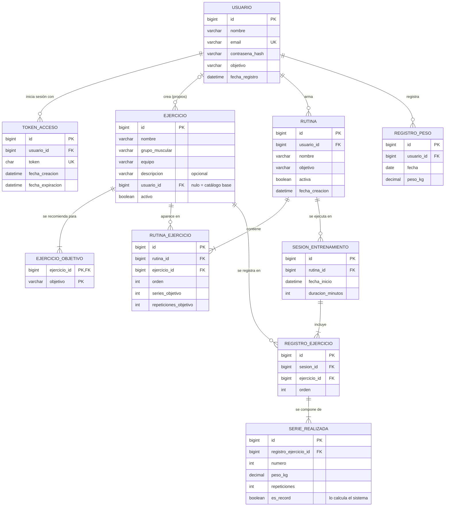
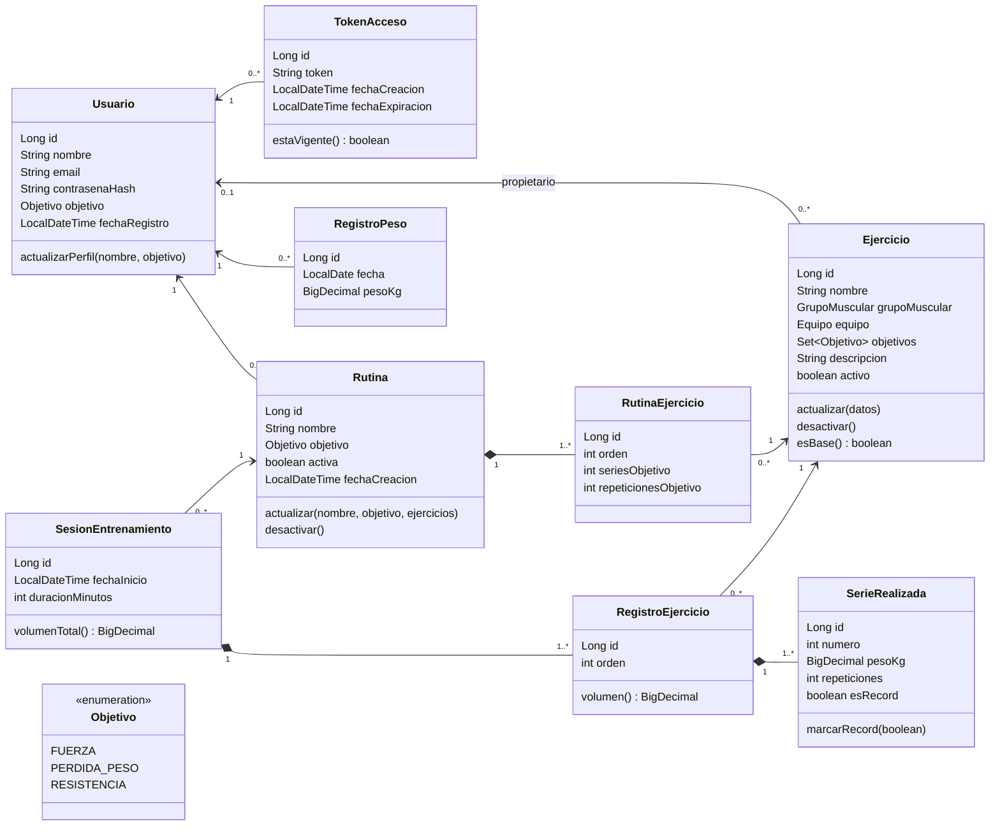

# Modelo de datos — GymRutine

**Versión:** 1.0
**Fecha:** 2026-09-14
**Motor:** MySQL 8.4 LTS · **Acceso a datos:** Spring Data JPA (Hibernate)

Este documento es la referencia del modelo: el diagrama entidad-relación, el diccionario de datos, las reglas que el esquema no puede garantizar por sí solo y el catálogo base de ejercicios. Las entidades JPA de la tarea T1 deben coincidir con lo que dice aquí. Si hay que cambiar el modelo, **se cambia primero este documento** y después el código.

## 1. Resumen

| Tabla | Qué guarda | Volumen típico |
|---|---|---|
| `usuario` | Cuentas: nombre, email, contraseña cifrada y objetivo | 1 por persona |
| `token_acceso` | Tokens de inicio de sesión vigentes | 1 a 3 por usuario |
| `ejercicio` | Catálogo base (sin dueño) y ejercicios propios de cada usuario | 40 base + pocos propios |
| `ejercicio_objetivo` | Objetivos para los que se recomienda cada ejercicio | 1 a 3 por ejercicio |
| `rutina` | Planes de entrenamiento de cada usuario | 2 a 6 por usuario |
| `rutina_ejercicio` | Ejercicios de cada rutina, con series y repeticiones objetivo | 4 a 8 por rutina |
| `sesion_entrenamiento` | Cada vez que el usuario ejecuta una rutina | 3 a 5 por semana |
| `registro_ejercicio` | Cada ejercicio realizado dentro de una sesión | 4 a 8 por sesión |
| `serie_realizada` | Cada serie real: peso, repeticiones y si fue récord | 3 a 5 por ejercicio |
| `registro_peso` | Peso corporal por fecha | 1 a 2 por semana |

## 2. Diagrama entidad-relación

**Cómo leer las líneas:** `||` exactamente uno · `|o` cero o uno · `|{` uno o más · `o{` cero o más. GitHub dibuja el diagrama automáticamente al abrir este archivo.

## 3. Relaciones y cardinalidades

| Relación | Cardinalidad | Qué significa |
|---|---|---|
| usuario → token_acceso | 1 : 0..N | Un usuario puede tener la sesión abierta en varios dispositivos |
| usuario → ejercicio | 0..1 : 0..N | `usuario_id` nulo = ejercicio del catálogo base; con valor = ejercicio propio, visible solo para su dueño |
| ejercicio → ejercicio_objetivo | 1 : 1..3 | Todo ejercicio se recomienda para al menos un objetivo |
| usuario → rutina | 1 : 0..N | Las rutinas son privadas de cada usuario |
| rutina → rutina_ejercicio | 1 : 1..15 | Una rutina tiene al menos un ejercicio y no lo repite |
| ejercicio → rutina_ejercicio | 1 : 0..N | Un mismo ejercicio puede estar en varias rutinas |
| rutina → sesion_entrenamiento | 1 : 0..N | Cada sesión ejecuta exactamente una rutina. El dueño de la sesión es el dueño de la rutina |
| sesion_entrenamiento → registro_ejercicio | 1 : 1..15 | Solo se registran ejercicios de la rutina, sin repetir |
| ejercicio → registro_ejercicio | 1 : 0..N | El registro apunta al ejercicio, no a la fila de la rutina (decisión DM-05) |
| registro_ejercicio → serie_realizada | 1 : 1..20 | Un ejercicio registrado tiene al menos una serie |
| usuario → registro_peso | 1 : 0..N | Como máximo un registro por fecha |

## 4. Diccionario de datos

**Convenciones:** tablas y columnas en `snake_case`; la clave primaria de cada tabla se llama `id` y es `BIGINT AUTO_INCREMENT`; las claves foráneas terminan en `_id`; los enumerados se guardan como texto; motor InnoDB con `utf8mb4`. Las columnas no admiten nulos salvo que se indique.

### usuario

| Columna | Tipo | Clave | Regla |
|---|---|---|---|
| id | BIGINT | PK | Autoincremental |
| nombre | VARCHAR(80) | | 2 a 80 caracteres |
| email | VARCHAR(120) | UK | Formato de email. Se guarda en minúsculas y sin espacios alrededor |
| contrasena_hash | VARCHAR(60) | | Hash BCrypt (siempre mide 60). La contraseña original nunca se guarda |
| objetivo | VARCHAR(20) | | `FUERZA`, `PERDIDA_PESO` o `RESISTENCIA` |
| fecha_registro | DATETIME | | La asigna el servidor al crear la cuenta |

### token_acceso

| Columna | Tipo | Clave | Regla |
|---|---|---|---|
| id | BIGINT | PK | |
| usuario_id | BIGINT | FK → usuario | |
| token | CHAR(36) | UK | UUID aleatorio generado por el servidor |
| fecha_creacion | DATETIME | | |
| fecha_expiracion | DATETIME | | `fecha_creacion` + 7 días |

### ejercicio

| Columna | Tipo | Clave | Regla |
|---|---|---|---|
| id | BIGINT | PK | |
| nombre | VARCHAR(80) | | 3 a 80 caracteres. No se repite entre el catálogo base y los ejercicios propios activos del usuario, sin distinguir mayúsculas (se valida en el servicio) |
| grupo_muscular | VARCHAR(20) | | Valores en §5 |
| equipo | VARCHAR(20) | | Valores en §5 |
| descripcion | VARCHAR(500) | | **Admite nulo.** Indicaciones de técnica |
| usuario_id | BIGINT | FK → usuario | **Admite nulo.** Nulo = catálogo base |
| activo | BOOLEAN | | `true` al crearse; `false` al eliminarlo (borrado lógico) |

### ejercicio_objetivo

| Columna | Tipo | Clave | Regla |
|---|---|---|---|
| ejercicio_id | BIGINT | PK, FK → ejercicio | |
| objetivo | VARCHAR(20) | PK | Valores en §5 |

### rutina

| Columna | Tipo | Clave | Regla |
|---|---|---|---|
| id | BIGINT | PK | |
| usuario_id | BIGINT | FK → usuario | |
| nombre | VARCHAR(80) | | 3 a 80 caracteres |
| objetivo | VARCHAR(20) | | Por defecto, el objetivo del usuario al crearla |
| activa | BOOLEAN | | `false` al eliminarla (borrado lógico) |
| fecha_creacion | DATETIME | | |

### rutina_ejercicio

| Columna | Tipo | Clave | Regla |
|---|---|---|---|
| id | BIGINT | PK | |
| rutina_id | BIGINT | FK → rutina | |
| ejercicio_id | BIGINT | FK → ejercicio | No se repite dentro de la misma rutina (se valida en el servicio, ver DM-10) |
| orden | INT | | 1, 2, 3… según el orden en que llegan en la petición |
| series_objetivo | INT | | 1 a 10 |
| repeticiones_objetivo | INT | | 1 a 50 |

### sesion_entrenamiento

| Columna | Tipo | Clave | Regla |
|---|---|---|---|
| id | BIGINT | PK | |
| rutina_id | BIGINT | FK → rutina | Índice compuesto (`rutina_id`, `fecha_inicio`) |
| fecha_inicio | DATETIME | | Hora local. No puede ser futura |
| duracion_minutos | INT | | 1 a 600 |

### registro_ejercicio

| Columna | Tipo | Clave | Regla |
|---|---|---|---|
| id | BIGINT | PK | |
| sesion_id | BIGINT | FK → sesion_entrenamiento | UK (`sesion_id`, `ejercicio_id`) |
| ejercicio_id | BIGINT | FK → ejercicio | Debe pertenecer a la rutina de la sesión y estar activo |
| orden | INT | | Lo asigna el servidor |

### serie_realizada

| Columna | Tipo | Clave | Regla |
|---|---|---|---|
| id | BIGINT | PK | |
| registro_ejercicio_id | BIGINT | FK → registro_ejercicio | UK (`registro_ejercicio_id`, `numero`) |
| numero | INT | | 1, 2, 3… Lo asigna el servidor |
| peso_kg | DECIMAL(5,2) | | 0 a 500. `0` = sin carga externa (por ejemplo, dominadas sin lastre) |
| repeticiones | INT | | 1 a 100 |
| es_record | BOOLEAN | | La calcula el sistema con la regla R6. El cliente nunca la envía |

### registro_peso

| Columna | Tipo | Clave | Regla |
|---|---|---|---|
| id | BIGINT | PK | |
| usuario_id | BIGINT | FK → usuario | UK (`usuario_id`, `fecha`) |
| fecha | DATE | | No puede ser futura |
| peso_kg | DECIMAL(5,2) | | 20 a 350 |

## 5. Enumeraciones

Se guardan como texto con el código. El nombre visible y las sugerencias los entrega la API en `GET /referencias` (ver [contrato](CONTRATO-API.md) §4), para que el frontend nunca escriba estos textos a mano.

### Objetivo

| Código | Nombre visible | Series sugeridas | Repeticiones sugeridas | Idea |
|---|---|---|---|---|
| `FUERZA` | Fuerza | 4 | 5 | Pocas repeticiones con cargas altas |
| `PERDIDA_PESO` | Pérdida de peso | 3 | 12 | Repeticiones moderadas y descansos cortos |
| `RESISTENCIA` | Resistencia | 3 | 15 | Muchas repeticiones con cargas moderadas |

Las sugerencias son **valores iniciales** al agregar un ejercicio a una rutina: el usuario puede cambiarlos. Así se concreta "rutinas alineadas al objetivo" sin prometer una prescripción médica.

### Grupo muscular

`PECHO` Pecho · `ESPALDA` Espalda · `HOMBROS` Hombros · `BICEPS` Bíceps · `TRICEPS` Tríceps · `PIERNAS` Piernas · `GLUTEOS` Glúteos · `ABDOMEN` Abdomen

### Equipo

`BARRA` Barra · `MANCUERNAS` Mancuernas · `MAQUINA` Máquina · `POLEA` Polea · `PESO_CORPORAL` Peso corporal · `OTRO` Otro

## 6. Reglas de negocio e integridad

Reglas que el esquema no garantiza solo y que implementan los servicios. Cada una tiene su criterio de aceptación en las [historias](HISTORIAS.md).

| # | Regla |
|---|---|
| R1 | **Visibilidad de ejercicios.** Un usuario ve los ejercicios base y sus propios ejercicios. Un ejercicio propio de otro usuario se trata como inexistente (404) |
| R2 | **Solo los propios se modifican.** Editar o eliminar un ejercicio base responde 403 |
| R3 | **Borrado lógico** en `ejercicio` y `rutina`. Lo eliminado desaparece de los listados y no se puede usar en rutinas ni sesiones nuevas, pero se sigue mostrando en el historial con su nombre |
| R4 | **Consistencia de la sesión.** La rutina es del usuario y está activa; cada ejercicio registrado pertenece a esa rutina, está activo y no se repite; hay al menos un ejercicio con al menos una serie. `orden` y `numero` los asigna el servidor |
| R5 | **Las sesiones no se editan.** Para corregir una sesión, se elimina y se registra de nuevo. Así el recálculo de récords tiene un solo camino |
| R6 | **Récords personales** — ver §6.1 |
| R7 | **Volumen.** Volumen de una serie = `peso_kg × repeticiones`. El volumen de un ejercicio y el de una sesión son sumas. No se guardan: se calculan al consultar |
| R8 | **Peso corporal.** Como máximo un registro por usuario y fecha |
| R9 | **Tokens.** Vencen a los 7 días. Cerrar sesión borra el token. Al iniciar sesión se borran los tokens vencidos de ese usuario |
| R10 | **Pertenencia.** Todo recurso de otro usuario (rutina, sesión, registro de peso, ejercicio propio) responde como si no existiera: 404 |

### 6.1 Regla de récords personales (R6)

**Definición (decisión D2):** una serie es récord personal si su peso **supera** el máximo que el usuario había levantado en ese ejercicio en sus sesiones anteriores.

**Algoritmo `recalcularRecords(usuario, ejercicio)`:**

1. Tomar todas las series de ese usuario en ese ejercicio, agrupadas por sesión, con las sesiones en orden cronológico: por `fecha_inicio` y, a igual fecha, por `id`.
2. Empezar con `maximoPrevio = 0`.
3. Para cada sesión, en ese orden:
   - `maximoSesion` = el mayor `peso_kg` de sus series en ese ejercicio.
   - Si `maximoSesion > maximoPrevio`: se marca como récord **la primera serie** (la de menor `numero`) que tiene ese peso, y `maximoPrevio` pasa a ser `maximoSesion`.
   - Las demás series quedan con `es_record = false`.

**Cuándo se ejecuta:** después de guardar una sesión y después de eliminarla, para cada ejercicio de esa sesión, **dentro de la misma transacción**.

**Por qué se recalcula todo el historial del ejercicio** y no se compara solo contra el récord actual: una sesión puede registrarse con fecha pasada o eliminarse, y en los dos casos cambian los récords de sesiones posteriores. Con los volúmenes de este proyecto (decenas o pocos cientos de series por ejercicio) el recálculo es instantáneo.

**Casos que deben tener prueba unitaria:**

| Caso | Resultado esperado |
|---|---|
| Primera vez que se hace el ejercicio, con peso mayor que 0 | Récord: supera el máximo previo de 0 |
| El mismo peso que el récord vigente | No es récord: empatar no es superar |
| Dos series con el mismo peso máximo en la sesión | Solo la primera es récord |
| Varias series que superan el récord en la misma sesión | Solo la más pesada: máximo un récord por ejercicio en cada sesión |
| Peso 0 | Nunca es récord |
| Se registra una sesión con una fecha anterior y un peso mayor | Esa sesión es récord y puede quitárselo a sesiones posteriores |
| Se elimina la sesión que tenía el récord | Una sesión posterior puede pasar a ser récord |

**Ejemplo — Press de banca con barra:**

| Sesión | Fecha | Series (kg × reps) | Máximo de la sesión | Máximo previo | ¿Récord? |
|---|---|---|---|---|---|
| S1 | 01-sep | 40 × 12 · **45 × 10** · 45 × 8 | 45 | 0 | Sí: serie 2 |
| S2 | 04-sep | 45 × 12 · 45 × 10 | 45 | 45 | No: empata |
| S3 | 08-sep | 47,5 × 8 · **50 × 6** · 50 × 5 | 50 | 45 | Sí: serie 2 |
| S4 | 11-sep | 40 × 15 | 40 | 50 | No |

- Si se **elimina S3**, el máximo vuelve a 45 y S4 (40 kg) sigue sin ser récord.
- Si después se **registra una sesión con fecha 06-sep** y una serie de 52,5 × 3, esa sesión pasa a ser récord y **S3 deja de serlo** (50 < 52,5).

## 7. Normalización

- **1FN:** todos los atributos son atómicos. Los objetivos de un ejercicio (multivaluados) van en su propia tabla, `ejercicio_objetivo`. Las series van en `serie_realizada`, en lugar de un texto como `"60x10, 65x8"`.
- **2FN:** las tablas con clave primaria simple no pueden tener dependencias parciales. `ejercicio_objetivo`, la única con clave compuesta, no tiene más atributos.
- **3FN:** `sesion_entrenamiento` **no guarda `usuario_id`**: el usuario se obtiene de la rutina. Guardarlo sería una dependencia transitiva (`sesión → rutina → usuario`) que podría quedar inconsistente.
- **Excepción deliberada:** `serie_realizada.es_record` es un dato derivado, porque se puede calcular con el historial. Se guarda para no recalcular en cada lectura del historial y porque la funcionalidad pide *marcar* el récord. Su consistencia la garantiza R6: se recalcula en cada escritura.
- **Lo que no se guarda:** volúmenes, totales de la sesión y récord vigente por ejercicio. Todo eso se calcula al consultar.

## 8. Modelo de dominio (clases JPA)

`*--` es composición: las filas hijas no existen sin su padre y se guardan y borran con él.

### Correspondencia entidad ↔ tabla

| Entidad | Tabla | Relaciones JPA |
|---|---|---|
| `Usuario` | `usuario` | — |
| `TokenAcceso` | `token_acceso` | `@ManyToOne` → `Usuario` |
| `Ejercicio` | `ejercicio` | `@ManyToOne` opcional → `Usuario` · `@ElementCollection` de `Objetivo` en `ejercicio_objetivo` |
| `Rutina` | `rutina` | `@ManyToOne` → `Usuario` · `@OneToMany` → `RutinaEjercicio` (cascada y `orphanRemoval`, ordenada por `orden`) |
| `RutinaEjercicio` | `rutina_ejercicio` | `@ManyToOne` → `Rutina` y → `Ejercicio` |
| `SesionEntrenamiento` | `sesion_entrenamiento` | `@ManyToOne` → `Rutina` · `@OneToMany` → `RegistroEjercicio` (cascada y `orphanRemoval`) |
| `RegistroEjercicio` | `registro_ejercicio` | `@ManyToOne` → `SesionEntrenamiento` (columna `sesion_id`) y → `Ejercicio` · `@OneToMany` → `SerieRealizada` (cascada y `orphanRemoval`) |
| `SerieRealizada` | `serie_realizada` | `@ManyToOne` → `RegistroEjercicio` |
| `RegistroPeso` | `registro_peso` | `@ManyToOne` → `Usuario` |

**Convenciones de mapeo:**

- Hibernate convierte `camelCase` en `snake_case` automáticamente (`fechaInicio` → `fecha_inicio`, `SesionEntrenamiento` → `sesion_entrenamiento`), así que casi ninguna columna necesita nombre explícito. La excepción es `sesion_id` en `registro_ejercicio`.
- Enumerados con `@Enumerated(EnumType.STRING)`. **Nunca `ORDINAL`:** reordenar el enum cambiaría el significado de los datos guardados.
- Pesos con `BigDecimal` (se comparan con `compareTo`, no con `equals`); fechas con `LocalDateTime` y `LocalDate`.
- Relaciones `@ManyToOne` con carga perezosa (`LAZY`). Las entidades se convierten a DTO dentro del servicio, antes de salir de la transacción.

## 9. Catálogo base (datos iniciales)

Se carga al arrancar la aplicación de forma **idempotente**: se inserta cada ejercicio base solo si no existe ya uno base con ese nombre. Arrancar varias veces no crea duplicados, y agregar un ejercicio nuevo a esta lista no obliga a borrar la base de datos.

Objetivos: **F** = Fuerza · **P** = Pérdida de peso · **R** = Resistencia. Son orientativos.

| # | Ejercicio | Grupo | Equipo | Objetivos |
|---|---|---|---|---|
| 1 | Press de banca con barra | Pecho | Barra | F |
| 2 | Press inclinado con mancuernas | Pecho | Mancuernas | F, P |
| 3 | Aperturas con mancuernas | Pecho | Mancuernas | P, R |
| 4 | Cruce de poleas | Pecho | Polea | P, R |
| 5 | Flexiones de pecho | Pecho | Peso corporal | P, R |
| 6 | Peso muerto | Espalda | Barra | F |
| 7 | Dominadas | Espalda | Peso corporal | F, R |
| 8 | Jalón al pecho | Espalda | Polea | F, P |
| 9 | Remo con barra | Espalda | Barra | F |
| 10 | Remo con mancuerna a una mano | Espalda | Mancuernas | F, P |
| 11 | Remo sentado en polea | Espalda | Polea | P, R |
| 12 | Press militar con barra | Hombros | Barra | F |
| 13 | Press de hombro con mancuernas | Hombros | Mancuernas | F, P |
| 14 | Elevaciones laterales | Hombros | Mancuernas | P, R |
| 15 | Elevaciones posteriores | Hombros | Mancuernas | R |
| 16 | Face pull en polea | Hombros | Polea | R |
| 17 | Curl con barra | Bíceps | Barra | F, P |
| 18 | Curl alterno con mancuernas | Bíceps | Mancuernas | P, R |
| 19 | Curl martillo | Bíceps | Mancuernas | P, R |
| 20 | Curl en polea | Bíceps | Polea | R |
| 21 | Fondos en paralelas | Tríceps | Peso corporal | F, R |
| 22 | Press francés con barra | Tríceps | Barra | F |
| 23 | Extensión de tríceps en polea | Tríceps | Polea | P, R |
| 24 | Patada de tríceps con mancuerna | Tríceps | Mancuernas | R |
| 25 | Sentadilla con barra | Piernas | Barra | F |
| 26 | Prensa de piernas | Piernas | Máquina | F, P |
| 27 | Zancadas con mancuernas | Piernas | Mancuernas | P, R |
| 28 | Extensión de cuádriceps | Piernas | Máquina | P, R |
| 29 | Curl femoral en máquina | Piernas | Máquina | P, R |
| 30 | Elevación de talones en máquina | Piernas | Máquina | R |
| 31 | Hip thrust con barra | Glúteos | Barra | F, P |
| 32 | Peso muerto rumano | Glúteos | Barra | F |
| 33 | Sentadilla búlgara | Glúteos | Mancuernas | P, R |
| 34 | Patada de glúteo en polea | Glúteos | Polea | R |
| 35 | Swing con kettlebell | Glúteos | Otro | P, R |
| 36 | Crunch abdominal | Abdomen | Peso corporal | R |
| 37 | Elevación de piernas colgado | Abdomen | Peso corporal | F, R |
| 38 | Crunch en polea | Abdomen | Polea | P, R |
| 39 | Rueda abdominal | Abdomen | Otro | R |
| 40 | Giros rusos con disco | Abdomen | Otro | P, R |

No hay ejercicios que se midan por tiempo o distancia (plancha, cinta, bicicleta): el registro de esta versión es por peso y repeticiones. Ver "Fuera de alcance" en el [contrato](CONTRATO-API.md) §12.

## 10. Decisiones del modelo

| # | Decisión | Alternativas descartadas | Por qué |
|---|---|---|---|
| DM-01 | **Registrar por serie** (D2) | Una fila por ejercicio con peso, series y reps | Las series cambian de peso dentro del mismo ejercicio (40, 45, 50 kg). Con una sola fila no se puede saber qué se levantó realmente, y el récord y el volumen serían inexactos |
| DM-02 | **Récord = peso máximo estricto, máximo uno por ejercicio por sesión, recalculado** (D2) | Comparar solo contra el récord actual · récord por peso × reps · 1RM estimado | Comparar solo contra el actual falla con sesiones de fecha pasada y con eliminaciones. El peso máximo es la definición más fácil de explicar y coincide con la gráfica de progreso. El 1RM queda como extensión |
| DM-03 | **Guardar `es_record`** aunque sea derivado | Calcularlo en cada consulta | El historial y el detalle se leen mucho más de lo que se escriben. Además deja visible en el modelo el concepto central de la app. La consistencia la da el recálculo (R6) |
| DM-04 | **Catálogo base de solo lectura + ejercicios propios por usuario** | Catálogo global que cualquiera edita · rol administrador | Con usuarios reales, un catálogo global editable permite que cualquiera borre "Press de banca" a todos. El rol administrador está fuera de alcance. Una columna `usuario_id` nula resuelve las dos cosas |
| DM-05 | **`registro_ejercicio` apunta a `ejercicio`**, no a `rutina_ejercicio` | Referenciar la fila de la rutina | Editar o eliminar una rutina no debe alterar el historial. Además permite prellenar con "la última vez" aunque haya sido en otra rutina |
| DM-06 | **Borrado lógico** en `ejercicio` y `rutina`; **físico** en `sesion_entrenamiento` y `registro_peso` | Todo físico · todo lógico | Ejercicios y rutinas son referenciados por el historial y no pueden desaparecer. Sesiones y registros de peso no los referencia nada, y borrarlos de verdad es lo que el usuario espera al corregir un error |
| DM-07 | **Enumerados como texto** (`@Enumerated(STRING)`) | Tablas de catálogo · `ORDINAL` | Son listas fijas que no se administran desde la app: una tabla agregaría joins y un CRUD que nadie usa. `ORDINAL` se rompe al reordenar |
| DM-08 | **Sin `usuario_id` en la sesión** | Guardarlo "por comodidad" | Cumple 3FN y evita que la sesión diga un dueño y la rutina otro |
| DM-09 | **Pesos en `DECIMAL(5,2)` / `BigDecimal`** | `DOUBLE` · enteros | `double` produce errores de redondeo al sumar volúmenes. Los discos de 1,25 kg necesitan decimales |
| DM-10 | **"No repetir ejercicios en una rutina" se valida en el servicio**, sin restricción única en la base de datos | UK (`rutina_id`, `ejercicio_id`) | Al editar, Hibernate reemplaza la lista y puede insertar las filas nuevas antes de borrar las viejas, lo que dispararía la restricción aunque el resultado final sea válido |

## 11. Documentos relacionados

- [CONTRATO-API.md](CONTRATO-API.md): cómo se exponen estos datos por la API
- [ARQUITECTURA.md](ARQUITECTURA.md): capas, autenticación y decisiones técnicas
- [HISTORIAS.md](HISTORIAS.md): criterios de aceptación de cada regla

## 12. Historial de cambios

| Fecha | Cambio |
|---|---|
| 2026-09-14 | v1.0: versión inicial con las decisiones D2 (registro por serie, récord por peso), D3 (peso corporal) y D4 (login con email y contraseña) |
