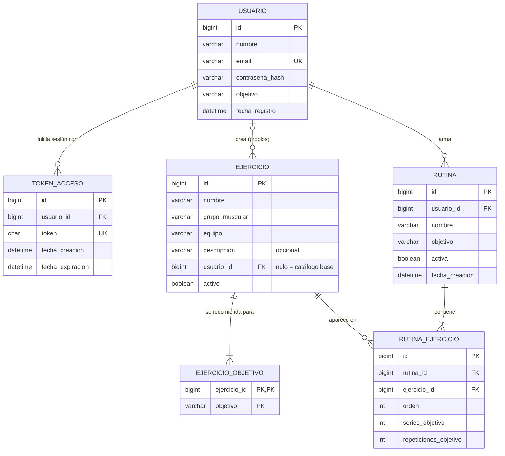
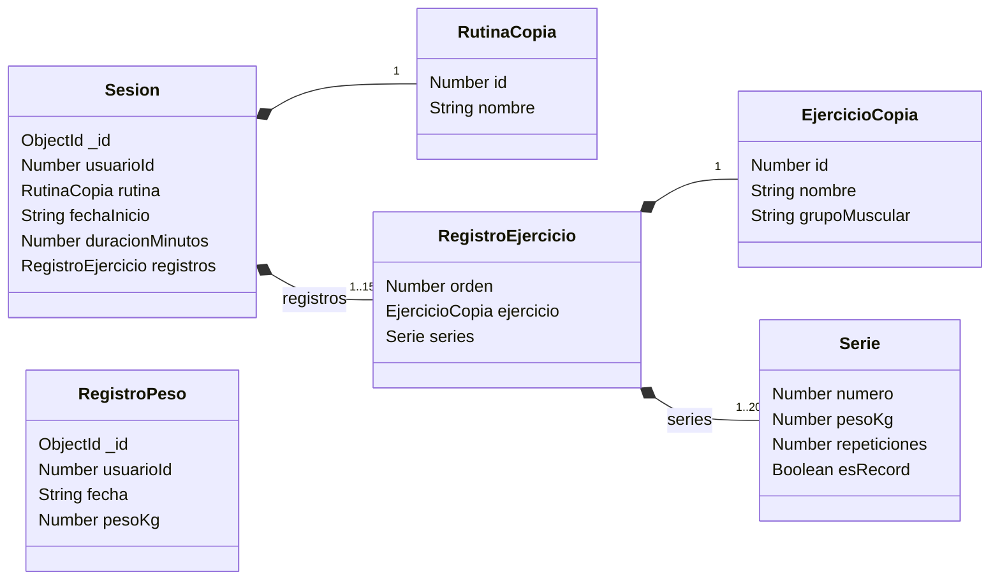
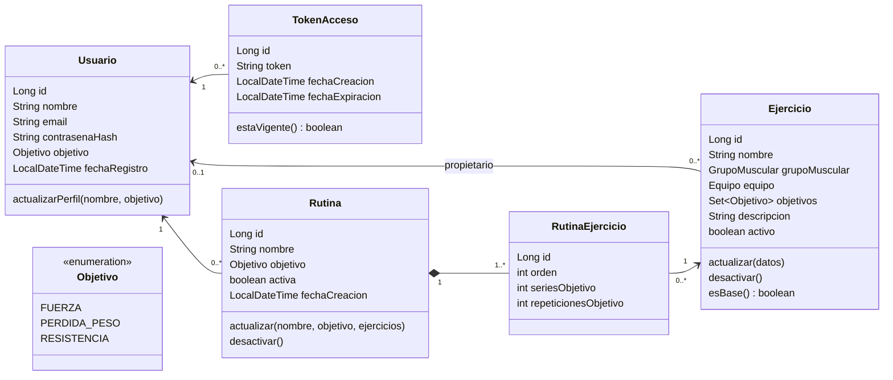

# Modelo de datos — GymRutine

**Versión:** 2.1
**Fecha:** 2026-09-21
**Bases de datos:** MySQL 8.4 LTS (servicio de cuentas, con Spring Data JPA) · MongoDB 8.0 (servicio de entrenamiento, con Mongoose)

Este documento es la referencia del modelo: el diagrama entidad-relación de MySQL, el modelo de documentos de MongoDB, el diccionario de datos, las reglas que el esquema no garantiza solo y el catálogo base de ejercicios. Las entidades JPA y los esquemas de Mongoose deben coincidir con lo que dice aquí. Si hay que cambiar el modelo, **se cambia primero este documento** y después el código.

## 1. Resumen

Cada servicio es dueño de su base de datos ([ARQUITECTURA.md](ARQUITECTURA.md), DEC-02).

| Base | Tabla o colección | Qué guarda | Volumen típico |
|---|---|---|---|
| MySQL | `usuario` | Cuentas: nombre, email, contraseña cifrada y objetivo | 1 por persona |
| MySQL | `token_acceso` | Tokens de inicio de sesión vigentes | 1 a 3 por usuario |
| MySQL | `ejercicio` | Catálogo base (sin dueño) y ejercicios propios de cada usuario | 40 base + pocos propios |
| MySQL | `ejercicio_objetivo` | Objetivos para los que se recomienda cada ejercicio | 1 a 3 por ejercicio |
| MySQL | `rutina` | Planes de entrenamiento de cada usuario | 2 a 6 por usuario |
| MySQL | `rutina_ejercicio` | Ejercicios de cada rutina, con series y repeticiones objetivo | 4 a 8 por rutina |
| MongoDB | `sesiones` | Cada entrenamiento, con sus ejercicios y sus series dentro del mismo documento | 3 a 5 por semana |
| MongoDB | `registrosPeso` | Peso corporal por fecha | 1 a 2 por semana |

## 2. MySQL: diagrama entidad-relación



**Cómo leer las líneas:** `||` exactamente uno · `|o` cero o uno · `|{` uno o más · `o{` cero o más. GitHub dibuja el diagrama al abrir este archivo.

## 3. MySQL: relaciones y cardinalidades

| Relación | Cardinalidad | Qué significa |
|---|---|---|
| usuario → token_acceso | 1 : 0..N | Un usuario puede tener la sesión abierta en varios dispositivos |
| usuario → ejercicio | 0..1 : 0..N | `usuario_id` nulo = ejercicio del catálogo base; con valor = ejercicio propio, visible solo para su dueño |
| ejercicio → ejercicio_objetivo | 1 : 1..3 | Todo ejercicio se recomienda para al menos un objetivo |
| usuario → rutina | 1 : 0..N | Las rutinas son privadas de cada usuario |
| rutina → rutina_ejercicio | 1 : 1..15 | Una rutina tiene al menos un ejercicio y no lo repite |
| ejercicio → rutina_ejercicio | 1 : 0..N | Un mismo ejercicio puede estar en varias rutinas |

## 4. MySQL: diccionario de datos

**Convenciones:** tablas y columnas en `snake_case`; la clave primaria de cada tabla se llama `id` y es `BIGINT AUTO_INCREMENT`; las claves foráneas terminan en `_id`; los enumerados se guardan como texto; motor InnoDB con `utf8mb4`. Las columnas no admiten nulos salvo que se indique.

### usuario

| Columna | Tipo | Clave | Regla |
|---|---|---|---|
| id | BIGINT | PK | Autoincremental |
| nombre | VARCHAR(80) | | 2 a 80 caracteres |
| email | VARCHAR(120) | UK | Formato de email. Se guarda en minúsculas y sin espacios alrededor |
| contrasena_hash | VARCHAR(60) | | Hash BCrypt (siempre mide 60). La contraseña original nunca se guarda |
| objetivo | VARCHAR(20) | | `FUERZA`, `PERDIDA_PESO` o `RESISTENCIA` |
| fecha_registro | DATETIME | | La asigna el servidor al crear la cuenta |

### token_acceso

| Columna | Tipo | Clave | Regla |
|---|---|---|---|
| id | BIGINT | PK | |
| usuario_id | BIGINT | FK → usuario | |
| token | CHAR(36) | UK | UUID aleatorio generado por el servidor |
| fecha_creacion | DATETIME | | |
| fecha_expiracion | DATETIME | | `fecha_creacion` + 7 días |

### ejercicio

| Columna | Tipo | Clave | Regla |
|---|---|---|---|
| id | BIGINT | PK | |
| nombre | VARCHAR(80) | | 3 a 80 caracteres. No se repite entre el catálogo base y los propios activos del usuario, sin distinguir mayúsculas (se valida en el servicio) |
| grupo_muscular | VARCHAR(20) | | Valores en §6 |
| equipo | VARCHAR(20) | | Valores en §6 |
| descripcion | VARCHAR(500) | | **Admite nulo.** Indicaciones de técnica |
| usuario_id | BIGINT | FK → usuario | **Admite nulo.** Nulo = catálogo base |
| activo | BOOLEAN | | `true` al crearse; `false` al eliminarlo (borrado lógico) |

### ejercicio_objetivo

| Columna | Tipo | Clave | Regla |
|---|---|---|---|
| ejercicio_id | BIGINT | PK, FK → ejercicio | |
| objetivo | VARCHAR(20) | PK | Valores en §6 |

### rutina

| Columna | Tipo | Clave | Regla |
|---|---|---|---|
| id | BIGINT | PK | |
| usuario_id | BIGINT | FK → usuario | |
| nombre | VARCHAR(80) | | 3 a 80 caracteres |
| objetivo | VARCHAR(20) | | Por defecto, el objetivo del usuario al crearla |
| activa | BOOLEAN | | `false` al eliminarla (borrado lógico) |
| fecha_creacion | DATETIME | | |

### rutina_ejercicio

| Columna | Tipo | Clave | Regla |
|---|---|---|---|
| id | BIGINT | PK | |
| rutina_id | BIGINT | FK → rutina | |
| ejercicio_id | BIGINT | FK → ejercicio | No se repite dentro de la misma rutina (se valida en el servicio, DM-10) |
| orden | INT | | 1, 2, 3… según el orden en que llegan en la petición |
| series_objetivo | INT | | 1 a 10 |
| repeticiones_objetivo | INT | | 1 a 50 |

## 5. MongoDB: modelo de documentos

Base `gymrutine` en MongoDB, con dos colecciones. En MongoDB no hay tablas ni uniones: **lo que se lee junto se guarda junto**. Una sesión se guarda completa, con sus ejercicios y sus series dentro del mismo documento.



`*--` es composición: el registro y sus series viven **dentro** del documento de la sesión, no en otra colección.

### Colección `sesiones`

Ejemplo (la sesión del lunes 14 de septiembre, la misma del contrato):

```json
{
  "_id": { "$oid": "66f1c0a2e4b0a1b2c3d4e5f6" },
  "usuarioId": 7,
  "rutina": { "id": 3, "nombre": "Pecho y tríceps" },
  "fechaInicio": "2026-09-14T18:30:00",
  "duracionMinutos": 55,
  "registros": [
    {
      "orden": 1,
      "ejercicio": { "id": 1, "nombre": "Press de banca con barra", "grupoMuscular": "PECHO" },
      "series": [
        { "numero": 1, "pesoKg": 55, "repeticiones": 5, "esRecord": false },
        { "numero": 2, "pesoKg": 57.5, "repeticiones": 5, "esRecord": false },
        { "numero": 3, "pesoKg": 60, "repeticiones": 5, "esRecord": false },
        { "numero": 4, "pesoKg": 62.5, "repeticiones": 4, "esRecord": true }
      ]
    },
    {
      "orden": 2,
      "ejercicio": { "id": 23, "nombre": "Extensión de tríceps en polea", "grupoMuscular": "TRICEPS" },
      "series": [
        { "numero": 1, "pesoKg": 25, "repeticiones": 12, "esRecord": false },
        { "numero": 2, "pesoKg": 27.5, "repeticiones": 10, "esRecord": false },
        { "numero": 3, "pesoKg": 27.5, "repeticiones": 9, "esRecord": false }
      ]
    }
  ]
}
```

| Campo | Tipo | Regla |
|---|---|---|
| `_id` | ObjectId | Lo genera MongoDB. En la API se expone como `id`, en texto |
| `usuarioId` | Number | Id del usuario en MySQL. Sale del token, nunca del cuerpo |
| `rutina.id` | Number | Id de la rutina en MySQL |
| `rutina.nombre` | String | **Copia** del nombre al momento de registrar (DM-09) |
| `fechaInicio` | String | `AAAA-MM-DDTHH:mm:ss`, hora local. No puede ser futura (DM-11) |
| `duracionMinutos` | Number | Entero de 1 a 600 |
| `registros` | Array | 1 a 15 elementos |
| `registros[].orden` | Number | 1, 2, 3… Lo asigna el servidor |
| `registros[].ejercicio.id` | Number | Id del ejercicio en MySQL. Está en la rutina, está activo y no se repite en la sesión |
| `registros[].ejercicio.nombre` · `.grupoMuscular` | String | **Copia** del nombre y del código del grupo muscular |
| `registros[].series` | Array | 1 a 20 elementos |
| `series[].numero` | Number | 1, 2, 3… Lo asigna el servidor |
| `series[].pesoKg` | Number | 0 a 500, máximo 2 decimales. `0` = sin carga externa |
| `series[].repeticiones` | Number | Entero de 1 a 100 |
| `series[].esRecord` | Boolean | Lo calcula el sistema con la regla R6 (§7.1). El cliente nunca lo envía |

**Índices:**

| Índice | Para qué |
|---|---|
| `{ usuarioId: 1, fechaInicio: -1 }` | Historial del usuario, de la más reciente a la más antigua |
| `{ usuarioId: 1, "registros.ejercicio.id": 1 }` | Récords, progreso y "última vez" de un ejercicio |

### Colección `registrosPeso`

```json
{ "_id": { "$oid": "66f1c3b8e4b0a1b2c3d4e601" }, "usuarioId": 7, "fecha": "2026-09-14", "pesoKg": 77.9 }
```

| Campo | Tipo | Regla |
|---|---|---|
| `_id` | ObjectId | En la API se expone como `id`, en texto |
| `usuarioId` | Number | Id del usuario en MySQL. Sale del token |
| `fecha` | String | `AAAA-MM-DD`. No puede ser futura |
| `pesoKg` | Number | 20 a 350, máximo 2 decimales |

**Índice único** `{ usuarioId: 1, fecha: 1 }`: como máximo un registro por usuario y fecha. Si se repite, MongoDB responde con el código `11000` y la API lo convierte en 409 `PESO_YA_REGISTRADO`.

## 6. Enumeraciones

Se guardan como texto con el código, en MySQL y en MongoDB. El nombre visible y las sugerencias los entrega `GET /referencias` ([contrato](CONTRATO-API.md) §4), para que el frontend nunca escriba estos textos a mano.

| Código de objetivo | Nombre visible | Series sugeridas | Repeticiones sugeridas | Idea |
|---|---|---|---|---|
| `FUERZA` | Fuerza | 4 | 5 | Pocas repeticiones con cargas altas |
| `PERDIDA_PESO` | Pérdida de peso | 3 | 12 | Repeticiones moderadas y descansos cortos |
| `RESISTENCIA` | Resistencia | 3 | 15 | Muchas repeticiones con cargas moderadas |

**Grupo muscular:** `PECHO` Pecho · `ESPALDA` Espalda · `HOMBROS` Hombros · `BICEPS` Bíceps · `TRICEPS` Tríceps · `PIERNAS` Piernas · `GLUTEOS` Glúteos · `ABDOMEN` Abdomen

**Equipo:** `BARRA` Barra · `MANCUERNAS` Mancuernas · `MAQUINA` Máquina · `POLEA` Polea · `PESO_CORPORAL` Peso corporal · `OTRO` Otro

### Referencias entre las dos bases

Entre MySQL y MongoDB **no hay claves foráneas**: son referencias lógicas por id. Cada una se protege así:

| Campo en MongoDB | Apunta a (MySQL) | Cómo se garantiza |
|---|---|---|
| `usuarioId` (las dos colecciones) | `usuario.id` | Sale del token que valida el servicio de cuentas |
| `sesiones.rutina.id` | `rutina.id` | Al registrar, el servicio de entrenamiento pide la rutina al de cuentas con el token del usuario (ARQUITECTURA DEC-16) |
| `sesiones.registros[].ejercicio.id` | `ejercicio.id` | Al registrar, el ejercicio debe estar en esa rutina y activo |

Como después la rutina o el ejercicio pueden renombrarse o eliminarse, la sesión guarda una copia de sus nombres (DM-09).

## 7. Reglas de negocio e integridad

Reglas que el esquema no garantiza solo y que implementan los servicios. Cada una tiene su criterio de aceptación en las [historias](HISTORIAS.md).

| # | Regla | Servicio |
|---|---|---|
| R1 | **Visibilidad de ejercicios.** Un usuario ve los ejercicios base y sus propios ejercicios. Un ejercicio propio de otro usuario se trata como inexistente (404) | Cuentas |
| R2 | **Solo los propios se modifican.** Editar o eliminar un ejercicio base responde 403 | Cuentas |
| R3 | **Borrado lógico** en `ejercicio` y `rutina`. Lo eliminado desaparece de los listados y no se puede usar en rutinas ni sesiones nuevas, pero se sigue viendo en el historial | Cuentas |
| R4 | **Consistencia de la sesión.** La rutina es del usuario y está activa; cada ejercicio registrado está en esa rutina, activo y sin repetir; hay al menos un ejercicio con al menos una serie. `orden` y `numero` los asigna el servidor | Entrenamiento, preguntando al de cuentas |
| R5 | **Corregir una sesión.** Se pueden cambiar su fecha, su duración y sus series, pero no sus ejercicios: no se agregan ni se quitan. La rutina no se vuelve a consultar, porque la sesión guarda la copia de los nombres. Al corregirla se recalculan los récords de sus ejercicios, igual que al registrarla o eliminarla | Entrenamiento |
| R6 | **Récords personales:** ver §7.1 | Entrenamiento |
| R7 | **Volumen.** Volumen de una serie = `pesoKg × repeticiones`. El de un ejercicio y el de una sesión son sumas, redondeadas a 2 decimales. No se guardan: se calculan al consultar | Entrenamiento |
| R8 | **Peso corporal.** Como máximo un registro por usuario y fecha (índice único), también al corregir la fecha de un registro | Entrenamiento |
| R9 | **Tokens.** Vencen a los 7 días. Cerrar sesión borra el token. Al iniciar sesión se borran los tokens vencidos de ese usuario | Cuentas |
| R10 | **Pertenencia.** Todo recurso de otro usuario responde como si no existiera: 404. En MongoDB, toda consulta lleva el `usuarioId` del token | Los dos |

### 7.1 Regla de récords personales (R6)

**Definición (decisión D2):** una serie es récord personal si su peso **supera** el máximo que el usuario había levantado en ese ejercicio en sus sesiones anteriores.

**Algoritmo `recalcularRecords(usuarioId, ejercicioId)`** (en `backend-node/src/servicios/records.js`):

1. Tomar las sesiones del usuario que tienen ese ejercicio, en orden cronológico: por `fechaInicio` y, a igual fecha, por `_id`.
2. Empezar con `maximoPrevio = 0`.
3. Para cada sesión, en ese orden:
   - `maximoSesion` = el mayor `pesoKg` de sus series en ese ejercicio.
   - Si `maximoSesion > maximoPrevio`: se marca como récord **la primera serie** (menor `numero`) que tiene ese peso, y `maximoPrevio` pasa a ser `maximoSesion`.
   - Las demás series de ese ejercicio quedan con `esRecord: false`.
4. Guardar solo las sesiones que cambiaron.

**Cuándo se ejecuta:** después de registrar, corregir o eliminar una sesión, para cada ejercicio de esa sesión.

**Por qué se recalcula todo el historial del ejercicio** y no se compara solo contra el récord actual: una sesión puede registrarse con fecha pasada, corregirse o eliminarse, y en los tres casos cambian los récords de sesiones posteriores. Además, así el recálculo es **idempotente**: MongoDB en local no tiene transacciones entre documentos, y si algo falla a mitad, la siguiente escritura deja todo correcto (ARQUITECTURA DEC-18).

**El cálculo es una función pura** (`calcularRecords`): recibe las sesiones ordenadas y devuelve qué series son récord, sin tocar la base de datos. Así se prueba con `node --test`.

**Casos que deben tener prueba:**

| Caso | Resultado esperado |
|---|---|
| Primera vez que se hace el ejercicio, con peso mayor que 0 | Récord: supera el máximo previo de 0 |
| El mismo peso que el récord vigente | No es récord: empatar no es superar |
| Dos series con el mismo peso máximo en la sesión | Solo la primera es récord |
| Varias series que superan el récord en la misma sesión | Solo la más pesada: máximo un récord por ejercicio en cada sesión |
| Peso 0 | Nunca es récord |
| Se registra una sesión con una fecha anterior y un peso mayor | Esa sesión es récord y puede quitárselo a sesiones posteriores |
| Se elimina la sesión que tenía el récord | Una sesión posterior puede pasar a ser récord |
| Se corrige a la baja el peso de la serie récord de una sesión | Esa sesión puede perder el récord y una posterior ganarlo |

**Ejemplo — Press de banca con barra:**

| Sesión | Fecha | Series (kg × reps) | Máximo de la sesión | Máximo previo | ¿Récord? |
|---|---|---|---|---|---|
| S1 | 01-sep | 40 × 12 · **45 × 10** · 45 × 8 | 45 | 0 | Sí: serie 2 |
| S2 | 04-sep | 45 × 12 · 45 × 10 | 45 | 45 | No: empata |
| S3 | 08-sep | 47,5 × 8 · **50 × 6** · 50 × 5 | 50 | 45 | Sí: serie 2 |
| S4 | 11-sep | 40 × 15 | 40 | 50 | No |

- Si se **elimina S3**, el máximo vuelve a 45 y S4 (40 kg) sigue sin ser récord.
- Si después se **registra una sesión con fecha 06-sep** y una serie de 52,5 × 3, esa sesión pasa a ser récord y **S3 deja de serlo** (50 < 52,5).
- Si en cambio se **corrige S3** y todas sus series quedan en 45 kg, S3 solo empata el máximo previo (45) y deja de ser récord; S4 (40 kg) sigue sin serlo. Si se corrige solo la serie de 50 × 6, S3 sigue siendo récord con la de 50 × 5.

## 8. Normalización y desnormalización

**MySQL, en tercera forma normal:**

- **1FN:** atributos atómicos. Los objetivos de un ejercicio (multivaluados) van en su propia tabla, `ejercicio_objetivo`.
- **2FN:** las tablas con clave simple no tienen dependencias parciales; `ejercicio_objetivo`, la única con clave compuesta, no tiene más atributos.
- **3FN:** ninguna columna depende de otra que no sea la clave.

**MongoDB, desnormalizado a propósito:** los documentos se diseñan según cómo se leen, no según formas normales.

| Qué se repite | Por qué |
|---|---|
| `usuarioId` en cada sesión y registro de peso | No hay uniones entre bases: sin él no se podría filtrar por dueño |
| Nombre de la rutina y de cada ejercicio dentro de la sesión | El historial se ve igual aunque después se renombren o se eliminen, y sin llamar al otro servicio (DM-09) |
| `esRecord` en cada serie | Es un dato derivado. Se guarda para no recalcularlo en cada lectura del historial; su consistencia la garantiza R6 |

**Lo que no se guarda:** volúmenes, totales de la sesión y récord vigente por ejercicio. Se calculan al consultar.

## 9. Modelo de dominio del servicio de cuentas (clases JPA)



| Entidad | Tabla | Relaciones JPA |
|---|---|---|
| `Usuario` | `usuario` | — |
| `TokenAcceso` | `token_acceso` | `@ManyToOne` → `Usuario` |
| `Ejercicio` | `ejercicio` | `@ManyToOne` opcional → `Usuario` · `@ElementCollection` de `Objetivo` en `ejercicio_objetivo` |
| `Rutina` | `rutina` | `@ManyToOne` → `Usuario` · `@OneToMany` → `RutinaEjercicio` (cascada y `orphanRemoval`, ordenada por `orden`) |
| `RutinaEjercicio` | `rutina_ejercicio` | `@ManyToOne` → `Rutina` y → `Ejercicio` |

- Hibernate convierte `camelCase` en `snake_case` solo (`fechaRegistro` → `fecha_registro`), así que casi ninguna columna necesita nombre explícito.
- Enumerados con `@Enumerated(EnumType.STRING)`, **nunca** `ORDINAL`: reordenar el enum cambiaría el significado de los datos guardados.
- Relaciones `@ManyToOne` con carga perezosa (`LAZY`); las entidades se convierten a DTO dentro del servicio.

Los esquemas de Mongoose del servicio de entrenamiento siguen exactamente las tablas de campos de §5.

## 10. Catálogo base (datos iniciales)

Lo carga el servicio de cuentas al arrancar, de forma **idempotente**: cada ejercicio base se inserta solo si no existe ya uno base con ese nombre. Arrancar varias veces no crea duplicados, y agregar un ejercicio a esta lista no obliga a borrar la base de datos.

Objetivos: **F** = Fuerza · **P** = Pérdida de peso · **R** = Resistencia. Son orientativos.

| # | Ejercicio | Grupo | Equipo | Objetivos |
|---|---|---|---|---|
| 1 | Press de banca con barra | Pecho | Barra | F |
| 2 | Press inclinado con mancuernas | Pecho | Mancuernas | F, P |
| 3 | Aperturas con mancuernas | Pecho | Mancuernas | P, R |
| 4 | Cruce de poleas | Pecho | Polea | P, R |
| 5 | Flexiones de pecho | Pecho | Peso corporal | P, R |
| 6 | Peso muerto | Espalda | Barra | F |
| 7 | Dominadas | Espalda | Peso corporal | F, R |
| 8 | Jalón al pecho | Espalda | Polea | F, P |
| 9 | Remo con barra | Espalda | Barra | F |
| 10 | Remo con mancuerna a una mano | Espalda | Mancuernas | F, P |
| 11 | Remo sentado en polea | Espalda | Polea | P, R |
| 12 | Press militar con barra | Hombros | Barra | F |
| 13 | Press de hombro con mancuernas | Hombros | Mancuernas | F, P |
| 14 | Elevaciones laterales | Hombros | Mancuernas | P, R |
| 15 | Elevaciones posteriores | Hombros | Mancuernas | R |
| 16 | Face pull en polea | Hombros | Polea | R |
| 17 | Curl con barra | Bíceps | Barra | F, P |
| 18 | Curl alterno con mancuernas | Bíceps | Mancuernas | P, R |
| 19 | Curl martillo | Bíceps | Mancuernas | P, R |
| 20 | Curl en polea | Bíceps | Polea | R |
| 21 | Fondos en paralelas | Tríceps | Peso corporal | F, R |
| 22 | Press francés con barra | Tríceps | Barra | F |
| 23 | Extensión de tríceps en polea | Tríceps | Polea | P, R |
| 24 | Patada de tríceps con mancuerna | Tríceps | Mancuernas | R |
| 25 | Sentadilla con barra | Piernas | Barra | F |
| 26 | Prensa de piernas | Piernas | Máquina | F, P |
| 27 | Zancadas con mancuernas | Piernas | Mancuernas | P, R |
| 28 | Extensión de cuádriceps | Piernas | Máquina | P, R |
| 29 | Curl femoral en máquina | Piernas | Máquina | P, R |
| 30 | Elevación de talones en máquina | Piernas | Máquina | R |
| 31 | Hip thrust con barra | Glúteos | Barra | F, P |
| 32 | Peso muerto rumano | Glúteos | Barra | F |
| 33 | Sentadilla búlgara | Glúteos | Mancuernas | P, R |
| 34 | Patada de glúteo en polea | Glúteos | Polea | R |
| 35 | Swing con kettlebell | Glúteos | Otro | P, R |
| 36 | Crunch abdominal | Abdomen | Peso corporal | R |
| 37 | Elevación de piernas colgado | Abdomen | Peso corporal | F, R |
| 38 | Crunch en polea | Abdomen | Polea | P, R |
| 39 | Rueda abdominal | Abdomen | Otro | R |
| 40 | Giros rusos con disco | Abdomen | Otro | P, R |

No hay ejercicios que se midan por tiempo o distancia (plancha, cinta, bicicleta): el registro es por peso y repeticiones.

## 11. Decisiones del modelo

| # | Decisión | Alternativas descartadas | Por qué |
|---|---|---|---|
| DM-01 | **Registrar por serie** (D2) | Una fila por ejercicio con peso, series y reps | Las series cambian de peso dentro del mismo ejercicio (40, 45, 50 kg). Con un solo dato no se sabría qué se levantó realmente, y el récord y el volumen serían inexactos |
| DM-02 | **Récord = peso máximo estricto, máximo uno por ejercicio por sesión, recalculado** (D2) | Comparar solo contra el récord actual · récord por peso × reps · 1RM estimado | Comparar solo contra el actual falla con sesiones de fecha pasada y con eliminaciones. El peso máximo es la definición más fácil de explicar y coincide con la gráfica de progreso |
| DM-03 | **Guardar `esRecord`** aunque sea derivado | Calcularlo en cada consulta | El historial se lee mucho más de lo que se escribe, y deja visible en los datos el concepto central de la app. La consistencia la da el recálculo (R6) |
| DM-04 | **Catálogo base de solo lectura + ejercicios propios por usuario** | Catálogo global que cualquiera edita · rol administrador | Con usuarios reales, un catálogo editable por todos permite que cualquiera borre "Press de banca" a los demás. Una columna `usuario_id` nula resuelve las dos cosas |
| DM-05 | **Cada registro de la sesión apunta al ejercicio**, no a la fila de la rutina | Referenciar `rutina_ejercicio` | Editar o eliminar una rutina no debe alterar el historial. Además permite prellenar con "la última vez" aunque haya sido en otra rutina |
| DM-06 | **Borrado lógico** en ejercicio y rutina; **físico** en sesión y registro de peso | Todo físico · todo lógico | Ejercicios y rutinas aparecen en el historial y no pueden desaparecer. Sesiones y pesos no los referencia nada, y borrarlos de verdad es lo que el usuario espera al corregir un error |
| DM-07 | **Enumerados como texto** | Tablas de catálogo · `ORDINAL` | Son listas fijas que no se administran desde la app. `ORDINAL` se rompe al reordenar |
| DM-08 | **Las sesiones en MongoDB, como un documento anidado** | Tres tablas en MySQL (sesión, registro y serie) | Una sesión se escribe completa, al registrarla o al corregirla, y se lee completa. Como documento no necesita uniones entre tablas, y su forma es la misma que la del JSON del contrato |
| DM-09 | **Copia de nombres en la sesión** (ARQUITECTURA DEC-15) | Guardar solo los ids | El historial debe verse igual aunque la rutina o el ejercicio se renombren o se eliminen, y sin llamar al servicio de cuentas por cada sesión |
| DM-10 | **"No repetir ejercicios en una rutina" se valida en el servicio**, sin restricción única en la base de datos | UK (`rutina_id`, `ejercicio_id`) | Al editar, Hibernate reemplaza la lista y puede insertar las filas nuevas antes de borrar las viejas, lo que dispararía la restricción aunque el resultado final sea válido |
| DM-11 | **Fechas de MongoDB como texto ISO en hora local** (`2026-09-14T18:30:00`) | El tipo `Date` de MongoDB | `Date` se guarda en UTC y obliga a convertir zonas horarias, un error clásico. El texto ISO es igual al del contrato y se ordena bien como texto |
| DM-12 | **Pesos como `Number` con máximo 2 decimales**, y volúmenes redondeados a 2 decimales | `Decimal128` | `Decimal128` complica el JSON y las cuentas en JavaScript. Los pesos del gimnasio (múltiplos de 0,25 kg) se representan bien, y el redondeo evita errores como `0,1 + 0,2` en los volúmenes |

## 12. Documentos relacionados

- [CONTRATO-API.md](CONTRATO-API.md): cómo exponen estos datos las dos APIs
- [ARQUITECTURA.md](ARQUITECTURA.md): servicios, comunicación entre ellos y decisiones técnicas
- [HISTORIAS.md](HISTORIAS.md): criterios de aceptación de cada regla

## 13. Historial de cambios

| Fecha | Cambio |
|---|---|
| 2026-09-14 | v1.0: versión inicial con las decisiones D2 (registro por serie, récord por peso), D3 (peso corporal) y D4 (login con email y contraseña) |
| 2026-09-21 | v2.0: el modelo se reparte entre dos bases. MySQL queda con 6 tablas (cuentas, catálogo y rutinas); las sesiones y el peso corporal pasan a MongoDB como las colecciones `sesiones` y `registrosPeso`. Nuevas decisiones DM-08, DM-09, DM-11 y DM-12 |
| 2026-09-21 | v2.1: un CRUD completo por integrante. Las sesiones se pueden corregir (R5: fecha, duración y series, sin cambiar los ejercicios) y el recálculo de récords se ejecuta también al corregir (§7.1, con un caso de prueba más). Los registros de peso se pueden corregir sin repetir fecha (R8) |
