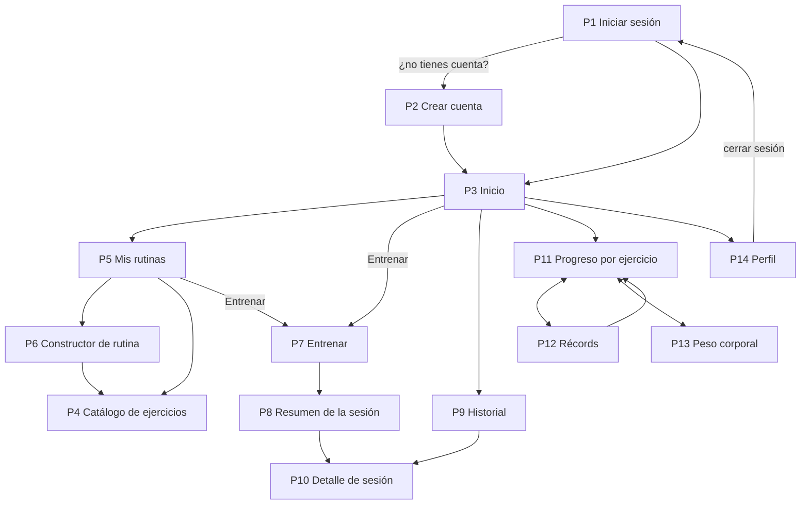

# Mockup de pantallas — GymRutine

**Versión:** 1.3
**Fecha:** 2026-09-21

Las 14 pantallas de GymRutine, **cada una con sus reglas**: ruta, de dónde salen los datos, qué se valida, qué pasa al enviar y qué se ve cuando algo falla. Lo que obliga son las reglas, que salen del [contrato](../CONTRATO-API.md) y de las [historias](../HISTORIAS.md).

## Cómo ver el mockup

El mockup visual está en **[mockup.html](mockup.html)**: un solo archivo HTML y CSS, sin dependencias, con cada pantalla dibujada en un marco de celular y sus reglas anotadas al lado. Incluye además la guía visual (colores, tipografía y componentes), los estados compartidos y la vista de escritorio.

- **GitHub no dibuja archivos HTML:** muestra su código. Para verlo como página, ábrelo desde tu copia del repo (doble clic en `docs/mockup/mockup.html`).
- **Los colores y la tipografía son una propuesta** para la decisión pendiente D6 ([IDEA.md](../IDEA.md) §13). Si el equipo la aprueba, T2 toma de ahí las variables y las clases de `estilos.css`.
- **Los datos son de ejemplo**, coherentes con los ejemplos del contrato (la usuaria Ana, la rutina "Pecho y tríceps" y la sesión del lunes 14 de septiembre).

Este documento es la versión en texto de las reglas, para leerlas directamente en GitHub. Si una regla cambia, se cambia aquí y en `mockup.html`.

## Mapa de navegación

**Barra de navegación** (abajo en el celular, arriba desde 768 px): **Inicio · Rutinas · Historial · Progreso · Perfil**. El catálogo se abre desde Rutinas. Récords y peso corporal se abren desde Progreso.

| Pantalla | Ruta | Página | Historias | Responsable |
|---|---|---|---|---|
| [P1 Iniciar sesión](#p1--iniciar-sesión) | `/login` | `PaginaLogin` | H2 | Javier (T4) |
| [P2 Crear cuenta](#p2--crear-cuenta) | `/registro` | `PaginaRegistro` | H1 | Javier (T4) |
| [P3 Inicio](#p3--inicio) | `/` | `PaginaInicio` | Resume H11, H15, H19 y H22 | Rances (T11) |
| [P4 Catálogo de ejercicios](#p4--catálogo-de-ejercicios) | `/ejercicios` | `PaginaEjercicios` | H5–H9 | Javier (T5) |
| [P5 Mis rutinas](#p5--mis-rutinas) | `/rutinas` | `PaginaRutinas` | H11, H13 | Javier (T6) |
| [P6 Constructor de rutina](#p6--constructor-de-rutina) | `/rutinas/nueva` · `/rutinas/:id/editar` | `PaginaRutinaFormulario` | H10, H12 | Javier (T6) |
| [P7 Entrenar](#p7--entrenar-) | `/rutinas/:id/entrenar` | `PaginaEntrenar` | H14, H18 | Santiago (T7) |
| [P8 Resumen de la sesión](#p8--resumen-de-la-sesión) | `/rutinas/:id/entrenar` (al guardar) | `PaginaEntrenar` | H14, H18 | Santiago (T7) |
| [P9 Historial](#p9--historial) | `/historial` | `PaginaHistorial` | H15 | Santiago (T7) |
| [P10 Detalle de sesión](#p10--detalle-de-sesión) | `/historial/:id` | `PaginaSesion` | H16, H17, H23 | Santiago (T7) |
| [P11 Progreso por ejercicio](#p11--progreso-por-ejercicio) | `/progreso` | `PaginaProgreso` | H20 | Javier (T9) |
| [P12 Récords](#p12--récords) | `/progreso/records` | `PaginaRecords` | H19 | Rances (T8) |
| [P13 Peso corporal](#p13--peso-corporal) | `/progreso/peso` | `PaginaPeso` | H21, H22, H24 | Rances (T10) |
| [P14 Perfil](#p14--perfil) | `/perfil` | `PaginaPerfil` | H3, H4 | Rances (T4) |

## Reglas generales (todas las pantallas)

1. **Primero para celular:** diseño base a 360 px de ancho y sin scroll horizontal. Desde 768 px, navegación superior y contenido centrado.
2. **Botones y campos de al menos 44 px de alto:** se usan de pie, con una mano y entre series.
3. **Campos numéricos con teclado numérico en el celular** (`inputmode="decimal"`). El peso admite hasta 2 decimales.
4. **Números y fechas en formato colombiano:** `62,5 kg`, `1.935 kg`, `lun 14 sep`. La API envía y recibe punto decimal; la conversión la hace `utilidades/formato.js`.
5. **Ningún nombre de objetivo, grupo muscular o equipo escrito a mano:** salen de `GET /referencias`.
6. **Validar en el navegador solo para avisar rápido.** La validación que cuenta es la del backend: sus errores también se muestran junto a cada campo.
7. **Confirmación antes de eliminar** cualquier cosa.
8. **Botón deshabilitado mientras se envía** una petición, para evitar dobles envíos.
9. **Rutas privadas protegidas:** sin sesión, cualquier ruta distinta de `/login` y `/registro` lleva a `/login` (`RutaPrivada`).
10. **En la entrega, todo con datos reales de la API**, nunca inventados.

## Estados compartidos

Los construye la tarea T2 como componentes (`Cargando`, `EstadoVacio`, `MensajeError` y `CampoFormulario`) y los usan todas las pantallas.

| Estado | Cuándo | Qué se ve |
|---|---|---|
| Cargando | Mientras llega la respuesta | Bloques grises animados con la forma del contenido; los botones de envío, deshabilitados |
| Lista vacía | La API responde `[]` | Mensaje que explica el vacío y botón con la acción siguiente ("Crea tu primera rutina") |
| Error de validación | 400 `VALIDACION_FALLIDA` | El mensaje de `campos` debajo de cada campo, y el campo resaltado en rojo |
| Conflicto | 409 | El `mensaje` de la API junto al campo afectado (email, nombre o fecha) |
| No autenticado | 401 `NO_AUTENTICADO` | Se borra la sesión y se lleva a `/login` con el aviso "Tu sesión terminó. Vuelve a iniciar sesión" |
| No encontrado | 404 | "No encontramos lo que buscas" y botón para volver |
| Sin conexión | La petición no llega al servidor | "No se pudo conectar con el servidor" y botón Reintentar. Los datos escritos no se borran |
| Error inesperado | 500 u otro | "Algo salió mal. Intenta de nuevo" |

---

## P1 — Iniciar sesión

**Ruta:** `/login` · **Boceto:** [mockup.html#p1](mockup.html#p1) · **Datos:** `POST /auth/login`

- Email y contraseña obligatorios antes de enviar.
- El ícono del ojo alterna entre ver y ocultar la contraseña.
- 401 `CREDENCIALES_INVALIDAS` → un único mensaje bajo el botón: "Email o contraseña incorrectos". Nunca se indica cuál de los dos falló.
- Éxito → `AuthContext` guarda el token y el usuario, y se va a `/`.
- Si al abrir la pantalla ya hay sesión, se va directo a `/`.

## P2 — Crear cuenta

**Ruta:** `/registro` · **Boceto:** [mockup.html#p2](mockup.html#p2) · **Datos:** `GET /referencias` y `POST /auth/registro`

- Nombre de 2 a 80 caracteres; email con formato válido; contraseña de 8 a 72 caracteres; objetivo obligatorio (ninguno viene marcado).
- Los objetivos se muestran como tarjetas con su nombre y su descripción, tomados de `/referencias`.
- 409 `EMAIL_YA_REGISTRADO` → mensaje bajo el email con enlace a `/login`.
- Éxito (201) → la sesión queda iniciada y se va a `/`.

## P3 — Inicio

**Ruta:** `/` · **Boceto:** [mockup.html#p3](mockup.html#p3) · **Datos:** usuario de `AuthContext`, `GET /rutinas`, `GET /sesiones` (la primera), `GET /records` (los 3 más recientes por fecha) y `GET /peso-corporal` (los dos últimos, para la diferencia)

Hasta el sprint 4, T2 deja aquí accesos simples a cada sección; T11 construye la pantalla completa.

- **Entrenar hoy:** hasta 3 rutinas activas; "Entrenar" va a P7 con esa rutina.
- **Sin rutinas:** en lugar de la lista, "Crea tu primera rutina" → P6.
- **Sin sesiones, récords o peso:** cada bloque vacío muestra su invitación, sin romper la pantalla.
- **Borrador pendiente:** si hay un entrenamiento sin guardar (ver P7), aparece arriba "Tienes un entrenamiento sin guardar" con el botón Continuar.
- La diferencia de peso se calcula con los dos últimos registros.

## P4 — Catálogo de ejercicios

**Ruta:** `/ejercicios` · **Boceto:** [mockup.html#p4](mockup.html#p4) · **Datos:** `GET /referencias`, `GET /ejercicios` (con filtros), `GET /ejercicios/{id}`, `POST /ejercicios`, `PUT /ejercicios/{id}` y `DELETE /ejercicios/{id}`

- **Grupos musculares plegables,** con la cantidad de ejercicios del filtro actual. Los ejercicios propios aparecen en su grupo con la etiqueta "Propio".
- **Filtros de equipo y "recomendados":** se envían a la API como parámetros (`equipo`, `objetivo`). La casilla usa el objetivo del perfil.
- **Búsqueda por nombre:** se filtra en el navegador sobre la lista ya cargada, sin distinguir mayúsculas ni tildes.
- **Detalle:** "Ver técnica en YouTube" abre `https://www.youtube.com/results?search_query=` seguido del nombre del ejercicio codificado para URL, en una pestaña nueva.
- **Editar y Eliminar solo aparecen en los ejercicios propios** (`propio: true`).
- **Formulario:** nombre de 3 a 80 caracteres, grupo y equipo obligatorios, al menos un objetivo, descripción de máximo 500 caracteres con contador.
- 409 `EJERCICIO_DUPLICADO` → mensaje bajo el nombre.
- **Eliminar:** "¿Eliminar este ejercicio? Tu historial se conserva." → `DELETE` → desaparece de la lista.

## P5 — Mis rutinas

**Ruta:** `/rutinas` · **Boceto:** [mockup.html#p5](mockup.html#p5) · **Datos:** `GET /rutinas` y `DELETE /rutinas/{id}` (cuentas); `GET /sesiones` (entrenamiento) para la última vez

- Cada tarjeta muestra el nombre, el objetivo (nombre visible), la cantidad de ejercicios y la última vez que se entrenó (la sesión más reciente de esa rutina en `GET /sesiones`, en formato corto; si no hay, "aún no la entrenas").
- "Entrenar" es el botón principal → P7.
- "Editar" → `/rutinas/:id/editar`.
- "Eliminar" → "¿Eliminar esta rutina? Sus sesiones seguirán en tu historial." → `DELETE` → desaparece de la lista.
- **Sin rutinas:** "Aún no tienes rutinas" con el botón "Crear mi primera rutina".

## P6 — Constructor de rutina

**Ruta:** `/rutinas/nueva` y `/rutinas/:id/editar` · **Boceto:** [mockup.html#p6](mockup.html#p6) · **Datos:** `GET /referencias`, `GET /ejercicios`, `GET /rutinas/{id}` (al editar), `POST /rutinas` y `PUT /rutinas/{id}`

- **Objetivo por defecto:** el del perfil (al crear) o el de la rutina (al editar).
- **Al agregar un ejercicio,** series y repeticiones se prellenan con `seriesSugeridas` y `repeticionesSugeridas` del objetivo elegido. Cambiar el objetivo **no** modifica los ejercicios ya agregados.
- **En el selector,** los ejercicios que ya están en la rutina aparecen como "Ya está" y no se pueden volver a agregar. Los recomendados para el objetivo llevan su etiqueta.
- Las flechas cambian el orden (se desactivan en los extremos) y la X quita el ejercicio. Lo que se envía es la lista en el orden visible.
- **Validación antes de enviar:** nombre de 3 a 80 caracteres, entre 1 y 15 ejercicios, series de 1 a 10 y repeticiones de 1 a 50.
- **Al editar,** un ejercicio que se eliminó del catálogo aparece con "Ya no está en el catálogo" y el aviso "Quítalo para poder guardar".
- **Salir con cambios sin guardar** → "¿Salir sin guardar?".
- **Éxito** → P5.

## P7 — Entrenar ★

**Ruta:** `/rutinas/:id/entrenar` · **Boceto:** [mockup.html#p7](mockup.html#p7) · **Datos:** `GET /rutinas/{id}` (cuentas) y `GET /sesiones/ultimos-registros?rutinaId=` (entrenamiento) al abrir; `POST /sesiones` al guardar

La pantalla más importante: es la única que se usa **dentro del gimnasio**, de pie, con prisa y a veces sin señal.

**Series:**

- **Filas iniciales por ejercicio:** tantas como `seriesObjetivo`, o como las series de la última vez si fueron más.
- **Valores iniciales:** los de la última vez, serie a serie. Si una fila no tiene serie anterior, copia la última disponible. Si el ejercicio nunca se ha hecho: peso vacío y reps = objetivo.
- **Solo se guardan las filas marcadas como hechas.** Un ejercicio sin filas hechas no se envía, igual que tocar "Saltar".
- **Marcar una fila como hecha la valida:** peso de 0 a 500 y reps de 1 a 100. Si no cumple, la fila se resalta y no se marca.
- **"Tu récord"** sale de `recordKg`. Si una fila hecha lo supera, se marca como "posible récord". La confirmación real llega en la respuesta del servidor.
- **Ejercicios eliminados del catálogo** aparecen deshabilitados, con "Ya no está en el catálogo".
- **El resumen superior** (ejercicios · series hechas · kg) se actualiza con cada fila marcada.

**Tiempo:**

- **Inicio:** por defecto, el momento en que se abrió la pantalla. "Cambiar" permite elegir otra fecha y hora que no sea futura.
- **Sin barra de navegación mientras se entrena,** para no salir de la pantalla sin querer.
- **Tiempo transcurrido:** cuenta desde que se abrió la pantalla. Al terminar, la duración propuesta son los minutos transcurridos (mínimo 1), y se puede corregir en la confirmación (1 a 600).

**Contra la mala señal (borrador):**

- **Cada cambio se guarda en `localStorage`** como borrador de esa rutina (`gymrutine.borrador.<rutinaId>`).
- **Al abrir la rutina con un borrador existente:** "Tienes un entrenamiento sin guardar del lun 14 sep, 18:30" con **Continuar** o **Descartar**.
- **Si el guardado falla por conexión:** "No se pudo guardar. Tus datos siguen aquí." con el botón **Reintentar**. No se borra nada.
- **El borrador se borra solo** cuando `POST /sesiones` responde 201, o cuando el usuario lo descarta.

**Al guardar:**

- Sin ninguna fila hecha, "Terminar y guardar" avisa: "Marca al menos una serie hecha".
- La confirmación muestra el resumen y la duración editable.
- 201 → P8 con la respuesta.
- 400 → se resaltan las filas indicadas en `campos` (por ejemplo, `registros[0].series[1].pesoKg`).
- Salir de la pantalla con series hechas sin guardar → "¿Salir? Tu entrenamiento queda como borrador".

## P8 — Resumen de la sesión

**Ruta:** `/rutinas/:id/entrenar`, al guardar · **Boceto:** [mockup.html#p8](mockup.html#p8) · **Datos:** la respuesta 201 de `POST /sesiones`, sin peticiones nuevas

- Las tarjetas salen de `resumen`: volumen, ejercicios, series y repeticiones.
- **"¡Nuevo récord!"** lista las series con `esRecord: true`: ejercicio, peso y repeticiones, con la marca anterior (el `recordKg` que se cargó al abrir P7).
- **Sin récords:** el bloque se reemplaza por "Esta vez no hubo récords".
- "Ver detalle" → P10 con el `id` de la sesión. "Ir a inicio" → P3.

## P9 — Historial

**Ruta:** `/historial` · **Boceto:** [mockup.html#p9](mockup.html#p9) · **Datos:** `GET /sesiones`

- De la más reciente a la más antigua, en el orden en que llegan de la API.
- Cada tarjeta muestra fecha y hora, rutina, duración, series y volumen. La etiqueta de récords aparece solo si `resumen.records > 0`.
- Tocar una tarjeta → P10.
- **Sin sesiones:** "Aún no has registrado entrenamientos" con el botón "Entrenar una rutina" → P5.

## P10 — Detalle de sesión

**Ruta:** `/historial/:id` · **Boceto:** [mockup.html#p10](mockup.html#p10) · **Datos:** `GET /sesiones/{id}`, `PUT /sesiones/{id}` y `DELETE /sesiones/{id}`

- Los ejercicios van en su orden, cada uno con su volumen y sus series. Las series con `esRecord: true` llevan la marca de récord.
- Una rutina o un ejercicio eliminados después se muestran igual, con su nombre.
- **Editar sesión** (parte del CRUD de Santiago, H23): el botón "Editar sesión" pasa la pantalla a modo edición, con los mismos controles de P7: fecha y hora de inicio, duración y, en cada ejercicio, sus filas de series con peso y repeticiones, "Agregar serie" y quitar serie.
  - Los ejercicios no se agregan ni se quitan, y cada uno conserva al menos una serie. Las validaciones son las de P7: de 0 a 500 kg, de 1 a 100 repeticiones y una fecha que no sea futura.
  - "Guardar cambios" → `PUT /sesiones/{id}` → vuelve al detalle, con los récords recalculados. "Cancelar" descarta los cambios.
  - Un 400 marca cada campo con error según la ruta que llega en `campos` (`registros[0].series[1].pesoKg`).
- **Eliminar sesión:** "¿Eliminar esta sesión? Se recalcularán tus récords." → `DELETE` → P9.
- 404 → estado "no encontrado" con el botón para volver al historial.

## P11 — Progreso por ejercicio

**Ruta:** `/progreso` (`?ejercicio=` opcional) · **Boceto:** [mockup.html#p11](mockup.html#p11) · **Datos:** `GET /progreso/ejercicios` (selector) y `GET /progreso/ejercicios/{id}`

- El selector solo lista ejercicios con historial. Si llega `?ejercicio=` (desde P12), ese viene elegido.
- **Gráfica de línea (`GraficaLinea`):** eje X = `fechaInicio` de cada punto; eje Y = `pesoMaximoKg`, o `volumenKg` si se elige "Volumen". Los puntos con `esRecord: true` se dibujan distintos.
- **La tabla muestra los mismos datos,** de la sesión más reciente a la más antigua. **Se construye antes que la gráfica:** si la gráfica falla, la tabla sigue funcionando.
- Con un solo punto, la gráfica lo muestra sin errores.
- **Sin ejercicios con historial:** "Registra tu primera sesión para ver tu progreso" → P5.

## P12 — Récords

**Ruta:** `/progreso/records` · **Boceto:** [mockup.html#p12](mockup.html#p12) · **Datos:** `GET /records`

- Se agrupan por grupo muscular (nombre visible de `/referencias`), en el orden en que llegan de la API.
- Cada récord muestra el peso, las repeticiones de esa serie y la fecha.
- Tocar un récord → P11 con `?ejercicio=`.
- **Sin récords:** "Aún no tienes récords. ¡Registra tu primera sesión!".

## P13 — Peso corporal

**Ruta:** `/progreso/peso` · **Boceto:** [mockup.html#p13](mockup.html#p13) · **Datos:** `GET /peso-corporal`, `POST /peso-corporal`, `PUT /peso-corporal/{id}` y `DELETE /peso-corporal/{id}`

- **Fecha por defecto: hoy.** No se permite una fecha futura. Peso de 20 a 350 kg.
- 409 `PESO_YA_REGISTRADO` → mensaje bajo la fecha: "Ya registraste tu peso ese día".
- **Gráfica de línea (`GraficaLinea`)** con los registros en orden cronológico, tal como llegan de la API.
- **La lista va de la más reciente a la más antigua,** cada registro con su diferencia contra el anterior (`+0,2`, `-0,5`). El registro más antiguo muestra `—`. La diferencia va en gris: subir o bajar de peso no es bueno ni malo por sí mismo, depende del objetivo.
- **Corregir un registro** (parte del CRUD de Rances, H24): el lápiz de un registro carga su fecha y su peso en el formulario de arriba, que cambia a "Guardar cambios" y "Cancelar". Guardar → `PUT /peso-corporal/{id}`. Si la fecha nueva ya tiene otro registro, llega un 409 y se muestra "Ya registraste tu peso ese día".
- Eliminar → "¿Eliminar el registro del 14 sep?" → `DELETE`.
- Es la primera pantalla con gráfica (sprint 3): aquí nace `GraficaLinea`, que después reutiliza P11.

## P14 — Perfil

**Ruta:** `/perfil` · **Boceto:** [mockup.html#p14](mockup.html#p14) · **Datos:** `GET /usuarios/me`, `GET /referencias`, `PUT /usuarios/me` y `POST /auth/logout`

- Nombre de 2 a 80 caracteres. El email se muestra, pero no se edita.
- Al guardar, `actualizarUsuario` refresca el usuario de `AuthContext`, para que P3 y P4 usen el objetivo nuevo.
- **Cerrar sesión** → `POST /auth/logout` → se borran el token, el usuario y los borradores → `/login`. Si la petición falla por conexión, igual se borran los datos locales y se va a `/login`.

---

## Qué tomamos de GymTracker

Ideas vistas en las capturas de la app de referencia ([ficha en Google Play](https://play.google.com/store/apps/details?id=com.kreatordev.gymtracker)) y dónde quedaron:

| En GymTracker | En GymRutine |
|---|---|
| Sesión del día con cada serie como "kg / reps" y un "+" por ejercicio para agregar series | P7: filas de series editables con "+ Serie" |
| Encabezado de la sesión con ejercicios · series · kg totales | P7: resumen en vivo; P8 y P9: volumen total |
| Pantalla de resultado con kg levantados, ejercicios, series, repeticiones y trofeos | P8: resumen con "¡Nuevo récord!" |
| Lista de récords por ejercicio con peso máximo | P12: récords agrupados por músculo |
| Gráfica de peso corporal con lista de registros | P13 |
| Biblioteca agrupada por músculo con contador y filtros de equipo | P4 |
| Detalle de ejercicio con enlace para buscar la técnica | P4: "Ver técnica en YouTube" |
| Selector de fecha en la sesión | P7: inicio editable para registrar un entrenamiento de otro día |
| Barra inferior de navegación | Barra inferior con 5 secciones |

Lo que **no** tomamos, y por qué, está en [IDEA.md](../IDEA.md) §7.

## Criterios de entrega del frontend

Una pantalla está lista para revisión cuando:

- [ ] Consume los endpoints reales del contrato, sin datos inventados
- [ ] Cumple todas las reglas de su sección de este documento
- [ ] Se parece al [mockup HTML](mockup.html) (o a la identidad visual que se apruebe en D6)
- [ ] Muestra los estados compartidos que le aplican (cargando, vacío, errores, sin conexión)
- [ ] Se usa bien a 360 px de ancho y en escritorio, sin scroll horizontal
- [ ] No deja errores en la consola del navegador
- [ ] Se probó en un celular real al menos una vez antes del cierre del sprint

## Historial de cambios

| Fecha | Cambio |
|---|---|
| 2026-09-14 | v1.0: versión inicial con 14 pantallas en bocetos de texto |
| 2026-09-15 | v1.1: los bocetos pasan a [mockup.html](mockup.html) (HTML y CSS, con propuesta visual); rutas y páginas de React; fechas de ejemplo corregidas (el 14 de septiembre de 2026 es lunes) |
| 2026-09-21 | v1.2: responsables según el nuevo plan; la última vez de cada rutina y los últimos registros salen del servicio de entrenamiento |
| 2026-09-21 | v1.3: un CRUD por integrante: P10 permite editar la sesión (H23) y P13 corregir un registro de peso (H24) |
