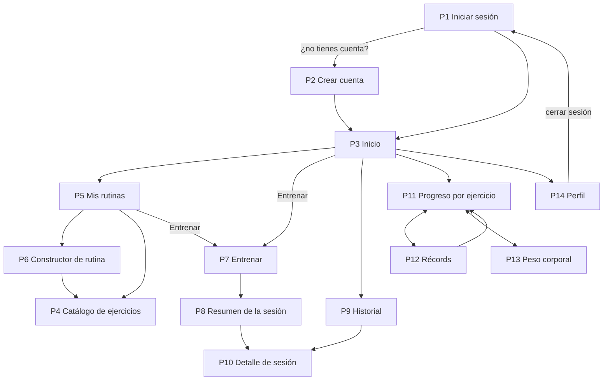

# Mockup de pantallas — GymRutine

**Versión:** 1.0
**Fecha:** 2026-09-14

Bocetos de las 14 pantallas, **cada una con sus reglas anotadas**: de dónde salen los datos, qué se valida, qué pasa al enviar y qué se ve cuando algo falla. El dibujo es orientativo. **Lo que obliga son las reglas**, que salen del [contrato](../CONTRATO-API.md) y de las [historias](../HISTORIAS.md).

Los bocetos son de celular, porque es donde se usa la app. La identidad visual (colores, tipografía, logo) está pendiente: decisión D6 en [IDEA.md](../IDEA.md).

**Cómo leer los bocetos:**

| Símbolo | Significa |
|---|---|
| `[ texto ]` | Campo de texto |
| `[BOTÓN]` · `[Botón]` | Botón principal · botón secundario |
| `(o)` · `( )` | Opción elegida · opción sin elegir |
| `[x]` · `[ ]` | Casilla marcada · sin marcar |
| `>` · `v` | Lleva a otra pantalla · despliega una lista |
| `[Inicio]` en la barra inferior | Sección en la que está el usuario |

## Mapa de navegación



**Barra de navegación inferior** (en escritorio pasa a la parte superior): **Inicio · Rutinas · Historial · Progreso · Perfil**. El catálogo se abre desde Rutinas. Récords y peso corporal se abren desde Progreso.

## Reglas generales (todas las pantallas)

1. **Primero para celular:** diseño base a 360 px de ancho y sin scroll horizontal. Desde 768 px, navegación superior y contenido centrado.
2. **Botones y campos de al menos 44 px de alto:** se usan de pie, con una mano y entre series.
3. **Campos numéricos con teclado numérico en el celular.** El peso admite hasta 2 decimales.
4. **Números y fechas en formato colombiano:** `62,5 kg`, `1.935 kg`, `dom 14 sep`. La API envía y recibe punto decimal; la conversión la hace `ui.js`.
5. **Ningún nombre de objetivo, grupo muscular o equipo escrito a mano:** salen de `GET /referencias`.
6. **Validar en el navegador solo para avisar rápido.** La validación que cuenta es la del backend: sus errores también se muestran junto a cada campo.
7. **Confirmación antes de eliminar** cualquier cosa.
8. **Botón deshabilitado mientras se envía** una petición, para evitar dobles envíos.
9. **Páginas privadas protegidas:** sin token, cualquier pantalla distinta de P1 y P2 redirige a P1.
10. **En la entrega, todo con datos reales de la API**, nunca inventados.

## Estados compartidos

Los construye la tarea T2 en `ui.js` y los usan todas las pantallas.

| Estado | Cuándo | Qué se ve |
|---|---|---|
| Cargando | Mientras llega la respuesta | Indicador en el área de contenido; los botones de envío, deshabilitados |
| Lista vacía | La API responde `[]` | Mensaje que explica el vacío y botón con la acción siguiente ("Crea tu primera rutina") |
| Error de validación | 400 `VALIDACION_FALLIDA` | El mensaje de `campos` debajo de cada campo, y el campo resaltado |
| Conflicto | 409 | El `mensaje` de la API junto al campo afectado (email, nombre o fecha) |
| No autenticado | 401 `NO_AUTENTICADO` | Se borra el token y se lleva a P1 con el aviso "Tu sesión terminó" |
| No encontrado | 404 | "No encontramos lo que buscas" y botón para volver |
| Sin conexión | La petición no llega al servidor | "No se pudo conectar con el servidor" y botón Reintentar. Los datos escritos no se borran |
| Error inesperado | 500 u otro | "Algo salió mal. Intenta de nuevo" |

---

## P1 — Iniciar sesión

**Archivo:** `login.html` · **Historias:** H2 · **Responsable:** Rances (T3)

```
┌────────────────────────────────────────────┐
│                                            │
│                 GymRutine                  │
│     Entrena con plan. Mide de verdad.      │
│                                            │
│ Email                                      │
│ [ ana@correo.com                         ] │
│ Contraseña                                 │
│ [ ********                       mostrar ] │
│                                            │
│ [             INICIAR SESIÓN             ] │
│                                            │
│      ¿No tienes cuenta?  Crear cuenta      │
└────────────────────────────────────────────┘
```

**Datos:** `POST /auth/login`

**Reglas:**

- Email y contraseña obligatorios antes de enviar.
- "mostrar" alterna entre ver y ocultar la contraseña.
- 401 `CREDENCIALES_INVALIDAS` → un único mensaje bajo el botón: "Email o contraseña incorrectos". Nunca se indica cuál de los dos falló.
- Éxito → se guardan el token y el usuario en `localStorage` y se va a P3.
- Si al abrir la pantalla ya hay un token guardado, se va directo a P3.

## P2 — Crear cuenta

**Archivo:** `registro.html` · **Historias:** H1 · **Responsable:** Rances (T3)

```
┌────────────────────────────────────────────┐
│ < Crear cuenta                             │
├────────────────────────────────────────────┤
│ Nombre                                     │
│ [ Ana Gómez                              ] │
│ Email                                      │
│ [ ana@correo.com                         ] │
│ Contraseña (mínimo 8 caracteres)           │
│ [ ********                               ] │
│                                            │
│ ¿Qué buscas en el gimnasio?                │
│ (o) Fuerza                                 │
│     Pocas repeticiones con cargas altas    │
│ ( ) Pérdida de peso                        │
│     Reps moderadas y descansos cortos      │
│ ( ) Resistencia                            │
│     Muchas reps con cargas moderadas       │
│                                            │
│ [              CREAR CUENTA              ] │
└────────────────────────────────────────────┘
```

**Datos:** `GET /referencias` (objetivos con su descripción) y `POST /auth/registro`

**Reglas:**

- Nombre de 2 a 80 caracteres; email con formato válido; contraseña de 8 a 72 caracteres; objetivo obligatorio (ninguno viene marcado).
- Los objetivos se muestran como tarjetas con su nombre y su descripción, tomados de `/referencias`.
- 409 `EMAIL_YA_REGISTRADO` → mensaje bajo el email con enlace a P1.
- Éxito (201) → la sesión queda iniciada: se guardan token y usuario y se va a P3.

## P3 — Inicio

**Archivo:** `inicio.html` · **Historias:** resume H11, H15, H19 y H22 · **Responsable:** Rances (T10). Hasta el sprint 4, T2 deja accesos simples a cada sección.

```
┌────────────────────────────────────────────┐
│ Hola, Ana                                  │
│ Tu objetivo: Fuerza                        │
├────────────────────────────────────────────┤
│ ENTRENAR HOY                               │
│ Pecho y tríceps                 [Entrenar] │
│ Espalda y bíceps                [Entrenar] │
│ Piernas                         [Entrenar] │
│ Ver todas mis rutinas >                    │
├────────────────────────────────────────────┤
│ ÚLTIMA SESIÓN                              │
│ Pecho y tríceps · dom 14 sep               │
│ 55 min · 7 series · 1.935 kg · 1 récord    │
├────────────────────────────────────────────┤
│ RÉCORDS RECIENTES                          │
│ Press de banca con barra         62,5 kg   │
│ Sentadilla con barra             90 kg     │
├────────────────────────────────────────────┤
│ PESO CORPORAL               77,9 kg (-0,5) │
├────────────────────────────────────────────┤
│ [Inicio] Rutinas Historial Progreso Perfil │
└────────────────────────────────────────────┘
```

**Datos:** usuario guardado en el navegador, `GET /rutinas`, `GET /sesiones` (la primera), `GET /records` (los 3 más recientes por fecha) y `GET /peso-corporal` (los dos últimos, para la diferencia)

**Reglas:**

- **Entrenar hoy:** hasta 3 rutinas activas; "Entrenar" va a P7 con esa rutina.
- **Sin rutinas:** en lugar de la lista, "Crea tu primera rutina" → P6.
- **Sin sesiones, récords o peso:** cada bloque vacío se oculta o muestra su invitación, sin romper la pantalla.
- **Borrador pendiente:** si hay un entrenamiento sin guardar (ver P7), aparece arriba "Tienes un entrenamiento sin guardar" con el botón Continuar.
- La diferencia de peso se calcula con los dos últimos registros.

## P4 — Catálogo de ejercicios

**Archivo:** `ejercicios.html` · **Historias:** H5, H6, H7, H8, H9 · **Responsable:** Javier (T4)

```
┌────────────────────────────────────────────┐
│ < Catálogo de ejercicios         [+ Nuevo] │
│ [ Buscar por nombre                      ] │
│ [x] Solo recomendados para Fuerza          │
│ Equipo: (Todos) (Barra) (Mancuernas)       │
│         (Máquina) (Polea) (Peso corporal)  │
├────────────────────────────────────────────┤
│ PECHO (5)                                v │
│   Press de banca con barra        Barra    │
│   Press inclinado con mancuernas  Manc.    │
│   Aperturas con mancuernas        Manc.    │
│   Cruce de poleas                 Polea    │
│   Flexiones de pecho              P. corp. │
│ ESPALDA (6)                              > │
│ HOMBROS (5)                              > │
│ …                                          │
│ MIS EJERCICIOS (1)                       v │
│   Press en máquina Smith          Propio   │
├────────────────────────────────────────────┤
│ Inicio [Rutinas] Historial Progreso Perfil │
└────────────────────────────────────────────┘
```

**Detalle** (al tocar un ejercicio):

```
┌────────────────────────────────────────────┐
│ < Press de banca con barra                 │
├────────────────────────────────────────────┤
│ Pecho · Barra                              │
│ Recomendado para: Fuerza                   │
│                                            │
│ Técnica                                    │
│ Baja la barra al pecho con control y       │
│ empuja hasta extender los brazos.          │
│                                            │
│ Ver técnica en YouTube >                   │
│                                            │
│ Solo si es propio:  [Editar]  [Eliminar]   │
└────────────────────────────────────────────┘
```

**Formulario de ejercicio propio** (crear o editar):

```
┌────────────────────────────────────────────┐
│ < Nuevo ejercicio                [Guardar] │
├────────────────────────────────────────────┤
│ Nombre                                     │
│ [ Press en máquina Smith                 ] │
│ Grupo muscular        Equipo               │
│ [ Pecho          v ]  [ Máquina        v ] │
│ Recomendado para                           │
│ [x] Fuerza [x] Pérdida de peso [ ] Resist. │
│ Descripción (opcional)                     │
│ [                                        ] │
│ [                                        ] │
└────────────────────────────────────────────┘
```

**Datos:** `GET /referencias`, `GET /ejercicios` (con filtros), `GET /ejercicios/{id}`, `POST /ejercicios`, `PUT /ejercicios/{id}` y `DELETE /ejercicios/{id}`

**Reglas:**

- **Grupos musculares plegables,** con la cantidad de ejercicios del filtro actual. Los ejercicios propios se muestran también en su grupo, con la etiqueta "Propio".
- **Filtros de equipo y "recomendados":** se envían a la API como parámetros (`equipo`, `objetivo`). La casilla usa el objetivo del perfil.
- **Búsqueda por nombre:** se filtra en el navegador sobre la lista ya cargada, sin distinguir mayúsculas ni tildes.
- **Detalle:** "Ver técnica en YouTube" abre `https://www.youtube.com/results?search_query=` seguido del nombre del ejercicio codificado para URL, en una pestaña nueva.
- **Editar y Eliminar solo aparecen en los ejercicios propios** (`propio: true`).
- **Formulario:** nombre de 3 a 80 caracteres, grupo y equipo obligatorios, al menos un objetivo, descripción de máximo 500 caracteres con contador.
- 409 `EJERCICIO_DUPLICADO` → mensaje bajo el nombre.
- **Eliminar:** "¿Eliminar este ejercicio? Tu historial se conserva." → `DELETE` → desaparece de la lista.

## P5 — Mis rutinas

**Archivo:** `rutinas.html` · **Historias:** H11, H13 · **Responsable:** Javier (T5)

```
┌────────────────────────────────────────────┐
│ Mis rutinas                      [+ Nueva] │
│ Catálogo de ejercicios >                   │
├────────────────────────────────────────────┤
│ Pecho y tríceps                     Fuerza │
│ 2 ejercicios · última vez: dom 14 sep      │
│ [ ENTRENAR ]           [Editar] [Eliminar] │
├────────────────────────────────────────────┤
│ Piernas                             Fuerza │
│ 6 ejercicios · aún no la entrenas          │
│ [ ENTRENAR ]           [Editar] [Eliminar] │
├────────────────────────────────────────────┤
│ Inicio [Rutinas] Historial Progreso Perfil │
└────────────────────────────────────────────┘
```

**Datos:** `GET /rutinas` y `DELETE /rutinas/{id}`

**Reglas:**

- Cada tarjeta muestra el nombre, el objetivo (nombre visible), la cantidad de ejercicios y la última vez que se entrenó (`ultimaSesion` en formato corto, o "aún no la entrenas").
- "ENTRENAR" es el botón principal → P7.
- "Editar" → P6 con `?id=`.
- "Eliminar" → "¿Eliminar esta rutina? Sus sesiones seguirán en tu historial." → `DELETE` → desaparece de la lista.
- **Sin rutinas:** "Aún no tienes rutinas" con el botón "Crear mi primera rutina".

## P6 — Constructor de rutina

**Archivo:** `rutina.html` (`?id=` para editar) · **Historias:** H10, H12 · **Responsable:** Javier (T5)

```
┌────────────────────────────────────────────┐
│ < Nueva rutina                   [Guardar] │
├────────────────────────────────────────────┤
│ Nombre                                     │
│ [ Pecho y tríceps                        ] │
│ Objetivo                                   │
│ (o) Fuerza ( ) Pérdida de peso ( ) Resist. │
├────────────────────────────────────────────┤
│ EJERCICIOS (2)                             │
│ 1. Press de banca con barra      [^][v][x] │
│    Series [ 4  ]     Repeticiones [ 5  ]   │
│ 2. Extensión de tríceps en polea [^][v][x] │
│    Series [ 3  ]     Repeticiones [ 10 ]   │
│                                            │
│ [          + AGREGAR EJERCICIO           ] │
└────────────────────────────────────────────┘
```

**Agregar ejercicio** (se abre sobre el constructor):

```
┌────────────────────────────────────────────┐
│ < Agregar ejercicio                        │
│ [ Buscar                                 ] │
│ Grupo: (Todos) (Pecho) (Espalda) (…)       │
│ [x] Solo recomendados para Fuerza          │
├────────────────────────────────────────────┤
│ Press de banca con barra         (ya está) │
│ Press inclinado con mancuernas         [+] │
│ Aperturas con mancuernas               [+] │
│ Cruce de poleas                        [+] │
│ Flexiones de pecho                     [+] │
└────────────────────────────────────────────┘
```

**Datos:** `GET /referencias`, `GET /ejercicios`, `GET /rutinas/{id}` (al editar), `POST /rutinas` y `PUT /rutinas/{id}`

**Reglas:**

- **Objetivo por defecto:** el del perfil (al crear) o el de la rutina (al editar).
- **Al agregar un ejercicio,** series y repeticiones se prellenan con `seriesSugeridas` y `repeticionesSugeridas` del objetivo elegido. Cambiar el objetivo **no** modifica los valores de los ejercicios ya agregados.
- **En el selector,** los ejercicios que ya están en la rutina aparecen como "(ya está)" y no se pueden volver a agregar.
- `[^]` y `[v]` cambian el orden; `[x]` quita el ejercicio. Lo que se envía es la lista en el orden visible.
- **Validación antes de enviar:** nombre de 3 a 80 caracteres, entre 1 y 15 ejercicios, series de 1 a 10 y repeticiones de 1 a 50.
- **Al editar,** un ejercicio que se eliminó del catálogo aparece con "(ya no está en el catálogo)" y el aviso "Quítalo para poder guardar".
- **Salir con cambios sin guardar** → "¿Salir sin guardar?".
- **Éxito** → P5.

## P7 — Entrenar ★

**Archivo:** `entrenar.html?rutinaId=` · **Historias:** H14, H18 · **Responsable:** Santiago (T6)

La pantalla más importante: es la única que se usa **dentro del gimnasio**, de pie, con prisa y a veces sin señal. Merece el doble de cuidado que las demás.

```
┌────────────────────────────────────────────┐
│ < Pecho y tríceps             Tiempo 00:32 │
│ Inicio: hoy 18:30 (cambiar)                │
│ 2 ejercicios · 4 series · 1.162,5 kg       │
├────────────────────────────────────────────┤
│ 1. Press de banca con barra                │
│    Objetivo 4 × 5 · Tu récord: 60 kg       │
│    (valores de la última vez: 10 sep)      │
│     #   Peso (kg)   Reps     Hecha         │
│     1   [ 55    ]   [ 5  ]   [x]           │
│     2   [ 57,5  ]   [ 5  ]   [x]           │
│     3   [ 60    ]   [ 5  ]   [x]           │
│     4   [ 60    ]   [ 5  ]   [ ]           │
│    [+ Serie]                    [Saltar]   │
├────────────────────────────────────────────┤
│ 2. Extensión de tríceps en polea           │
│    Objetivo 3 × 10 · Tu récord: 27,5 kg    │
│     #   Peso (kg)   Reps     Hecha         │
│     1   [ 25    ]   [ 12 ]   [x]           │
│     2   [ 27,5  ]   [ 10 ]   [ ]           │
│     3   [ 27,5  ]   [ 8  ]   [ ]           │
│    [+ Serie]                    [Saltar]   │
├────────────────────────────────────────────┤
│ [           TERMINAR Y GUARDAR           ] │
└────────────────────────────────────────────┘
```

**Al terminar** (confirmación):

```
┌────────────────────────────────────────────┐
│ ¿Terminar la sesión?                       │
├────────────────────────────────────────────┤
│ Pecho y tríceps · hoy 18:30                │
│ 2 ejercicios · 7 series · 1.935 kg         │
│ Duración (min)  [ 55 ]                     │
│                                            │
│ [Seguir entrenando]  [ GUARDAR SESIÓN ]    │
└────────────────────────────────────────────┘
```

**Datos:** `GET /rutinas/{id}` y `GET /rutinas/{id}/ultimos-registros` al abrir; `POST /sesiones` al guardar

**Reglas de las series:**

- **Filas iniciales por ejercicio:** tantas como `seriesObjetivo`, o como las series de la última vez si fueron más.
- **Valores iniciales:** los de la última vez, serie a serie (peso y reps de la serie 1 en la fila 1, y así). Si una fila no tiene serie anterior, copia la última disponible. Si el ejercicio nunca se ha hecho: peso vacío y reps = objetivo.
- **Solo se guardan las filas marcadas "Hecha".** Un ejercicio sin filas hechas no se envía, igual que tocar "Saltar".
- **Marcar "Hecha" valida la fila:** peso de 0 a 500 y reps de 1 a 100. Si no cumple, la fila se resalta y no se marca.
- **"Tu récord"** sale de `recordKg`. Si una fila hecha lo supera, se resalta como "posible récord". La confirmación real llega en la respuesta del servidor.
- **Ejercicios eliminados del catálogo** aparecen deshabilitados, con "(ya no está en el catálogo)".
- **El resumen superior** (ejercicios · series hechas · kg) se actualiza con cada fila marcada.

**Reglas de tiempo:**

- **Inicio:** por defecto, el momento en que se abrió la pantalla. "cambiar" permite elegir otra fecha y hora que no sea futura.
- **Tiempo:** cuenta desde que se abrió la pantalla. Al terminar, la duración propuesta son los minutos transcurridos (mínimo 1) y se puede corregir en la confirmación (1 a 600).

**Reglas contra la mala señal (borrador):**

- **Cada cambio se guarda en `localStorage`** como borrador de esa rutina.
- **Al abrir la rutina con un borrador existente:** "Tienes un entrenamiento sin guardar del dom 14 sep 18:30" con **Continuar** o **Descartar**.
- **Si el guardado falla por conexión:** "No se pudo guardar. Tus datos siguen aquí." con el botón **Reintentar**. No se borra nada.
- **El borrador se borra solo** cuando `POST /sesiones` responde 201, o cuando el usuario descarta.

**Al guardar:**

- Sin ninguna fila hecha, "Terminar y guardar" avisa: "Marca al menos una serie hecha".
- 201 → P8 con la respuesta.
- 400 → se resaltan las filas indicadas en `campos` (por ejemplo, `registros[0].series[1].pesoKg`).
- Salir de la pantalla con series hechas sin guardar → "¿Salir? Tu entrenamiento queda como borrador".

## P8 — Resumen de la sesión

**Archivo:** `entrenar.html` (se muestra al guardar) · **Historias:** H14, H18 · **Responsable:** Santiago (T6)

```
┌────────────────────────────────────────────┐
│             ¡Sesión guardada!              │
│          Pecho y tríceps · 55 min          │
├────────────────────────────────────────────┤
│ VOLUMEN               EJERCICIOS           │
│ 1.935 kg              2                    │
│                                            │
│ SERIES                REPETICIONES         │
│ 7                     50                   │
├────────────────────────────────────────────┤
│ ¡NUEVO RÉCORD!                             │
│ Press de banca con barra      62,5 kg × 4  │
├────────────────────────────────────────────┤
│ [Ver detalle]                [Ir a inicio] │
└────────────────────────────────────────────┘
```

**Datos:** la respuesta 201 de `POST /sesiones`. No hace peticiones nuevas.

**Reglas:**

- Las tarjetas salen de `resumen`: volumen, ejercicios, series y repeticiones.
- **"¡NUEVO RÉCORD!"** lista las series con `esRecord: true`: ejercicio, peso y repeticiones.
- **Sin récords:** el bloque se reemplaza por "Esta vez no hubo récords".
- "Ver detalle" → P10 con el `id` de la sesión. "Ir a inicio" → P3.

## P9 — Historial

**Archivo:** `historial.html` · **Historias:** H15 · **Responsable:** Santiago (T6)

```
┌────────────────────────────────────────────┐
│ Historial                                  │
├────────────────────────────────────────────┤
│ DOM 14 SEP · 18:30                         │
│ Pecho y tríceps                   [1 PR]   │
│ 55 min · 7 series · 1.935 kg               │
├────────────────────────────────────────────┤
│ JUE 11 SEP · 19:05                         │
│ Piernas                                    │
│ 62 min · 18 series · 4.210 kg              │
├────────────────────────────────────────────┤
│ LUN 8 SEP · 18:20                          │
│ Espalda y bíceps                  [2 PR]   │
│ 48 min · 15 series · 3.380 kg              │
├────────────────────────────────────────────┤
│ Inicio Rutinas [Historial] Progreso Perfil │
└────────────────────────────────────────────┘
```

**Datos:** `GET /sesiones`

**Reglas:**

- De la más reciente a la más antigua, en el orden en que llegan de la API.
- Cada tarjeta muestra la fecha y la hora, la rutina, la duración, las series y el volumen. `[n PR]` aparece solo si `resumen.records > 0`.
- Tocar una tarjeta → P10.
- **Sin sesiones:** "Aún no has registrado entrenamientos" con el botón "Entrenar una rutina" → P5.

## P10 — Detalle de sesión

**Archivo:** `sesion.html?id=` · **Historias:** H16, H17 · **Responsable:** Santiago (T6)

```
┌────────────────────────────────────────────┐
│ < Sesión                                   │
│ Pecho y tríceps · dom 14 sep · 18:30       │
│ 55 min · 7 series · 50 reps · 1.935 kg     │
├────────────────────────────────────────────┤
│ Press de banca con barra        1.112,5 kg │
│   1   55 kg × 5                            │
│   2   57,5 kg × 5                          │
│   3   60 kg × 5                            │
│   4   62,5 kg × 4             [RÉCORD]     │
├────────────────────────────────────────────┤
│ Extensión de tríceps en polea     822,5 kg │
│   1   25 kg × 12                           │
│   2   27,5 kg × 10                         │
│   3   27,5 kg × 9                          │
├────────────────────────────────────────────┤
│ [            Eliminar sesión             ] │
└────────────────────────────────────────────┘
```

**Datos:** `GET /sesiones/{id}` y `DELETE /sesiones/{id}`

**Reglas:**

- Los ejercicios van en su orden, cada uno con su volumen y sus series. Las series con `esRecord: true` llevan la marca `[RÉCORD]`.
- Una rutina o un ejercicio eliminados después se muestran igual, con su nombre.
- **Eliminar sesión:** "¿Eliminar esta sesión? Se recalcularán tus récords." → `DELETE` → P9.
- 404 → estado "no encontrado" con el botón para volver al historial.

## P11 — Progreso por ejercicio

**Archivo:** `progreso.html` (`?ejercicioId=` opcional) · **Historias:** H20 · **Responsable:** Javier (T8)

```
┌────────────────────────────────────────────┐
│ Progreso                                   │
│  [Por ejercicio]  Récords  Peso corporal   │
├────────────────────────────────────────────┤
│ [ Press de banca con barra             v ] │
│ Ver: (o) Peso máximo   ( ) Volumen         │
│                                            │
│  kg                                        │
│  62,5 |                            *       │
│       |                          /         │
│  60   |    *-------------o------/          │
│       +------------------------------      │
│          07 sep        10 sep  14 sep      │
│  * récord    o sesión                      │
├────────────────────────────────────────────┤
│ Fecha    Peso máx.  Volumen      Récord    │
│ 14 sep   62,5 kg    1.112,5 kg   Sí        │
│ 10 sep   60 kg      1.162,5 kg   —         │
│ 07 sep   60 kg      1.100 kg     Sí        │
├────────────────────────────────────────────┤
│ Inicio Rutinas Historial [Progreso] Perfil │
└────────────────────────────────────────────┘
```

**Datos:** `GET /progreso/ejercicios` (para el selector) y `GET /progreso/ejercicios/{id}`

**Reglas:**

- El selector solo lista ejercicios con historial. Si llega `?ejercicioId=` (desde P12), ese viene elegido.
- **Gráfica de línea (Chart.js):** eje X = `fechaInicio` de cada punto; eje Y = `pesoMaximoKg`, o `volumenKg` si se elige "Volumen". Los puntos con `esRecord: true` se dibujan distintos (otro color y tamaño).
- **La tabla muestra los mismos datos,** de la sesión más reciente a la más antigua. **Se construye antes que la gráfica:** si Chart.js falla, la tabla sigue funcionando.
- Con un solo punto, la gráfica lo muestra sin errores.
- **Sin ejercicios con historial:** "Registra tu primera sesión para ver tu progreso" → P5.

## P12 — Récords

**Archivo:** `records.html` · **Historias:** H19 · **Responsable:** Santiago (T7)

```
┌────────────────────────────────────────────┐
│ Progreso                                   │
│  Por ejercicio  [Récords]  Peso corporal   │
├────────────────────────────────────────────┤
│ PECHO                                      │
│ Press de banca con barra                   │
│ 62,5 kg × 4 · dom 14 sep                 > │
│ Press inclinado con mancuernas             │
│ 26 kg × 8 · mié 10 sep                   > │
├────────────────────────────────────────────┤
│ PIERNAS                                    │
│ Sentadilla con barra                       │
│ 90 kg × 5 · jue 11 sep                   > │
├────────────────────────────────────────────┤
│ Inicio Rutinas Historial [Progreso] Perfil │
└────────────────────────────────────────────┘
```

**Datos:** `GET /records`

**Reglas:**

- Se agrupan por grupo muscular (nombre visible de `/referencias`), en el orden en que llegan de la API.
- Cada récord muestra el peso, las repeticiones de esa serie y la fecha.
- Tocar un récord → P11 con `?ejercicioId=`.
- **Sin récords:** "Aún no tienes récords. ¡Registra tu primera sesión!".

## P13 — Peso corporal

**Archivo:** `peso.html` · **Historias:** H21, H22 · **Responsable:** Rances (T9)

```
┌────────────────────────────────────────────┐
│ Progreso                                   │
│  Por ejercicio  Récords  [Peso corporal]   │
├────────────────────────────────────────────┤
│ Fecha                 Peso (kg)            │
│ [ 14/09/2026 ]        [ 77,9 ]             │
│ [               REGISTRAR                ] │
├────────────────────────────────────────────┤
│  kg                                        │
│  78,4 |          o                         │
│  78,2 |  o------/ \                        │
│  77,9 |            \------o                │
│       +----------------------              │
│         31 ago   07 sep   14 sep           │
├────────────────────────────────────────────┤
│ 14 sep 2026     77,9 kg   -0,5         [x] │
│ 07 sep 2026     78,4 kg   +0,2         [x] │
│ 31 ago 2026     78,2 kg   —            [x] │
├────────────────────────────────────────────┤
│ Inicio Rutinas Historial [Progreso] Perfil │
└────────────────────────────────────────────┘
```

**Datos:** `GET /peso-corporal`, `POST /peso-corporal` y `DELETE /peso-corporal/{id}`

**Reglas:**

- **Fecha por defecto: hoy.** No se permite una fecha futura. Peso de 20 a 350 kg.
- 409 `PESO_YA_REGISTRADO` → mensaje bajo la fecha: "Ya registraste tu peso ese día".
- **Gráfica de línea (Chart.js)** con los registros en orden cronológico, tal como llegan de la API.
- **La lista va de la más reciente a la más antigua,** cada registro con su diferencia contra el anterior (`+0,2`, `-0,5`). El registro más antiguo muestra `—`.
- `[x]` → "¿Eliminar el registro del 14 sep?" → `DELETE`.
- Esta es la primera pantalla con gráfica (sprint 3): define el patrón que después reutiliza P11.

## P14 — Perfil

**Archivo:** `perfil.html` · **Historias:** H3, H4 · **Responsable:** Rances (T3)

```
┌────────────────────────────────────────────┐
│ Perfil                                     │
├────────────────────────────────────────────┤
│ Nombre                                     │
│ [ Ana Gómez                              ] │
│ Email                                      │
│ ana@correo.com (no se puede cambiar)       │
│                                            │
│ Objetivo                                   │
│ (o) Fuerza                                 │
│ ( ) Pérdida de peso                        │
│ ( ) Resistencia                            │
│ No cambia las rutinas que ya tienes.       │
│                                            │
│ [            GUARDAR CAMBIOS             ] │
├────────────────────────────────────────────┤
│ Miembro desde septiembre de 2026           │
│ [             Cerrar sesión              ] │
├────────────────────────────────────────────┤
│ Inicio Rutinas Historial Progreso [Perfil] │
└────────────────────────────────────────────┘
```

**Datos:** `GET /usuarios/me`, `GET /referencias`, `PUT /usuarios/me` y `POST /auth/logout`

**Reglas:**

- Nombre de 2 a 80 caracteres. El email se muestra, pero no se edita.
- Al guardar, se actualiza también el usuario guardado en el navegador, para que P3 y P4 usen el objetivo nuevo.
- **Cerrar sesión** → `POST /auth/logout` → se borran el token, el usuario y los borradores → P1. Si la petición falla por conexión, igual se borran los datos locales y se va a P1.

---

## Qué tomamos de GymTracker

Ideas vistas en las capturas de la app de referencia ([ficha en Google Play](https://play.google.com/store/apps/details?id=com.kreatordev.gymtracker)) y dónde quedaron:

| En GymTracker | En GymRutine |
|---|---|
| Sesión del día con cada serie como "kg / reps" y un "+" por ejercicio para agregar series | P7: filas de series editables con "+ Serie" |
| Encabezado de la sesión con ejercicios · series · kg totales | P7: resumen en vivo; P8 y P9: volumen total |
| Pantalla de resultado con kg levantados, ejercicios, series, repeticiones y trofeos | P8: resumen con "¡Nuevo récord!" |
| Lista de récords por ejercicio con peso máximo | P12: récords agrupados por músculo |
| Gráfica de peso corporal con lista de registros | P13 |
| Biblioteca agrupada por músculo con contador y filtros de equipo | P4 |
| Detalle de ejercicio con enlace para buscar la técnica | P4: "Ver técnica en YouTube" |
| Selector de fecha en la sesión | P7: inicio editable para registrar un entrenamiento de otro día |
| Barra inferior de navegación | Barra inferior con 5 secciones |

Lo que **no** tomamos, y por qué, está en [IDEA.md](../IDEA.md) §7.

## Criterios de entrega del frontend

Una pantalla está lista para revisión cuando:

- [ ] Consume los endpoints reales del contrato, sin datos inventados
- [ ] Cumple todas las reglas anotadas en su sección de este documento
- [ ] Muestra los estados compartidos que le aplican (cargando, vacío, errores, sin conexión)
- [ ] Se usa bien a 360 px de ancho y en escritorio, sin scroll horizontal
- [ ] No deja errores en la consola del navegador
- [ ] Se probó en un celular real al menos una vez antes del cierre del sprint

## Historial de cambios

| Fecha | Cambio |
|---|---|
| 2026-09-14 | v1.0: versión inicial con 14 pantallas en bocetos de texto |
